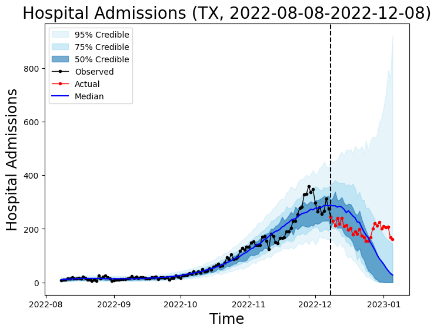

CFA Forecast Tools (Python)
================

<!-- To learn more about using Quarto for
render a GitHub README, see
<https://quarto.org/docs/output-formats/gfm.html>
-->

    polars.config.Config

Summary of `forecasttools-py`:

- A Python package.
- Primarily supports the Short Term Forecast’s team.
- Intended to support wider Real Time Monitoring branch operations.
- Has tools for pre- and post-processing.
  - Conversion of `az.InferenceData` forecast to Hubverse format.
  - Addition of time and or dates to `az.InferenceData`.

Notes:

- This repository is a WORK IN PROGRESS.

# Installation

Install `forecasttools` via:

    pip3 install git+https://github.com/CDCgov/forecasttools-py@main

# Vignettes

- [Format Arviz Forecast Output For FluSight
  Submission](https://github.com/CDCgov/forecasttools-py/blob/main/notebooks/flusight_from_idata.qmd)
- [Community Meeting Utilities Demonstration
  (2024-11-19)](https://github.com/CDCgov/forecasttools-py/blob/main/notebooks/forecasttools_community_demo_2024-11-19.qmd)

*Coming soon as webpages, once [Issue
26](https://github.com/CDCgov/forecasttools-py/issues/26) is completed*.

# Datasets

Within `forecasttools-py`, one finds several packaged datasets. These
datasets can aid with experimentation; some are directly necessary to
other utilities provided by `forecasttools-py`.

``` python
import forecasttools
```

Summary of datasets:

- `forecasttools.location_table`
  - A Polars dataframe of location abbreviations, codes, and names for
    Hubverse formatted forecast submissions.
- `forecasttools.example_flusight_submission`
  - An example Hubverse formatted influenza forecast submission (as a
    Polars dataframe) submitted to the FluSight Hub.
- `forecasttools.nhsn_hosp_COVID`
  - A Polars dataframe of NHSN COVID hospital admissions data.
- `forecasttools.nhsn_hosp_flu`
  - A Polars dataframe of NHSN influenza hospital admissions data.
- `forecasttools.nhsn_flu_forecast_wo_dates`
  - An `az.InferenceData` object containing a forecast made using NSHN
    influenza data for Texas.
- `forecasttools.nhsn_flu_forecast_w_dates`
  - An modified (with dates as coordinates) `az.InferenceData` object
    containing a forecast made using NSHN influenza data for Texas.

See below for more information on the datasets.

## Location Table

The location table contains abbreviations, codes, and extended names for
the US jurisdictions for which the FluSight and COVID forecasting hubs
require users to generate forecasts.

The location table is stored in `forecasttools` as a `polars` dataframe
and is accessed via:

``` python
loc_table = forecasttools.location_table
loc_table
```

<div><style>
.dataframe > thead > tr,
.dataframe > tbody > tr {
  text-align: right;
  white-space: pre-wrap;
}
</style>
<table border="1" class="dataframe"><thead><tr><th>location_code</th><th>short_name</th><th>long_name</th></tr><tr><td>str</td><td>str</td><td>str</td></tr></thead><tbody><tr><td>&quot;US&quot;</td><td>&quot;US&quot;</td><td>&quot;United States&quot;</td></tr><tr><td>&quot;01&quot;</td><td>&quot;AL&quot;</td><td>&quot;Alabama&quot;</td></tr><tr><td>&quot;02&quot;</td><td>&quot;AK&quot;</td><td>&quot;Alaska&quot;</td></tr><tr><td>&quot;04&quot;</td><td>&quot;AZ&quot;</td><td>&quot;Arizona&quot;</td></tr><tr><td>&quot;05&quot;</td><td>&quot;AR&quot;</td><td>&quot;Arkansas&quot;</td></tr><tr><td>&hellip;</td><td>&hellip;</td><td>&hellip;</td></tr><tr><td>&quot;66&quot;</td><td>&quot;GU&quot;</td><td>&quot;Guam&quot;</td></tr><tr><td>&quot;69&quot;</td><td>&quot;MP&quot;</td><td>&quot;Northern Mariana Islands&quot;</td></tr><tr><td>&quot;72&quot;</td><td>&quot;PR&quot;</td><td>&quot;Puerto Rico&quot;</td></tr><tr><td>&quot;74&quot;</td><td>&quot;UM&quot;</td><td>&quot;U.S. Minor Outlying Islands&quot;</td></tr><tr><td>&quot;78&quot;</td><td>&quot;VI&quot;</td><td>&quot;U.S. Virgin Islands&quot;</td></tr></tbody></table></div>

Using `./forecasttools/data.py`, the location table was created by
running the following:

``` python
make_census_dataset(
    file_save_path=os.path.join(
        os.getcwd(),
        "location_table.csv"
    ),
)
```

## Example FluSight Hub Submission

The example FluSight submission comes from the [following 2023-24
submission](https://raw.githubusercontent.com/cdcepi/FluSight-forecast-hub/main/model-output/cfa-flumech/2023-10-14-cfa-flumech.csv).

The example FluSight submission is stored in `forecasttools` as a
`polars` dataframe and is accessed via:

``` python
submission = forecasttools.example_flusight_submission
submission
```

<div><style>
.dataframe > thead > tr,
.dataframe > tbody > tr {
  text-align: right;
  white-space: pre-wrap;
}
</style>
<table border="1" class="dataframe"><thead><tr><th>reference_date</th><th>target</th><th>horizon</th><th>target_end_date</th><th>location</th><th>output_type</th><th>output_type_id</th><th>value</th></tr><tr><td>str</td><td>str</td><td>i64</td><td>str</td><td>str</td><td>str</td><td>f64</td><td>f64</td></tr></thead><tbody><tr><td>&quot;2023-10-14&quot;</td><td>&quot;wk inc flu hosp&quot;</td><td>-1</td><td>&quot;2023-10-07&quot;</td><td>&quot;01&quot;</td><td>&quot;quantile&quot;</td><td>0.01</td><td>7.670286</td></tr><tr><td>&quot;2023-10-14&quot;</td><td>&quot;wk inc flu hosp&quot;</td><td>-1</td><td>&quot;2023-10-07&quot;</td><td>&quot;01&quot;</td><td>&quot;quantile&quot;</td><td>0.025</td><td>9.968043</td></tr><tr><td>&quot;2023-10-14&quot;</td><td>&quot;wk inc flu hosp&quot;</td><td>-1</td><td>&quot;2023-10-07&quot;</td><td>&quot;01&quot;</td><td>&quot;quantile&quot;</td><td>0.05</td><td>12.022354</td></tr><tr><td>&quot;2023-10-14&quot;</td><td>&quot;wk inc flu hosp&quot;</td><td>-1</td><td>&quot;2023-10-07&quot;</td><td>&quot;01&quot;</td><td>&quot;quantile&quot;</td><td>0.1</td><td>14.497646</td></tr><tr><td>&quot;2023-10-14&quot;</td><td>&quot;wk inc flu hosp&quot;</td><td>-1</td><td>&quot;2023-10-07&quot;</td><td>&quot;01&quot;</td><td>&quot;quantile&quot;</td><td>0.15</td><td>16.119813</td></tr><tr><td>&hellip;</td><td>&hellip;</td><td>&hellip;</td><td>&hellip;</td><td>&hellip;</td><td>&hellip;</td><td>&hellip;</td><td>&hellip;</td></tr><tr><td>&quot;2023-10-14&quot;</td><td>&quot;wk inc flu hosp&quot;</td><td>2</td><td>&quot;2023-10-28&quot;</td><td>&quot;US&quot;</td><td>&quot;quantile&quot;</td><td>0.85</td><td>2451.874899</td></tr><tr><td>&quot;2023-10-14&quot;</td><td>&quot;wk inc flu hosp&quot;</td><td>2</td><td>&quot;2023-10-28&quot;</td><td>&quot;US&quot;</td><td>&quot;quantile&quot;</td><td>0.9</td><td>2806.928588</td></tr><tr><td>&quot;2023-10-14&quot;</td><td>&quot;wk inc flu hosp&quot;</td><td>2</td><td>&quot;2023-10-28&quot;</td><td>&quot;US&quot;</td><td>&quot;quantile&quot;</td><td>0.95</td><td>3383.74799</td></tr><tr><td>&quot;2023-10-14&quot;</td><td>&quot;wk inc flu hosp&quot;</td><td>2</td><td>&quot;2023-10-28&quot;</td><td>&quot;US&quot;</td><td>&quot;quantile&quot;</td><td>0.975</td><td>3940.392536</td></tr><tr><td>&quot;2023-10-14&quot;</td><td>&quot;wk inc flu hosp&quot;</td><td>2</td><td>&quot;2023-10-28&quot;</td><td>&quot;US&quot;</td><td>&quot;quantile&quot;</td><td>0.99</td><td>4761.757385</td></tr></tbody></table></div>

Using `data.py`, the example FluSight submission was created by running
the following:

``` python
get_and_save_flusight_submission(
    file_save_path=os.path.join(
        os.getcwd(),
        "example_flusight_submission.csv"
    ),
)
```

## NHSN COVID And Flu Hospital Admissions

NHSN hospital admissions fitting data for COVID and Flu is included in
`forecasttools-py` as well, for user experimentation.

This data:

- Is current as of `2024-04-27`
- Comes from the website [HealthData.gov COVID-19 Reported Patient
  Impact and Hospital Capacity by State
  Timeseries](https://healthdata.gov/Hospital/COVID-19-Reported-Patient-Impact-and-Hospital-Capa/g62h-syeh).

For influenza, the `previous_day_admission_influenza_confirmed` column
is retained and for COVID the
`previous_day_admission_adult_covid_confirmed` column is retained. As
can be seen in the example below, some early dates for each jurisdiction
do not have data.

The fitting data is stored in `forecasttools` as a `polars` dataframe
and is accessed via:

``` python
# access COVID data
covid_nhsn_data = forecasttools.nhsn_hosp_COVID

# access flu data
flu_nhsn_data = forecasttools.nhsn_hosp_flu

# display flu data
flu_nhsn_data
```

<div><style>
.dataframe > thead > tr,
.dataframe > tbody > tr {
  text-align: right;
  white-space: pre-wrap;
}
</style>
<table border="1" class="dataframe"><thead><tr><th>state</th><th>date</th><th>hosp</th></tr><tr><td>str</td><td>str</td><td>str</td></tr></thead><tbody><tr><td>&quot;AK&quot;</td><td>&quot;2020-03-23&quot;</td><td>null</td></tr><tr><td>&quot;AK&quot;</td><td>&quot;2020-03-24&quot;</td><td>null</td></tr><tr><td>&quot;AK&quot;</td><td>&quot;2020-03-25&quot;</td><td>null</td></tr><tr><td>&quot;AK&quot;</td><td>&quot;2020-03-26&quot;</td><td>null</td></tr><tr><td>&quot;AK&quot;</td><td>&quot;2020-03-27&quot;</td><td>null</td></tr><tr><td>&hellip;</td><td>&hellip;</td><td>&hellip;</td></tr><tr><td>&quot;WY&quot;</td><td>&quot;2024-04-23&quot;</td><td>&quot;1&quot;</td></tr><tr><td>&quot;WY&quot;</td><td>&quot;2024-04-24&quot;</td><td>&quot;1&quot;</td></tr><tr><td>&quot;WY&quot;</td><td>&quot;2024-04-25&quot;</td><td>&quot;0&quot;</td></tr><tr><td>&quot;WY&quot;</td><td>&quot;2024-04-26&quot;</td><td>&quot;0&quot;</td></tr><tr><td>&quot;WY&quot;</td><td>&quot;2024-04-27&quot;</td><td>&quot;0&quot;</td></tr></tbody></table></div>

The data was created by placing a csv file called
`NHSN_RAW_20240926.csv` (the full NHSN dataset) into `./forecasttools/`
and running, in `data.py`, the following:

``` python
# generate COVID dataset
make_nshn_fitting_dataset(
    dataset="COVID",
    nhsn_dataset_path="NHSN_RAW_20240926.csv",
    file_save_path=os.path.join(
        os.getcwd(),
        "nhsn_hosp_COVID.csv"
    )
)

# generate flu dataset
make_nshn_fitting_dataset(
    dataset="flu",
    nhsn_dataset_path="NHSN_RAW_20240926.csv",
    file_save_path=os.path.join(
        os.getcwd(),
        "nhsn_hosp_flu.csv"
    )
)
```

## Influenza Hospitalizations Forecast(s)

Two example forecasts stored in Arviz `InferenceData` objects are
included for vignettes and user experimentation. Both are 28 day
influenza hospital admissions forecasts for Texas made using a spline
regression model fitted to NHSN data between 2022-08-08 and 2022-12-08.
The only difference between the forecasts is that
`example_flu_forecast_w_dates.nc` has had dates added as its coordinates
(this is not a native Arviz feature). The `idata` objects which includes
the observed data and posterior predictive samples is given below:

    Inference data with groups:
        > posterior
        > posterior_predictive
        > log_likelihood
        > sample_stats
        > prior
        > prior_predictive
        > observed_data

The forecast `idata`s are accessed via:

``` python
# idata with dates as coordinates
idata_w_dates = forecasttools.nhsn_flu_forecast_w_dates
idata_w_dates
```

            <div>
              <div class='xr-header'>
                <div class="xr-obj-type">arviz.InferenceData</div>
              </div>
              <ul class="xr-sections group-sections">

            <li class = "xr-section-item">
                  <input id="idata_posterior6830499a-548c-4862-b5f9-8c4d75cd1b70" class="xr-section-summary-in" type="checkbox">
                  <label for="idata_posterior6830499a-548c-4862-b5f9-8c4d75cd1b70" class = "xr-section-summary">posterior</label>
                  <div class="xr-section-inline-details"></div>
                  <div class="xr-section-details">
                      <ul id="xr-dataset-coord-list" class="xr-var-list">
                          <div style="padding-left:2rem;"><div><svg style="position: absolute; width: 0; height: 0; overflow: hidden">
<defs>
<symbol id="icon-database" viewBox="0 0 32 32">
<path d="M16 0c-8.837 0-16 2.239-16 5v4c0 2.761 7.163 5 16 5s16-2.239 16-5v-4c0-2.761-7.163-5-16-5z"></path>
<path d="M16 17c-8.837 0-16-2.239-16-5v6c0 2.761 7.163 5 16 5s16-2.239 16-5v-6c0 2.761-7.163 5-16 5z"></path>
<path d="M16 26c-8.837 0-16-2.239-16-5v6c0 2.761 7.163 5 16 5s16-2.239 16-5v-6c0 2.761-7.163 5-16 5z"></path>
</symbol>
<symbol id="icon-file-text2" viewBox="0 0 32 32">
<path d="M28.681 7.159c-0.694-0.947-1.662-2.053-2.724-3.116s-2.169-2.030-3.116-2.724c-1.612-1.182-2.393-1.319-2.841-1.319h-15.5c-1.378 0-2.5 1.121-2.5 2.5v27c0 1.378 1.122 2.5 2.5 2.5h23c1.378 0 2.5-1.122 2.5-2.5v-19.5c0-0.448-0.137-1.23-1.319-2.841zM24.543 5.457c0.959 0.959 1.712 1.825 2.268 2.543h-4.811v-4.811c0.718 0.556 1.584 1.309 2.543 2.268zM28 29.5c0 0.271-0.229 0.5-0.5 0.5h-23c-0.271 0-0.5-0.229-0.5-0.5v-27c0-0.271 0.229-0.5 0.5-0.5 0 0 15.499-0 15.5 0v7c0 0.552 0.448 1 1 1h7v19.5z"></path>
<path d="M23 26h-14c-0.552 0-1-0.448-1-1s0.448-1 1-1h14c0.552 0 1 0.448 1 1s-0.448 1-1 1z"></path>
<path d="M23 22h-14c-0.552 0-1-0.448-1-1s0.448-1 1-1h14c0.552 0 1 0.448 1 1s-0.448 1-1 1z"></path>
<path d="M23 18h-14c-0.552 0-1-0.448-1-1s0.448-1 1-1h14c0.552 0 1 0.448 1 1s-0.448 1-1 1z"></path>
</symbol>
</defs>
</svg>
<style>/* CSS stylesheet for displaying xarray objects in jupyterlab.
 *
 */

:root {
  --xr-font-color0: var(--jp-content-font-color0, rgba(0, 0, 0, 1));
  --xr-font-color2: var(--jp-content-font-color2, rgba(0, 0, 0, 0.54));
  --xr-font-color3: var(--jp-content-font-color3, rgba(0, 0, 0, 0.38));
  --xr-border-color: var(--jp-border-color2, #e0e0e0);
  --xr-disabled-color: var(--jp-layout-color3, #bdbdbd);
  --xr-background-color: var(--jp-layout-color0, white);
  --xr-background-color-row-even: var(--jp-layout-color1, white);
  --xr-background-color-row-odd: var(--jp-layout-color2, #eeeeee);
}

html[theme=dark],
html[data-theme=dark],
body[data-theme=dark],
body.vscode-dark {
  --xr-font-color0: rgba(255, 255, 255, 1);
  --xr-font-color2: rgba(255, 255, 255, 0.54);
  --xr-font-color3: rgba(255, 255, 255, 0.38);
  --xr-border-color: #1F1F1F;
  --xr-disabled-color: #515151;
  --xr-background-color: #111111;
  --xr-background-color-row-even: #111111;
  --xr-background-color-row-odd: #313131;
}

.xr-wrap {
  display: block !important;
  min-width: 300px;
  max-width: 700px;
}

.xr-text-repr-fallback {
  /* fallback to plain text repr when CSS is not injected (untrusted notebook) */
  display: none;
}

.xr-header {
  padding-top: 6px;
  padding-bottom: 6px;
  margin-bottom: 4px;
  border-bottom: solid 1px var(--xr-border-color);
}

.xr-header > div,
.xr-header > ul {
  display: inline;
  margin-top: 0;
  margin-bottom: 0;
}

.xr-obj-type,
.xr-array-name {
  margin-left: 2px;
  margin-right: 10px;
}

.xr-obj-type {
  color: var(--xr-font-color2);
}

.xr-sections {
  padding-left: 0 !important;
  display: grid;
  grid-template-columns: 150px auto auto 1fr 0 20px 0 20px;
}

.xr-section-item {
  display: contents;
}

.xr-section-item input {
  display: inline-block;
  opacity: 0;
}

.xr-section-item input + label {
  color: var(--xr-disabled-color);
}

.xr-section-item input:enabled + label {
  cursor: pointer;
  color: var(--xr-font-color2);
}

.xr-section-item input:focus + label {
  border: 2px solid var(--xr-font-color0);
}

.xr-section-item input:enabled + label:hover {
  color: var(--xr-font-color0);
}

.xr-section-summary {
  grid-column: 1;
  color: var(--xr-font-color2);
  font-weight: 500;
}

.xr-section-summary > span {
  display: inline-block;
  padding-left: 0.5em;
}

.xr-section-summary-in:disabled + label {
  color: var(--xr-font-color2);
}

.xr-section-summary-in + label:before {
  display: inline-block;
  content: '►';
  font-size: 11px;
  width: 15px;
  text-align: center;
}

.xr-section-summary-in:disabled + label:before {
  color: var(--xr-disabled-color);
}

.xr-section-summary-in:checked + label:before {
  content: '▼';
}

.xr-section-summary-in:checked + label > span {
  display: none;
}

.xr-section-summary,
.xr-section-inline-details {
  padding-top: 4px;
  padding-bottom: 4px;
}

.xr-section-inline-details {
  grid-column: 2 / -1;
}

.xr-section-details {
  display: none;
  grid-column: 1 / -1;
  margin-bottom: 5px;
}

.xr-section-summary-in:checked ~ .xr-section-details {
  display: contents;
}

.xr-array-wrap {
  grid-column: 1 / -1;
  display: grid;
  grid-template-columns: 20px auto;
}

.xr-array-wrap > label {
  grid-column: 1;
  vertical-align: top;
}

.xr-preview {
  color: var(--xr-font-color3);
}

.xr-array-preview,
.xr-array-data {
  padding: 0 5px !important;
  grid-column: 2;
}

.xr-array-data,
.xr-array-in:checked ~ .xr-array-preview {
  display: none;
}

.xr-array-in:checked ~ .xr-array-data,
.xr-array-preview {
  display: inline-block;
}

.xr-dim-list {
  display: inline-block !important;
  list-style: none;
  padding: 0 !important;
  margin: 0;
}

.xr-dim-list li {
  display: inline-block;
  padding: 0;
  margin: 0;
}

.xr-dim-list:before {
  content: '(';
}

.xr-dim-list:after {
  content: ')';
}

.xr-dim-list li:not(:last-child):after {
  content: ',';
  padding-right: 5px;
}

.xr-has-index {
  font-weight: bold;
}

.xr-var-list,
.xr-var-item {
  display: contents;
}

.xr-var-item > div,
.xr-var-item label,
.xr-var-item > .xr-var-name span {
  background-color: var(--xr-background-color-row-even);
  margin-bottom: 0;
}

.xr-var-item > .xr-var-name:hover span {
  padding-right: 5px;
}

.xr-var-list > li:nth-child(odd) > div,
.xr-var-list > li:nth-child(odd) > label,
.xr-var-list > li:nth-child(odd) > .xr-var-name span {
  background-color: var(--xr-background-color-row-odd);
}

.xr-var-name {
  grid-column: 1;
}

.xr-var-dims {
  grid-column: 2;
}

.xr-var-dtype {
  grid-column: 3;
  text-align: right;
  color: var(--xr-font-color2);
}

.xr-var-preview {
  grid-column: 4;
}

.xr-index-preview {
  grid-column: 2 / 5;
  color: var(--xr-font-color2);
}

.xr-var-name,
.xr-var-dims,
.xr-var-dtype,
.xr-preview,
.xr-attrs dt {
  white-space: nowrap;
  overflow: hidden;
  text-overflow: ellipsis;
  padding-right: 10px;
}

.xr-var-name:hover,
.xr-var-dims:hover,
.xr-var-dtype:hover,
.xr-attrs dt:hover {
  overflow: visible;
  width: auto;
  z-index: 1;
}

.xr-var-attrs,
.xr-var-data,
.xr-index-data {
  display: none;
  background-color: var(--xr-background-color) !important;
  padding-bottom: 5px !important;
}

.xr-var-attrs-in:checked ~ .xr-var-attrs,
.xr-var-data-in:checked ~ .xr-var-data,
.xr-index-data-in:checked ~ .xr-index-data {
  display: block;
}

.xr-var-data > table {
  float: right;
}

.xr-var-name span,
.xr-var-data,
.xr-index-name div,
.xr-index-data,
.xr-attrs {
  padding-left: 25px !important;
}

.xr-attrs,
.xr-var-attrs,
.xr-var-data,
.xr-index-data {
  grid-column: 1 / -1;
}

dl.xr-attrs {
  padding: 0;
  margin: 0;
  display: grid;
  grid-template-columns: 125px auto;
}

.xr-attrs dt,
.xr-attrs dd {
  padding: 0;
  margin: 0;
  float: left;
  padding-right: 10px;
  width: auto;
}

.xr-attrs dt {
  font-weight: normal;
  grid-column: 1;
}

.xr-attrs dt:hover span {
  display: inline-block;
  background: var(--xr-background-color);
  padding-right: 10px;
}

.xr-attrs dd {
  grid-column: 2;
  white-space: pre-wrap;
  word-break: break-all;
}

.xr-icon-database,
.xr-icon-file-text2,
.xr-no-icon {
  display: inline-block;
  vertical-align: middle;
  width: 1em;
  height: 1.5em !important;
  stroke-width: 0;
  stroke: currentColor;
  fill: currentColor;
}
</style><pre class='xr-text-repr-fallback'>&lt;xarray.Dataset&gt; Size: 48kB
Dimensions:            (chain: 1, draw: 1000, beta_coeffs_dim_0: 8)
Coordinates:
  * chain              (chain) int64 8B 0
  * draw               (draw) int64 8kB 0 1 2 3 4 5 ... 994 995 996 997 998 999
  * beta_coeffs_dim_0  (beta_coeffs_dim_0) int64 64B 0 1 2 3 4 5 6 7
Data variables:
    alpha              (chain, draw) float32 4kB ...
    beta_coeffs        (chain, draw, beta_coeffs_dim_0) float32 32kB ...
    shift              (chain, draw) float32 4kB ...
Attributes: (4)</pre><div class='xr-wrap' style='display:none'><div class='xr-header'><div class='xr-obj-type'>xarray.Dataset</div></div><ul class='xr-sections'><li class='xr-section-item'><input id='section-adfe267f-e9d3-408a-a616-90f50383c5d7' class='xr-section-summary-in' type='checkbox' disabled ><label for='section-adfe267f-e9d3-408a-a616-90f50383c5d7' class='xr-section-summary'  title='Expand/collapse section'>Dimensions:</label><div class='xr-section-inline-details'><ul class='xr-dim-list'><li><span class='xr-has-index'>chain</span>: 1</li><li><span class='xr-has-index'>draw</span>: 1000</li><li><span class='xr-has-index'>beta_coeffs_dim_0</span>: 8</li></ul></div><div class='xr-section-details'></div></li><li class='xr-section-item'><input id='section-a85ff9d3-8e81-417e-baff-3e6fd6db8599' class='xr-section-summary-in' type='checkbox'  checked><label for='section-a85ff9d3-8e81-417e-baff-3e6fd6db8599' class='xr-section-summary' >Coordinates: <span>(3)</span></label><div class='xr-section-inline-details'></div><div class='xr-section-details'><ul class='xr-var-list'><li class='xr-var-item'><div class='xr-var-name'><span class='xr-has-index'>chain</span></div><div class='xr-var-dims'>(chain)</div><div class='xr-var-dtype'>int64</div><div class='xr-var-preview xr-preview'>0</div><input id='attrs-74ce1198-c92f-4d00-b3b3-39504c244d85' class='xr-var-attrs-in' type='checkbox' disabled><label for='attrs-74ce1198-c92f-4d00-b3b3-39504c244d85' title='Show/Hide attributes'><svg class='icon xr-icon-file-text2'><use xlink:href='#icon-file-text2'></use></svg></label><input id='data-a37f0403-d8fc-438e-8fa4-b2d4d32cd67b' class='xr-var-data-in' type='checkbox'><label for='data-a37f0403-d8fc-438e-8fa4-b2d4d32cd67b' title='Show/Hide data repr'><svg class='icon xr-icon-database'><use xlink:href='#icon-database'></use></svg></label><div class='xr-var-attrs'><dl class='xr-attrs'></dl></div><div class='xr-var-data'><pre>array([0])</pre></div></li><li class='xr-var-item'><div class='xr-var-name'><span class='xr-has-index'>draw</span></div><div class='xr-var-dims'>(draw)</div><div class='xr-var-dtype'>int64</div><div class='xr-var-preview xr-preview'>0 1 2 3 4 5 ... 995 996 997 998 999</div><input id='attrs-3288d8f5-bfcf-4834-9f98-d513caca5533' class='xr-var-attrs-in' type='checkbox' disabled><label for='attrs-3288d8f5-bfcf-4834-9f98-d513caca5533' title='Show/Hide attributes'><svg class='icon xr-icon-file-text2'><use xlink:href='#icon-file-text2'></use></svg></label><input id='data-97b7803f-b7ca-425f-896e-0d2fb35f38e4' class='xr-var-data-in' type='checkbox'><label for='data-97b7803f-b7ca-425f-896e-0d2fb35f38e4' title='Show/Hide data repr'><svg class='icon xr-icon-database'><use xlink:href='#icon-database'></use></svg></label><div class='xr-var-attrs'><dl class='xr-attrs'></dl></div><div class='xr-var-data'><pre>array([  0,   1,   2, ..., 997, 998, 999])</pre></div></li><li class='xr-var-item'><div class='xr-var-name'><span class='xr-has-index'>beta_coeffs_dim_0</span></div><div class='xr-var-dims'>(beta_coeffs_dim_0)</div><div class='xr-var-dtype'>int64</div><div class='xr-var-preview xr-preview'>0 1 2 3 4 5 6 7</div><input id='attrs-9405fe97-e836-4e3d-821c-65308182b952' class='xr-var-attrs-in' type='checkbox' disabled><label for='attrs-9405fe97-e836-4e3d-821c-65308182b952' title='Show/Hide attributes'><svg class='icon xr-icon-file-text2'><use xlink:href='#icon-file-text2'></use></svg></label><input id='data-a7b8182c-eece-41df-883a-6f1d78c62522' class='xr-var-data-in' type='checkbox'><label for='data-a7b8182c-eece-41df-883a-6f1d78c62522' title='Show/Hide data repr'><svg class='icon xr-icon-database'><use xlink:href='#icon-database'></use></svg></label><div class='xr-var-attrs'><dl class='xr-attrs'></dl></div><div class='xr-var-data'><pre>array([0, 1, 2, 3, 4, 5, 6, 7])</pre></div></li></ul></div></li><li class='xr-section-item'><input id='section-f1b860d2-7a29-4cf6-a221-ffd2179ef359' class='xr-section-summary-in' type='checkbox'  checked><label for='section-f1b860d2-7a29-4cf6-a221-ffd2179ef359' class='xr-section-summary' >Data variables: <span>(3)</span></label><div class='xr-section-inline-details'></div><div class='xr-section-details'><ul class='xr-var-list'><li class='xr-var-item'><div class='xr-var-name'><span>alpha</span></div><div class='xr-var-dims'>(chain, draw)</div><div class='xr-var-dtype'>float32</div><div class='xr-var-preview xr-preview'>...</div><input id='attrs-8edf8e73-8930-49b8-8f50-504b95b4ddc3' class='xr-var-attrs-in' type='checkbox' disabled><label for='attrs-8edf8e73-8930-49b8-8f50-504b95b4ddc3' title='Show/Hide attributes'><svg class='icon xr-icon-file-text2'><use xlink:href='#icon-file-text2'></use></svg></label><input id='data-b44a1e4d-db8f-478d-bea6-76b27def7fe1' class='xr-var-data-in' type='checkbox'><label for='data-b44a1e4d-db8f-478d-bea6-76b27def7fe1' title='Show/Hide data repr'><svg class='icon xr-icon-database'><use xlink:href='#icon-database'></use></svg></label><div class='xr-var-attrs'><dl class='xr-attrs'></dl></div><div class='xr-var-data'><pre>[1000 values with dtype=float32]</pre></div></li><li class='xr-var-item'><div class='xr-var-name'><span>beta_coeffs</span></div><div class='xr-var-dims'>(chain, draw, beta_coeffs_dim_0)</div><div class='xr-var-dtype'>float32</div><div class='xr-var-preview xr-preview'>...</div><input id='attrs-d98442a6-4036-4a44-a6c5-f37c42226804' class='xr-var-attrs-in' type='checkbox' disabled><label for='attrs-d98442a6-4036-4a44-a6c5-f37c42226804' title='Show/Hide attributes'><svg class='icon xr-icon-file-text2'><use xlink:href='#icon-file-text2'></use></svg></label><input id='data-5091e696-24b0-4fb3-978f-db838995dd58' class='xr-var-data-in' type='checkbox'><label for='data-5091e696-24b0-4fb3-978f-db838995dd58' title='Show/Hide data repr'><svg class='icon xr-icon-database'><use xlink:href='#icon-database'></use></svg></label><div class='xr-var-attrs'><dl class='xr-attrs'></dl></div><div class='xr-var-data'><pre>[8000 values with dtype=float32]</pre></div></li><li class='xr-var-item'><div class='xr-var-name'><span>shift</span></div><div class='xr-var-dims'>(chain, draw)</div><div class='xr-var-dtype'>float32</div><div class='xr-var-preview xr-preview'>...</div><input id='attrs-6c8c31a3-5fd5-4f4a-b468-847371f10424' class='xr-var-attrs-in' type='checkbox' disabled><label for='attrs-6c8c31a3-5fd5-4f4a-b468-847371f10424' title='Show/Hide attributes'><svg class='icon xr-icon-file-text2'><use xlink:href='#icon-file-text2'></use></svg></label><input id='data-6d96457b-28ce-4d5c-ba30-6c96663f3aad' class='xr-var-data-in' type='checkbox'><label for='data-6d96457b-28ce-4d5c-ba30-6c96663f3aad' title='Show/Hide data repr'><svg class='icon xr-icon-database'><use xlink:href='#icon-database'></use></svg></label><div class='xr-var-attrs'><dl class='xr-attrs'></dl></div><div class='xr-var-data'><pre>[1000 values with dtype=float32]</pre></div></li></ul></div></li><li class='xr-section-item'><input id='section-8ad3e89e-3d83-4615-8fb5-1048a49f473c' class='xr-section-summary-in' type='checkbox'  ><label for='section-8ad3e89e-3d83-4615-8fb5-1048a49f473c' class='xr-section-summary' >Indexes: <span>(3)</span></label><div class='xr-section-inline-details'></div><div class='xr-section-details'><ul class='xr-var-list'><li class='xr-var-item'><div class='xr-index-name'><div>chain</div></div><div class='xr-index-preview'>PandasIndex</div><div></div><input id='index-53079022-578a-49f7-a8a8-92a21d25a088' class='xr-index-data-in' type='checkbox'/><label for='index-53079022-578a-49f7-a8a8-92a21d25a088' title='Show/Hide index repr'><svg class='icon xr-icon-database'><use xlink:href='#icon-database'></use></svg></label><div class='xr-index-data'><pre>PandasIndex(Index([0], dtype=&#x27;int64&#x27;, name=&#x27;chain&#x27;))</pre></div></li><li class='xr-var-item'><div class='xr-index-name'><div>draw</div></div><div class='xr-index-preview'>PandasIndex</div><div></div><input id='index-f21ecbe1-801e-4318-9573-dacaec561521' class='xr-index-data-in' type='checkbox'/><label for='index-f21ecbe1-801e-4318-9573-dacaec561521' title='Show/Hide index repr'><svg class='icon xr-icon-database'><use xlink:href='#icon-database'></use></svg></label><div class='xr-index-data'><pre>PandasIndex(Index([  0,   1,   2,   3,   4,   5,   6,   7,   8,   9,
       ...
       990, 991, 992, 993, 994, 995, 996, 997, 998, 999],
      dtype=&#x27;int64&#x27;, name=&#x27;draw&#x27;, length=1000))</pre></div></li><li class='xr-var-item'><div class='xr-index-name'><div>beta_coeffs_dim_0</div></div><div class='xr-index-preview'>PandasIndex</div><div></div><input id='index-fb4b7d57-d789-49bc-828a-f8342f88ba1d' class='xr-index-data-in' type='checkbox'/><label for='index-fb4b7d57-d789-49bc-828a-f8342f88ba1d' title='Show/Hide index repr'><svg class='icon xr-icon-database'><use xlink:href='#icon-database'></use></svg></label><div class='xr-index-data'><pre>PandasIndex(Index([0, 1, 2, 3, 4, 5, 6, 7], dtype=&#x27;int64&#x27;, name=&#x27;beta_coeffs_dim_0&#x27;))</pre></div></li></ul></div></li><li class='xr-section-item'><input id='section-2387eb9e-d01f-41d7-8125-e457a28fbe10' class='xr-section-summary-in' type='checkbox'  ><label for='section-2387eb9e-d01f-41d7-8125-e457a28fbe10' class='xr-section-summary' >Attributes: <span>(4)</span></label><div class='xr-section-inline-details'></div><div class='xr-section-details'><dl class='xr-attrs'><dt><span>created_at :</span></dt><dd>2024-10-24T16:45:20.119636+00:00</dd><dt><span>arviz_version :</span></dt><dd>0.19.0</dd><dt><span>inference_library :</span></dt><dd>numpyro</dd><dt><span>inference_library_version :</span></dt><dd>0.15.3</dd></dl></div></li></ul></div></div><br></div>
                      </ul>
                  </div>
            </li>

            <li class = "xr-section-item">
                  <input id="idata_posterior_predictivec9aaa729-9e31-4747-b74e-e34876405e3a" class="xr-section-summary-in" type="checkbox">
                  <label for="idata_posterior_predictivec9aaa729-9e31-4747-b74e-e34876405e3a" class = "xr-section-summary">posterior_predictive</label>
                  <div class="xr-section-inline-details"></div>
                  <div class="xr-section-details">
                      <ul id="xr-dataset-coord-list" class="xr-var-list">
                          <div style="padding-left:2rem;"><div><svg style="position: absolute; width: 0; height: 0; overflow: hidden">
<defs>
<symbol id="icon-database" viewBox="0 0 32 32">
<path d="M16 0c-8.837 0-16 2.239-16 5v4c0 2.761 7.163 5 16 5s16-2.239 16-5v-4c0-2.761-7.163-5-16-5z"></path>
<path d="M16 17c-8.837 0-16-2.239-16-5v6c0 2.761 7.163 5 16 5s16-2.239 16-5v-6c0 2.761-7.163 5-16 5z"></path>
<path d="M16 26c-8.837 0-16-2.239-16-5v6c0 2.761 7.163 5 16 5s16-2.239 16-5v-6c0 2.761-7.163 5-16 5z"></path>
</symbol>
<symbol id="icon-file-text2" viewBox="0 0 32 32">
<path d="M28.681 7.159c-0.694-0.947-1.662-2.053-2.724-3.116s-2.169-2.030-3.116-2.724c-1.612-1.182-2.393-1.319-2.841-1.319h-15.5c-1.378 0-2.5 1.121-2.5 2.5v27c0 1.378 1.122 2.5 2.5 2.5h23c1.378 0 2.5-1.122 2.5-2.5v-19.5c0-0.448-0.137-1.23-1.319-2.841zM24.543 5.457c0.959 0.959 1.712 1.825 2.268 2.543h-4.811v-4.811c0.718 0.556 1.584 1.309 2.543 2.268zM28 29.5c0 0.271-0.229 0.5-0.5 0.5h-23c-0.271 0-0.5-0.229-0.5-0.5v-27c0-0.271 0.229-0.5 0.5-0.5 0 0 15.499-0 15.5 0v7c0 0.552 0.448 1 1 1h7v19.5z"></path>
<path d="M23 26h-14c-0.552 0-1-0.448-1-1s0.448-1 1-1h14c0.552 0 1 0.448 1 1s-0.448 1-1 1z"></path>
<path d="M23 22h-14c-0.552 0-1-0.448-1-1s0.448-1 1-1h14c0.552 0 1 0.448 1 1s-0.448 1-1 1z"></path>
<path d="M23 18h-14c-0.552 0-1-0.448-1-1s0.448-1 1-1h14c0.552 0 1 0.448 1 1s-0.448 1-1 1z"></path>
</symbol>
</defs>
</svg>
<style>/* CSS stylesheet for displaying xarray objects in jupyterlab.
 *
 */

:root {
  --xr-font-color0: var(--jp-content-font-color0, rgba(0, 0, 0, 1));
  --xr-font-color2: var(--jp-content-font-color2, rgba(0, 0, 0, 0.54));
  --xr-font-color3: var(--jp-content-font-color3, rgba(0, 0, 0, 0.38));
  --xr-border-color: var(--jp-border-color2, #e0e0e0);
  --xr-disabled-color: var(--jp-layout-color3, #bdbdbd);
  --xr-background-color: var(--jp-layout-color0, white);
  --xr-background-color-row-even: var(--jp-layout-color1, white);
  --xr-background-color-row-odd: var(--jp-layout-color2, #eeeeee);
}

html[theme=dark],
html[data-theme=dark],
body[data-theme=dark],
body.vscode-dark {
  --xr-font-color0: rgba(255, 255, 255, 1);
  --xr-font-color2: rgba(255, 255, 255, 0.54);
  --xr-font-color3: rgba(255, 255, 255, 0.38);
  --xr-border-color: #1F1F1F;
  --xr-disabled-color: #515151;
  --xr-background-color: #111111;
  --xr-background-color-row-even: #111111;
  --xr-background-color-row-odd: #313131;
}

.xr-wrap {
  display: block !important;
  min-width: 300px;
  max-width: 700px;
}

.xr-text-repr-fallback {
  /* fallback to plain text repr when CSS is not injected (untrusted notebook) */
  display: none;
}

.xr-header {
  padding-top: 6px;
  padding-bottom: 6px;
  margin-bottom: 4px;
  border-bottom: solid 1px var(--xr-border-color);
}

.xr-header > div,
.xr-header > ul {
  display: inline;
  margin-top: 0;
  margin-bottom: 0;
}

.xr-obj-type,
.xr-array-name {
  margin-left: 2px;
  margin-right: 10px;
}

.xr-obj-type {
  color: var(--xr-font-color2);
}

.xr-sections {
  padding-left: 0 !important;
  display: grid;
  grid-template-columns: 150px auto auto 1fr 0 20px 0 20px;
}

.xr-section-item {
  display: contents;
}

.xr-section-item input {
  display: inline-block;
  opacity: 0;
}

.xr-section-item input + label {
  color: var(--xr-disabled-color);
}

.xr-section-item input:enabled + label {
  cursor: pointer;
  color: var(--xr-font-color2);
}

.xr-section-item input:focus + label {
  border: 2px solid var(--xr-font-color0);
}

.xr-section-item input:enabled + label:hover {
  color: var(--xr-font-color0);
}

.xr-section-summary {
  grid-column: 1;
  color: var(--xr-font-color2);
  font-weight: 500;
}

.xr-section-summary > span {
  display: inline-block;
  padding-left: 0.5em;
}

.xr-section-summary-in:disabled + label {
  color: var(--xr-font-color2);
}

.xr-section-summary-in + label:before {
  display: inline-block;
  content: '►';
  font-size: 11px;
  width: 15px;
  text-align: center;
}

.xr-section-summary-in:disabled + label:before {
  color: var(--xr-disabled-color);
}

.xr-section-summary-in:checked + label:before {
  content: '▼';
}

.xr-section-summary-in:checked + label > span {
  display: none;
}

.xr-section-summary,
.xr-section-inline-details {
  padding-top: 4px;
  padding-bottom: 4px;
}

.xr-section-inline-details {
  grid-column: 2 / -1;
}

.xr-section-details {
  display: none;
  grid-column: 1 / -1;
  margin-bottom: 5px;
}

.xr-section-summary-in:checked ~ .xr-section-details {
  display: contents;
}

.xr-array-wrap {
  grid-column: 1 / -1;
  display: grid;
  grid-template-columns: 20px auto;
}

.xr-array-wrap > label {
  grid-column: 1;
  vertical-align: top;
}

.xr-preview {
  color: var(--xr-font-color3);
}

.xr-array-preview,
.xr-array-data {
  padding: 0 5px !important;
  grid-column: 2;
}

.xr-array-data,
.xr-array-in:checked ~ .xr-array-preview {
  display: none;
}

.xr-array-in:checked ~ .xr-array-data,
.xr-array-preview {
  display: inline-block;
}

.xr-dim-list {
  display: inline-block !important;
  list-style: none;
  padding: 0 !important;
  margin: 0;
}

.xr-dim-list li {
  display: inline-block;
  padding: 0;
  margin: 0;
}

.xr-dim-list:before {
  content: '(';
}

.xr-dim-list:after {
  content: ')';
}

.xr-dim-list li:not(:last-child):after {
  content: ',';
  padding-right: 5px;
}

.xr-has-index {
  font-weight: bold;
}

.xr-var-list,
.xr-var-item {
  display: contents;
}

.xr-var-item > div,
.xr-var-item label,
.xr-var-item > .xr-var-name span {
  background-color: var(--xr-background-color-row-even);
  margin-bottom: 0;
}

.xr-var-item > .xr-var-name:hover span {
  padding-right: 5px;
}

.xr-var-list > li:nth-child(odd) > div,
.xr-var-list > li:nth-child(odd) > label,
.xr-var-list > li:nth-child(odd) > .xr-var-name span {
  background-color: var(--xr-background-color-row-odd);
}

.xr-var-name {
  grid-column: 1;
}

.xr-var-dims {
  grid-column: 2;
}

.xr-var-dtype {
  grid-column: 3;
  text-align: right;
  color: var(--xr-font-color2);
}

.xr-var-preview {
  grid-column: 4;
}

.xr-index-preview {
  grid-column: 2 / 5;
  color: var(--xr-font-color2);
}

.xr-var-name,
.xr-var-dims,
.xr-var-dtype,
.xr-preview,
.xr-attrs dt {
  white-space: nowrap;
  overflow: hidden;
  text-overflow: ellipsis;
  padding-right: 10px;
}

.xr-var-name:hover,
.xr-var-dims:hover,
.xr-var-dtype:hover,
.xr-attrs dt:hover {
  overflow: visible;
  width: auto;
  z-index: 1;
}

.xr-var-attrs,
.xr-var-data,
.xr-index-data {
  display: none;
  background-color: var(--xr-background-color) !important;
  padding-bottom: 5px !important;
}

.xr-var-attrs-in:checked ~ .xr-var-attrs,
.xr-var-data-in:checked ~ .xr-var-data,
.xr-index-data-in:checked ~ .xr-index-data {
  display: block;
}

.xr-var-data > table {
  float: right;
}

.xr-var-name span,
.xr-var-data,
.xr-index-name div,
.xr-index-data,
.xr-attrs {
  padding-left: 25px !important;
}

.xr-attrs,
.xr-var-attrs,
.xr-var-data,
.xr-index-data {
  grid-column: 1 / -1;
}

dl.xr-attrs {
  padding: 0;
  margin: 0;
  display: grid;
  grid-template-columns: 125px auto;
}

.xr-attrs dt,
.xr-attrs dd {
  padding: 0;
  margin: 0;
  float: left;
  padding-right: 10px;
  width: auto;
}

.xr-attrs dt {
  font-weight: normal;
  grid-column: 1;
}

.xr-attrs dt:hover span {
  display: inline-block;
  background: var(--xr-background-color);
  padding-right: 10px;
}

.xr-attrs dd {
  grid-column: 2;
  white-space: pre-wrap;
  word-break: break-all;
}

.xr-icon-database,
.xr-icon-file-text2,
.xr-no-icon {
  display: inline-block;
  vertical-align: middle;
  width: 1em;
  height: 1.5em !important;
  stroke-width: 0;
  stroke: currentColor;
  fill: currentColor;
}
</style><pre class='xr-text-repr-fallback'>&lt;xarray.Dataset&gt; Size: 613kB
Dimensions:    (chain: 1, draw: 1000, obs_dim_0: 151)
Coordinates:
  * chain      (chain) int64 8B 0
  * draw       (draw) int64 8kB 0 1 2 3 4 5 6 7 ... 993 994 995 996 997 998 999
  * obs_dim_0  (obs_dim_0) datetime64[ns] 1kB 2022-08-08 ... 2023-01-05
Data variables:
    obs        (chain, draw, obs_dim_0) int32 604kB ...
Attributes: (4)</pre><div class='xr-wrap' style='display:none'><div class='xr-header'><div class='xr-obj-type'>xarray.Dataset</div></div><ul class='xr-sections'><li class='xr-section-item'><input id='section-d244d753-8de5-40e5-985d-bba5de90c3d6' class='xr-section-summary-in' type='checkbox' disabled ><label for='section-d244d753-8de5-40e5-985d-bba5de90c3d6' class='xr-section-summary'  title='Expand/collapse section'>Dimensions:</label><div class='xr-section-inline-details'><ul class='xr-dim-list'><li><span class='xr-has-index'>chain</span>: 1</li><li><span class='xr-has-index'>draw</span>: 1000</li><li><span class='xr-has-index'>obs_dim_0</span>: 151</li></ul></div><div class='xr-section-details'></div></li><li class='xr-section-item'><input id='section-083cbf37-a454-4319-91a1-874cc007c2d7' class='xr-section-summary-in' type='checkbox'  checked><label for='section-083cbf37-a454-4319-91a1-874cc007c2d7' class='xr-section-summary' >Coordinates: <span>(3)</span></label><div class='xr-section-inline-details'></div><div class='xr-section-details'><ul class='xr-var-list'><li class='xr-var-item'><div class='xr-var-name'><span class='xr-has-index'>chain</span></div><div class='xr-var-dims'>(chain)</div><div class='xr-var-dtype'>int64</div><div class='xr-var-preview xr-preview'>0</div><input id='attrs-a52b07ca-7cf2-4365-9f5c-2a1c126adf8e' class='xr-var-attrs-in' type='checkbox' disabled><label for='attrs-a52b07ca-7cf2-4365-9f5c-2a1c126adf8e' title='Show/Hide attributes'><svg class='icon xr-icon-file-text2'><use xlink:href='#icon-file-text2'></use></svg></label><input id='data-5a9d2e60-3148-4f48-96bf-42a60d2acbc7' class='xr-var-data-in' type='checkbox'><label for='data-5a9d2e60-3148-4f48-96bf-42a60d2acbc7' title='Show/Hide data repr'><svg class='icon xr-icon-database'><use xlink:href='#icon-database'></use></svg></label><div class='xr-var-attrs'><dl class='xr-attrs'></dl></div><div class='xr-var-data'><pre>array([0])</pre></div></li><li class='xr-var-item'><div class='xr-var-name'><span class='xr-has-index'>draw</span></div><div class='xr-var-dims'>(draw)</div><div class='xr-var-dtype'>int64</div><div class='xr-var-preview xr-preview'>0 1 2 3 4 5 ... 995 996 997 998 999</div><input id='attrs-41f5f0c3-74da-45dc-aca7-58488acee4da' class='xr-var-attrs-in' type='checkbox' disabled><label for='attrs-41f5f0c3-74da-45dc-aca7-58488acee4da' title='Show/Hide attributes'><svg class='icon xr-icon-file-text2'><use xlink:href='#icon-file-text2'></use></svg></label><input id='data-170358b8-4cb5-4271-8c48-fbfbd2c2823f' class='xr-var-data-in' type='checkbox'><label for='data-170358b8-4cb5-4271-8c48-fbfbd2c2823f' title='Show/Hide data repr'><svg class='icon xr-icon-database'><use xlink:href='#icon-database'></use></svg></label><div class='xr-var-attrs'><dl class='xr-attrs'></dl></div><div class='xr-var-data'><pre>array([  0,   1,   2, ..., 997, 998, 999])</pre></div></li><li class='xr-var-item'><div class='xr-var-name'><span class='xr-has-index'>obs_dim_0</span></div><div class='xr-var-dims'>(obs_dim_0)</div><div class='xr-var-dtype'>datetime64[ns]</div><div class='xr-var-preview xr-preview'>2022-08-08 ... 2023-01-05</div><input id='attrs-1ab75c41-9a75-4caa-8802-3b6c0b07b231' class='xr-var-attrs-in' type='checkbox' disabled><label for='attrs-1ab75c41-9a75-4caa-8802-3b6c0b07b231' title='Show/Hide attributes'><svg class='icon xr-icon-file-text2'><use xlink:href='#icon-file-text2'></use></svg></label><input id='data-69d2cd86-1c4f-4b64-96e2-848a296e2ac8' class='xr-var-data-in' type='checkbox'><label for='data-69d2cd86-1c4f-4b64-96e2-848a296e2ac8' title='Show/Hide data repr'><svg class='icon xr-icon-database'><use xlink:href='#icon-database'></use></svg></label><div class='xr-var-attrs'><dl class='xr-attrs'></dl></div><div class='xr-var-data'><pre>array([&#x27;2022-08-08T00:00:00.000000000&#x27;, &#x27;2022-08-09T00:00:00.000000000&#x27;,
       &#x27;2022-08-10T00:00:00.000000000&#x27;, &#x27;2022-08-11T00:00:00.000000000&#x27;,
       &#x27;2022-08-12T00:00:00.000000000&#x27;, &#x27;2022-08-13T00:00:00.000000000&#x27;,
       &#x27;2022-08-14T00:00:00.000000000&#x27;, &#x27;2022-08-15T00:00:00.000000000&#x27;,
       &#x27;2022-08-16T00:00:00.000000000&#x27;, &#x27;2022-08-17T00:00:00.000000000&#x27;,
       &#x27;2022-08-18T00:00:00.000000000&#x27;, &#x27;2022-08-19T00:00:00.000000000&#x27;,
       &#x27;2022-08-20T00:00:00.000000000&#x27;, &#x27;2022-08-21T00:00:00.000000000&#x27;,
       &#x27;2022-08-22T00:00:00.000000000&#x27;, &#x27;2022-08-23T00:00:00.000000000&#x27;,
       &#x27;2022-08-24T00:00:00.000000000&#x27;, &#x27;2022-08-25T00:00:00.000000000&#x27;,
       &#x27;2022-08-26T00:00:00.000000000&#x27;, &#x27;2022-08-27T00:00:00.000000000&#x27;,
       &#x27;2022-08-28T00:00:00.000000000&#x27;, &#x27;2022-08-29T00:00:00.000000000&#x27;,
       &#x27;2022-08-30T00:00:00.000000000&#x27;, &#x27;2022-08-31T00:00:00.000000000&#x27;,
       &#x27;2022-09-01T00:00:00.000000000&#x27;, &#x27;2022-09-02T00:00:00.000000000&#x27;,
       &#x27;2022-09-03T00:00:00.000000000&#x27;, &#x27;2022-09-04T00:00:00.000000000&#x27;,
       &#x27;2022-09-05T00:00:00.000000000&#x27;, &#x27;2022-09-06T00:00:00.000000000&#x27;,
       &#x27;2022-09-07T00:00:00.000000000&#x27;, &#x27;2022-09-08T00:00:00.000000000&#x27;,
       &#x27;2022-09-09T00:00:00.000000000&#x27;, &#x27;2022-09-10T00:00:00.000000000&#x27;,
       &#x27;2022-09-11T00:00:00.000000000&#x27;, &#x27;2022-09-12T00:00:00.000000000&#x27;,
       &#x27;2022-09-13T00:00:00.000000000&#x27;, &#x27;2022-09-14T00:00:00.000000000&#x27;,
       &#x27;2022-09-15T00:00:00.000000000&#x27;, &#x27;2022-09-16T00:00:00.000000000&#x27;,
       &#x27;2022-09-17T00:00:00.000000000&#x27;, &#x27;2022-09-18T00:00:00.000000000&#x27;,
       &#x27;2022-09-19T00:00:00.000000000&#x27;, &#x27;2022-09-20T00:00:00.000000000&#x27;,
       &#x27;2022-09-21T00:00:00.000000000&#x27;, &#x27;2022-09-22T00:00:00.000000000&#x27;,
       &#x27;2022-09-23T00:00:00.000000000&#x27;, &#x27;2022-09-24T00:00:00.000000000&#x27;,
       &#x27;2022-09-25T00:00:00.000000000&#x27;, &#x27;2022-09-26T00:00:00.000000000&#x27;,
       &#x27;2022-09-27T00:00:00.000000000&#x27;, &#x27;2022-09-28T00:00:00.000000000&#x27;,
       &#x27;2022-09-29T00:00:00.000000000&#x27;, &#x27;2022-09-30T00:00:00.000000000&#x27;,
       &#x27;2022-10-01T00:00:00.000000000&#x27;, &#x27;2022-10-02T00:00:00.000000000&#x27;,
       &#x27;2022-10-03T00:00:00.000000000&#x27;, &#x27;2022-10-04T00:00:00.000000000&#x27;,
       &#x27;2022-10-05T00:00:00.000000000&#x27;, &#x27;2022-10-06T00:00:00.000000000&#x27;,
       &#x27;2022-10-07T00:00:00.000000000&#x27;, &#x27;2022-10-08T00:00:00.000000000&#x27;,
       &#x27;2022-10-09T00:00:00.000000000&#x27;, &#x27;2022-10-10T00:00:00.000000000&#x27;,
       &#x27;2022-10-11T00:00:00.000000000&#x27;, &#x27;2022-10-12T00:00:00.000000000&#x27;,
       &#x27;2022-10-13T00:00:00.000000000&#x27;, &#x27;2022-10-14T00:00:00.000000000&#x27;,
       &#x27;2022-10-15T00:00:00.000000000&#x27;, &#x27;2022-10-16T00:00:00.000000000&#x27;,
       &#x27;2022-10-17T00:00:00.000000000&#x27;, &#x27;2022-10-18T00:00:00.000000000&#x27;,
       &#x27;2022-10-19T00:00:00.000000000&#x27;, &#x27;2022-10-20T00:00:00.000000000&#x27;,
       &#x27;2022-10-21T00:00:00.000000000&#x27;, &#x27;2022-10-22T00:00:00.000000000&#x27;,
       &#x27;2022-10-23T00:00:00.000000000&#x27;, &#x27;2022-10-24T00:00:00.000000000&#x27;,
       &#x27;2022-10-25T00:00:00.000000000&#x27;, &#x27;2022-10-26T00:00:00.000000000&#x27;,
       &#x27;2022-10-27T00:00:00.000000000&#x27;, &#x27;2022-10-28T00:00:00.000000000&#x27;,
       &#x27;2022-10-29T00:00:00.000000000&#x27;, &#x27;2022-10-30T00:00:00.000000000&#x27;,
       &#x27;2022-10-31T00:00:00.000000000&#x27;, &#x27;2022-11-01T00:00:00.000000000&#x27;,
       &#x27;2022-11-02T00:00:00.000000000&#x27;, &#x27;2022-11-03T00:00:00.000000000&#x27;,
       &#x27;2022-11-04T00:00:00.000000000&#x27;, &#x27;2022-11-05T00:00:00.000000000&#x27;,
       &#x27;2022-11-06T00:00:00.000000000&#x27;, &#x27;2022-11-07T00:00:00.000000000&#x27;,
       &#x27;2022-11-08T00:00:00.000000000&#x27;, &#x27;2022-11-09T00:00:00.000000000&#x27;,
       &#x27;2022-11-10T00:00:00.000000000&#x27;, &#x27;2022-11-11T00:00:00.000000000&#x27;,
       &#x27;2022-11-12T00:00:00.000000000&#x27;, &#x27;2022-11-13T00:00:00.000000000&#x27;,
       &#x27;2022-11-14T00:00:00.000000000&#x27;, &#x27;2022-11-15T00:00:00.000000000&#x27;,
       &#x27;2022-11-16T00:00:00.000000000&#x27;, &#x27;2022-11-17T00:00:00.000000000&#x27;,
       &#x27;2022-11-18T00:00:00.000000000&#x27;, &#x27;2022-11-19T00:00:00.000000000&#x27;,
       &#x27;2022-11-20T00:00:00.000000000&#x27;, &#x27;2022-11-21T00:00:00.000000000&#x27;,
       &#x27;2022-11-22T00:00:00.000000000&#x27;, &#x27;2022-11-23T00:00:00.000000000&#x27;,
       &#x27;2022-11-24T00:00:00.000000000&#x27;, &#x27;2022-11-25T00:00:00.000000000&#x27;,
       &#x27;2022-11-26T00:00:00.000000000&#x27;, &#x27;2022-11-27T00:00:00.000000000&#x27;,
       &#x27;2022-11-28T00:00:00.000000000&#x27;, &#x27;2022-11-29T00:00:00.000000000&#x27;,
       &#x27;2022-11-30T00:00:00.000000000&#x27;, &#x27;2022-12-01T00:00:00.000000000&#x27;,
       &#x27;2022-12-02T00:00:00.000000000&#x27;, &#x27;2022-12-03T00:00:00.000000000&#x27;,
       &#x27;2022-12-04T00:00:00.000000000&#x27;, &#x27;2022-12-05T00:00:00.000000000&#x27;,
       &#x27;2022-12-06T00:00:00.000000000&#x27;, &#x27;2022-12-07T00:00:00.000000000&#x27;,
       &#x27;2022-12-08T00:00:00.000000000&#x27;, &#x27;2022-12-09T00:00:00.000000000&#x27;,
       &#x27;2022-12-10T00:00:00.000000000&#x27;, &#x27;2022-12-11T00:00:00.000000000&#x27;,
       &#x27;2022-12-12T00:00:00.000000000&#x27;, &#x27;2022-12-13T00:00:00.000000000&#x27;,
       &#x27;2022-12-14T00:00:00.000000000&#x27;, &#x27;2022-12-15T00:00:00.000000000&#x27;,
       &#x27;2022-12-16T00:00:00.000000000&#x27;, &#x27;2022-12-17T00:00:00.000000000&#x27;,
       &#x27;2022-12-18T00:00:00.000000000&#x27;, &#x27;2022-12-19T00:00:00.000000000&#x27;,
       &#x27;2022-12-20T00:00:00.000000000&#x27;, &#x27;2022-12-21T00:00:00.000000000&#x27;,
       &#x27;2022-12-22T00:00:00.000000000&#x27;, &#x27;2022-12-23T00:00:00.000000000&#x27;,
       &#x27;2022-12-24T00:00:00.000000000&#x27;, &#x27;2022-12-25T00:00:00.000000000&#x27;,
       &#x27;2022-12-26T00:00:00.000000000&#x27;, &#x27;2022-12-27T00:00:00.000000000&#x27;,
       &#x27;2022-12-28T00:00:00.000000000&#x27;, &#x27;2022-12-29T00:00:00.000000000&#x27;,
       &#x27;2022-12-30T00:00:00.000000000&#x27;, &#x27;2022-12-31T00:00:00.000000000&#x27;,
       &#x27;2023-01-01T00:00:00.000000000&#x27;, &#x27;2023-01-02T00:00:00.000000000&#x27;,
       &#x27;2023-01-03T00:00:00.000000000&#x27;, &#x27;2023-01-04T00:00:00.000000000&#x27;,
       &#x27;2023-01-05T00:00:00.000000000&#x27;], dtype=&#x27;datetime64[ns]&#x27;)</pre></div></li></ul></div></li><li class='xr-section-item'><input id='section-066514ae-a499-4814-8b48-62d6a3ea6f0e' class='xr-section-summary-in' type='checkbox'  checked><label for='section-066514ae-a499-4814-8b48-62d6a3ea6f0e' class='xr-section-summary' >Data variables: <span>(1)</span></label><div class='xr-section-inline-details'></div><div class='xr-section-details'><ul class='xr-var-list'><li class='xr-var-item'><div class='xr-var-name'><span>obs</span></div><div class='xr-var-dims'>(chain, draw, obs_dim_0)</div><div class='xr-var-dtype'>int32</div><div class='xr-var-preview xr-preview'>...</div><input id='attrs-123063cb-adf2-4dfd-9eda-9f36d9a2c95b' class='xr-var-attrs-in' type='checkbox' disabled><label for='attrs-123063cb-adf2-4dfd-9eda-9f36d9a2c95b' title='Show/Hide attributes'><svg class='icon xr-icon-file-text2'><use xlink:href='#icon-file-text2'></use></svg></label><input id='data-fb886521-7f9c-4fdf-835e-e1c7711c0d9c' class='xr-var-data-in' type='checkbox'><label for='data-fb886521-7f9c-4fdf-835e-e1c7711c0d9c' title='Show/Hide data repr'><svg class='icon xr-icon-database'><use xlink:href='#icon-database'></use></svg></label><div class='xr-var-attrs'><dl class='xr-attrs'></dl></div><div class='xr-var-data'><pre>[151000 values with dtype=int32]</pre></div></li></ul></div></li><li class='xr-section-item'><input id='section-31324a91-6e05-4e5c-9e62-d32e3ab4f483' class='xr-section-summary-in' type='checkbox'  ><label for='section-31324a91-6e05-4e5c-9e62-d32e3ab4f483' class='xr-section-summary' >Indexes: <span>(3)</span></label><div class='xr-section-inline-details'></div><div class='xr-section-details'><ul class='xr-var-list'><li class='xr-var-item'><div class='xr-index-name'><div>chain</div></div><div class='xr-index-preview'>PandasIndex</div><div></div><input id='index-f7d0d2e3-b279-418b-9e05-2f7b827dc613' class='xr-index-data-in' type='checkbox'/><label for='index-f7d0d2e3-b279-418b-9e05-2f7b827dc613' title='Show/Hide index repr'><svg class='icon xr-icon-database'><use xlink:href='#icon-database'></use></svg></label><div class='xr-index-data'><pre>PandasIndex(Index([0], dtype=&#x27;int64&#x27;, name=&#x27;chain&#x27;))</pre></div></li><li class='xr-var-item'><div class='xr-index-name'><div>draw</div></div><div class='xr-index-preview'>PandasIndex</div><div></div><input id='index-21cf3bf9-249d-4f1d-baf7-483db5a5046d' class='xr-index-data-in' type='checkbox'/><label for='index-21cf3bf9-249d-4f1d-baf7-483db5a5046d' title='Show/Hide index repr'><svg class='icon xr-icon-database'><use xlink:href='#icon-database'></use></svg></label><div class='xr-index-data'><pre>PandasIndex(Index([  0,   1,   2,   3,   4,   5,   6,   7,   8,   9,
       ...
       990, 991, 992, 993, 994, 995, 996, 997, 998, 999],
      dtype=&#x27;int64&#x27;, name=&#x27;draw&#x27;, length=1000))</pre></div></li><li class='xr-var-item'><div class='xr-index-name'><div>obs_dim_0</div></div><div class='xr-index-preview'>PandasIndex</div><div></div><input id='index-f911e5a7-6fed-49ce-bc4b-cde0b9f1deb2' class='xr-index-data-in' type='checkbox'/><label for='index-f911e5a7-6fed-49ce-bc4b-cde0b9f1deb2' title='Show/Hide index repr'><svg class='icon xr-icon-database'><use xlink:href='#icon-database'></use></svg></label><div class='xr-index-data'><pre>PandasIndex(DatetimeIndex([&#x27;2022-08-08&#x27;, &#x27;2022-08-09&#x27;, &#x27;2022-08-10&#x27;, &#x27;2022-08-11&#x27;,
               &#x27;2022-08-12&#x27;, &#x27;2022-08-13&#x27;, &#x27;2022-08-14&#x27;, &#x27;2022-08-15&#x27;,
               &#x27;2022-08-16&#x27;, &#x27;2022-08-17&#x27;,
               ...
               &#x27;2022-12-27&#x27;, &#x27;2022-12-28&#x27;, &#x27;2022-12-29&#x27;, &#x27;2022-12-30&#x27;,
               &#x27;2022-12-31&#x27;, &#x27;2023-01-01&#x27;, &#x27;2023-01-02&#x27;, &#x27;2023-01-03&#x27;,
               &#x27;2023-01-04&#x27;, &#x27;2023-01-05&#x27;],
              dtype=&#x27;datetime64[ns]&#x27;, name=&#x27;obs_dim_0&#x27;, length=151, freq=None))</pre></div></li></ul></div></li><li class='xr-section-item'><input id='section-d963f107-bd27-4911-9fd8-aac71c8a800c' class='xr-section-summary-in' type='checkbox'  ><label for='section-d963f107-bd27-4911-9fd8-aac71c8a800c' class='xr-section-summary' >Attributes: <span>(4)</span></label><div class='xr-section-inline-details'></div><div class='xr-section-details'><dl class='xr-attrs'><dt><span>created_at :</span></dt><dd>2024-10-24T16:45:20.236298+00:00</dd><dt><span>arviz_version :</span></dt><dd>0.19.0</dd><dt><span>inference_library :</span></dt><dd>numpyro</dd><dt><span>inference_library_version :</span></dt><dd>0.15.3</dd></dl></div></li></ul></div></div><br></div>
                      </ul>
                  </div>
            </li>

            <li class = "xr-section-item">
                  <input id="idata_log_likelihoodce838487-f664-4a69-9606-92ff98c57a52" class="xr-section-summary-in" type="checkbox">
                  <label for="idata_log_likelihoodce838487-f664-4a69-9606-92ff98c57a52" class = "xr-section-summary">log_likelihood</label>
                  <div class="xr-section-inline-details"></div>
                  <div class="xr-section-details">
                      <ul id="xr-dataset-coord-list" class="xr-var-list">
                          <div style="padding-left:2rem;"><div><svg style="position: absolute; width: 0; height: 0; overflow: hidden">
<defs>
<symbol id="icon-database" viewBox="0 0 32 32">
<path d="M16 0c-8.837 0-16 2.239-16 5v4c0 2.761 7.163 5 16 5s16-2.239 16-5v-4c0-2.761-7.163-5-16-5z"></path>
<path d="M16 17c-8.837 0-16-2.239-16-5v6c0 2.761 7.163 5 16 5s16-2.239 16-5v-6c0 2.761-7.163 5-16 5z"></path>
<path d="M16 26c-8.837 0-16-2.239-16-5v6c0 2.761 7.163 5 16 5s16-2.239 16-5v-6c0 2.761-7.163 5-16 5z"></path>
</symbol>
<symbol id="icon-file-text2" viewBox="0 0 32 32">
<path d="M28.681 7.159c-0.694-0.947-1.662-2.053-2.724-3.116s-2.169-2.030-3.116-2.724c-1.612-1.182-2.393-1.319-2.841-1.319h-15.5c-1.378 0-2.5 1.121-2.5 2.5v27c0 1.378 1.122 2.5 2.5 2.5h23c1.378 0 2.5-1.122 2.5-2.5v-19.5c0-0.448-0.137-1.23-1.319-2.841zM24.543 5.457c0.959 0.959 1.712 1.825 2.268 2.543h-4.811v-4.811c0.718 0.556 1.584 1.309 2.543 2.268zM28 29.5c0 0.271-0.229 0.5-0.5 0.5h-23c-0.271 0-0.5-0.229-0.5-0.5v-27c0-0.271 0.229-0.5 0.5-0.5 0 0 15.499-0 15.5 0v7c0 0.552 0.448 1 1 1h7v19.5z"></path>
<path d="M23 26h-14c-0.552 0-1-0.448-1-1s0.448-1 1-1h14c0.552 0 1 0.448 1 1s-0.448 1-1 1z"></path>
<path d="M23 22h-14c-0.552 0-1-0.448-1-1s0.448-1 1-1h14c0.552 0 1 0.448 1 1s-0.448 1-1 1z"></path>
<path d="M23 18h-14c-0.552 0-1-0.448-1-1s0.448-1 1-1h14c0.552 0 1 0.448 1 1s-0.448 1-1 1z"></path>
</symbol>
</defs>
</svg>
<style>/* CSS stylesheet for displaying xarray objects in jupyterlab.
 *
 */

:root {
  --xr-font-color0: var(--jp-content-font-color0, rgba(0, 0, 0, 1));
  --xr-font-color2: var(--jp-content-font-color2, rgba(0, 0, 0, 0.54));
  --xr-font-color3: var(--jp-content-font-color3, rgba(0, 0, 0, 0.38));
  --xr-border-color: var(--jp-border-color2, #e0e0e0);
  --xr-disabled-color: var(--jp-layout-color3, #bdbdbd);
  --xr-background-color: var(--jp-layout-color0, white);
  --xr-background-color-row-even: var(--jp-layout-color1, white);
  --xr-background-color-row-odd: var(--jp-layout-color2, #eeeeee);
}

html[theme=dark],
html[data-theme=dark],
body[data-theme=dark],
body.vscode-dark {
  --xr-font-color0: rgba(255, 255, 255, 1);
  --xr-font-color2: rgba(255, 255, 255, 0.54);
  --xr-font-color3: rgba(255, 255, 255, 0.38);
  --xr-border-color: #1F1F1F;
  --xr-disabled-color: #515151;
  --xr-background-color: #111111;
  --xr-background-color-row-even: #111111;
  --xr-background-color-row-odd: #313131;
}

.xr-wrap {
  display: block !important;
  min-width: 300px;
  max-width: 700px;
}

.xr-text-repr-fallback {
  /* fallback to plain text repr when CSS is not injected (untrusted notebook) */
  display: none;
}

.xr-header {
  padding-top: 6px;
  padding-bottom: 6px;
  margin-bottom: 4px;
  border-bottom: solid 1px var(--xr-border-color);
}

.xr-header > div,
.xr-header > ul {
  display: inline;
  margin-top: 0;
  margin-bottom: 0;
}

.xr-obj-type,
.xr-array-name {
  margin-left: 2px;
  margin-right: 10px;
}

.xr-obj-type {
  color: var(--xr-font-color2);
}

.xr-sections {
  padding-left: 0 !important;
  display: grid;
  grid-template-columns: 150px auto auto 1fr 0 20px 0 20px;
}

.xr-section-item {
  display: contents;
}

.xr-section-item input {
  display: inline-block;
  opacity: 0;
}

.xr-section-item input + label {
  color: var(--xr-disabled-color);
}

.xr-section-item input:enabled + label {
  cursor: pointer;
  color: var(--xr-font-color2);
}

.xr-section-item input:focus + label {
  border: 2px solid var(--xr-font-color0);
}

.xr-section-item input:enabled + label:hover {
  color: var(--xr-font-color0);
}

.xr-section-summary {
  grid-column: 1;
  color: var(--xr-font-color2);
  font-weight: 500;
}

.xr-section-summary > span {
  display: inline-block;
  padding-left: 0.5em;
}

.xr-section-summary-in:disabled + label {
  color: var(--xr-font-color2);
}

.xr-section-summary-in + label:before {
  display: inline-block;
  content: '►';
  font-size: 11px;
  width: 15px;
  text-align: center;
}

.xr-section-summary-in:disabled + label:before {
  color: var(--xr-disabled-color);
}

.xr-section-summary-in:checked + label:before {
  content: '▼';
}

.xr-section-summary-in:checked + label > span {
  display: none;
}

.xr-section-summary,
.xr-section-inline-details {
  padding-top: 4px;
  padding-bottom: 4px;
}

.xr-section-inline-details {
  grid-column: 2 / -1;
}

.xr-section-details {
  display: none;
  grid-column: 1 / -1;
  margin-bottom: 5px;
}

.xr-section-summary-in:checked ~ .xr-section-details {
  display: contents;
}

.xr-array-wrap {
  grid-column: 1 / -1;
  display: grid;
  grid-template-columns: 20px auto;
}

.xr-array-wrap > label {
  grid-column: 1;
  vertical-align: top;
}

.xr-preview {
  color: var(--xr-font-color3);
}

.xr-array-preview,
.xr-array-data {
  padding: 0 5px !important;
  grid-column: 2;
}

.xr-array-data,
.xr-array-in:checked ~ .xr-array-preview {
  display: none;
}

.xr-array-in:checked ~ .xr-array-data,
.xr-array-preview {
  display: inline-block;
}

.xr-dim-list {
  display: inline-block !important;
  list-style: none;
  padding: 0 !important;
  margin: 0;
}

.xr-dim-list li {
  display: inline-block;
  padding: 0;
  margin: 0;
}

.xr-dim-list:before {
  content: '(';
}

.xr-dim-list:after {
  content: ')';
}

.xr-dim-list li:not(:last-child):after {
  content: ',';
  padding-right: 5px;
}

.xr-has-index {
  font-weight: bold;
}

.xr-var-list,
.xr-var-item {
  display: contents;
}

.xr-var-item > div,
.xr-var-item label,
.xr-var-item > .xr-var-name span {
  background-color: var(--xr-background-color-row-even);
  margin-bottom: 0;
}

.xr-var-item > .xr-var-name:hover span {
  padding-right: 5px;
}

.xr-var-list > li:nth-child(odd) > div,
.xr-var-list > li:nth-child(odd) > label,
.xr-var-list > li:nth-child(odd) > .xr-var-name span {
  background-color: var(--xr-background-color-row-odd);
}

.xr-var-name {
  grid-column: 1;
}

.xr-var-dims {
  grid-column: 2;
}

.xr-var-dtype {
  grid-column: 3;
  text-align: right;
  color: var(--xr-font-color2);
}

.xr-var-preview {
  grid-column: 4;
}

.xr-index-preview {
  grid-column: 2 / 5;
  color: var(--xr-font-color2);
}

.xr-var-name,
.xr-var-dims,
.xr-var-dtype,
.xr-preview,
.xr-attrs dt {
  white-space: nowrap;
  overflow: hidden;
  text-overflow: ellipsis;
  padding-right: 10px;
}

.xr-var-name:hover,
.xr-var-dims:hover,
.xr-var-dtype:hover,
.xr-attrs dt:hover {
  overflow: visible;
  width: auto;
  z-index: 1;
}

.xr-var-attrs,
.xr-var-data,
.xr-index-data {
  display: none;
  background-color: var(--xr-background-color) !important;
  padding-bottom: 5px !important;
}

.xr-var-attrs-in:checked ~ .xr-var-attrs,
.xr-var-data-in:checked ~ .xr-var-data,
.xr-index-data-in:checked ~ .xr-index-data {
  display: block;
}

.xr-var-data > table {
  float: right;
}

.xr-var-name span,
.xr-var-data,
.xr-index-name div,
.xr-index-data,
.xr-attrs {
  padding-left: 25px !important;
}

.xr-attrs,
.xr-var-attrs,
.xr-var-data,
.xr-index-data {
  grid-column: 1 / -1;
}

dl.xr-attrs {
  padding: 0;
  margin: 0;
  display: grid;
  grid-template-columns: 125px auto;
}

.xr-attrs dt,
.xr-attrs dd {
  padding: 0;
  margin: 0;
  float: left;
  padding-right: 10px;
  width: auto;
}

.xr-attrs dt {
  font-weight: normal;
  grid-column: 1;
}

.xr-attrs dt:hover span {
  display: inline-block;
  background: var(--xr-background-color);
  padding-right: 10px;
}

.xr-attrs dd {
  grid-column: 2;
  white-space: pre-wrap;
  word-break: break-all;
}

.xr-icon-database,
.xr-icon-file-text2,
.xr-no-icon {
  display: inline-block;
  vertical-align: middle;
  width: 1em;
  height: 1.5em !important;
  stroke-width: 0;
  stroke: currentColor;
  fill: currentColor;
}
</style><pre class='xr-text-repr-fallback'>&lt;xarray.Dataset&gt; Size: 501kB
Dimensions:    (chain: 1, draw: 1000, obs_dim_0: 123)
Coordinates:
  * chain      (chain) int64 8B 0
  * draw       (draw) int64 8kB 0 1 2 3 4 5 6 7 ... 993 994 995 996 997 998 999
  * obs_dim_0  (obs_dim_0) int64 984B 0 1 2 3 4 5 6 ... 117 118 119 120 121 122
Data variables:
    obs        (chain, draw, obs_dim_0) float32 492kB ...
Attributes: (4)</pre><div class='xr-wrap' style='display:none'><div class='xr-header'><div class='xr-obj-type'>xarray.Dataset</div></div><ul class='xr-sections'><li class='xr-section-item'><input id='section-b69069d5-9c9a-481d-9822-919b5ebf4936' class='xr-section-summary-in' type='checkbox' disabled ><label for='section-b69069d5-9c9a-481d-9822-919b5ebf4936' class='xr-section-summary'  title='Expand/collapse section'>Dimensions:</label><div class='xr-section-inline-details'><ul class='xr-dim-list'><li><span class='xr-has-index'>chain</span>: 1</li><li><span class='xr-has-index'>draw</span>: 1000</li><li><span class='xr-has-index'>obs_dim_0</span>: 123</li></ul></div><div class='xr-section-details'></div></li><li class='xr-section-item'><input id='section-df2d2fab-c5c4-40a3-9881-b8c529f6a442' class='xr-section-summary-in' type='checkbox'  checked><label for='section-df2d2fab-c5c4-40a3-9881-b8c529f6a442' class='xr-section-summary' >Coordinates: <span>(3)</span></label><div class='xr-section-inline-details'></div><div class='xr-section-details'><ul class='xr-var-list'><li class='xr-var-item'><div class='xr-var-name'><span class='xr-has-index'>chain</span></div><div class='xr-var-dims'>(chain)</div><div class='xr-var-dtype'>int64</div><div class='xr-var-preview xr-preview'>0</div><input id='attrs-6021d467-aee5-4912-bc7a-56fc66856bc4' class='xr-var-attrs-in' type='checkbox' disabled><label for='attrs-6021d467-aee5-4912-bc7a-56fc66856bc4' title='Show/Hide attributes'><svg class='icon xr-icon-file-text2'><use xlink:href='#icon-file-text2'></use></svg></label><input id='data-24bcf386-ffaa-467d-97ce-452a07addab4' class='xr-var-data-in' type='checkbox'><label for='data-24bcf386-ffaa-467d-97ce-452a07addab4' title='Show/Hide data repr'><svg class='icon xr-icon-database'><use xlink:href='#icon-database'></use></svg></label><div class='xr-var-attrs'><dl class='xr-attrs'></dl></div><div class='xr-var-data'><pre>array([0])</pre></div></li><li class='xr-var-item'><div class='xr-var-name'><span class='xr-has-index'>draw</span></div><div class='xr-var-dims'>(draw)</div><div class='xr-var-dtype'>int64</div><div class='xr-var-preview xr-preview'>0 1 2 3 4 5 ... 995 996 997 998 999</div><input id='attrs-8144975a-a351-4b0f-b094-056efa4d57df' class='xr-var-attrs-in' type='checkbox' disabled><label for='attrs-8144975a-a351-4b0f-b094-056efa4d57df' title='Show/Hide attributes'><svg class='icon xr-icon-file-text2'><use xlink:href='#icon-file-text2'></use></svg></label><input id='data-e10dc69b-4d21-4646-b8fd-331df64330da' class='xr-var-data-in' type='checkbox'><label for='data-e10dc69b-4d21-4646-b8fd-331df64330da' title='Show/Hide data repr'><svg class='icon xr-icon-database'><use xlink:href='#icon-database'></use></svg></label><div class='xr-var-attrs'><dl class='xr-attrs'></dl></div><div class='xr-var-data'><pre>array([  0,   1,   2, ..., 997, 998, 999])</pre></div></li><li class='xr-var-item'><div class='xr-var-name'><span class='xr-has-index'>obs_dim_0</span></div><div class='xr-var-dims'>(obs_dim_0)</div><div class='xr-var-dtype'>int64</div><div class='xr-var-preview xr-preview'>0 1 2 3 4 5 ... 118 119 120 121 122</div><input id='attrs-99cab864-e632-4e2b-8af2-a1a0c5999885' class='xr-var-attrs-in' type='checkbox' disabled><label for='attrs-99cab864-e632-4e2b-8af2-a1a0c5999885' title='Show/Hide attributes'><svg class='icon xr-icon-file-text2'><use xlink:href='#icon-file-text2'></use></svg></label><input id='data-5e6d93fe-8ecf-442d-a112-0c06163e43d1' class='xr-var-data-in' type='checkbox'><label for='data-5e6d93fe-8ecf-442d-a112-0c06163e43d1' title='Show/Hide data repr'><svg class='icon xr-icon-database'><use xlink:href='#icon-database'></use></svg></label><div class='xr-var-attrs'><dl class='xr-attrs'></dl></div><div class='xr-var-data'><pre>array([  0,   1,   2,   3,   4,   5,   6,   7,   8,   9,  10,  11,  12,  13,
        14,  15,  16,  17,  18,  19,  20,  21,  22,  23,  24,  25,  26,  27,
        28,  29,  30,  31,  32,  33,  34,  35,  36,  37,  38,  39,  40,  41,
        42,  43,  44,  45,  46,  47,  48,  49,  50,  51,  52,  53,  54,  55,
        56,  57,  58,  59,  60,  61,  62,  63,  64,  65,  66,  67,  68,  69,
        70,  71,  72,  73,  74,  75,  76,  77,  78,  79,  80,  81,  82,  83,
        84,  85,  86,  87,  88,  89,  90,  91,  92,  93,  94,  95,  96,  97,
        98,  99, 100, 101, 102, 103, 104, 105, 106, 107, 108, 109, 110, 111,
       112, 113, 114, 115, 116, 117, 118, 119, 120, 121, 122])</pre></div></li></ul></div></li><li class='xr-section-item'><input id='section-8b22a108-3f98-4679-99a5-850315a75f2a' class='xr-section-summary-in' type='checkbox'  checked><label for='section-8b22a108-3f98-4679-99a5-850315a75f2a' class='xr-section-summary' >Data variables: <span>(1)</span></label><div class='xr-section-inline-details'></div><div class='xr-section-details'><ul class='xr-var-list'><li class='xr-var-item'><div class='xr-var-name'><span>obs</span></div><div class='xr-var-dims'>(chain, draw, obs_dim_0)</div><div class='xr-var-dtype'>float32</div><div class='xr-var-preview xr-preview'>...</div><input id='attrs-61ce1fd6-3c05-46e1-adb2-a02d97c0182c' class='xr-var-attrs-in' type='checkbox' disabled><label for='attrs-61ce1fd6-3c05-46e1-adb2-a02d97c0182c' title='Show/Hide attributes'><svg class='icon xr-icon-file-text2'><use xlink:href='#icon-file-text2'></use></svg></label><input id='data-4644e13b-d8cb-4610-a5b7-fd259f727170' class='xr-var-data-in' type='checkbox'><label for='data-4644e13b-d8cb-4610-a5b7-fd259f727170' title='Show/Hide data repr'><svg class='icon xr-icon-database'><use xlink:href='#icon-database'></use></svg></label><div class='xr-var-attrs'><dl class='xr-attrs'></dl></div><div class='xr-var-data'><pre>[123000 values with dtype=float32]</pre></div></li></ul></div></li><li class='xr-section-item'><input id='section-5c609c88-0583-49ca-84c7-08d1d40a08de' class='xr-section-summary-in' type='checkbox'  ><label for='section-5c609c88-0583-49ca-84c7-08d1d40a08de' class='xr-section-summary' >Indexes: <span>(3)</span></label><div class='xr-section-inline-details'></div><div class='xr-section-details'><ul class='xr-var-list'><li class='xr-var-item'><div class='xr-index-name'><div>chain</div></div><div class='xr-index-preview'>PandasIndex</div><div></div><input id='index-47b138ff-47d9-4586-a10a-d2c72cda3333' class='xr-index-data-in' type='checkbox'/><label for='index-47b138ff-47d9-4586-a10a-d2c72cda3333' title='Show/Hide index repr'><svg class='icon xr-icon-database'><use xlink:href='#icon-database'></use></svg></label><div class='xr-index-data'><pre>PandasIndex(Index([0], dtype=&#x27;int64&#x27;, name=&#x27;chain&#x27;))</pre></div></li><li class='xr-var-item'><div class='xr-index-name'><div>draw</div></div><div class='xr-index-preview'>PandasIndex</div><div></div><input id='index-04ef21f8-3982-41e0-b907-5a3134bc8507' class='xr-index-data-in' type='checkbox'/><label for='index-04ef21f8-3982-41e0-b907-5a3134bc8507' title='Show/Hide index repr'><svg class='icon xr-icon-database'><use xlink:href='#icon-database'></use></svg></label><div class='xr-index-data'><pre>PandasIndex(Index([  0,   1,   2,   3,   4,   5,   6,   7,   8,   9,
       ...
       990, 991, 992, 993, 994, 995, 996, 997, 998, 999],
      dtype=&#x27;int64&#x27;, name=&#x27;draw&#x27;, length=1000))</pre></div></li><li class='xr-var-item'><div class='xr-index-name'><div>obs_dim_0</div></div><div class='xr-index-preview'>PandasIndex</div><div></div><input id='index-d2de58eb-bd27-4404-85e5-42d12c1f2dd6' class='xr-index-data-in' type='checkbox'/><label for='index-d2de58eb-bd27-4404-85e5-42d12c1f2dd6' title='Show/Hide index repr'><svg class='icon xr-icon-database'><use xlink:href='#icon-database'></use></svg></label><div class='xr-index-data'><pre>PandasIndex(Index([  0,   1,   2,   3,   4,   5,   6,   7,   8,   9,
       ...
       113, 114, 115, 116, 117, 118, 119, 120, 121, 122],
      dtype=&#x27;int64&#x27;, name=&#x27;obs_dim_0&#x27;, length=123))</pre></div></li></ul></div></li><li class='xr-section-item'><input id='section-afc20db8-9ef5-4dca-9c3c-b7fc87b19709' class='xr-section-summary-in' type='checkbox'  ><label for='section-afc20db8-9ef5-4dca-9c3c-b7fc87b19709' class='xr-section-summary' >Attributes: <span>(4)</span></label><div class='xr-section-inline-details'></div><div class='xr-section-details'><dl class='xr-attrs'><dt><span>created_at :</span></dt><dd>2024-10-24T16:45:20.235298+00:00</dd><dt><span>arviz_version :</span></dt><dd>0.19.0</dd><dt><span>inference_library :</span></dt><dd>numpyro</dd><dt><span>inference_library_version :</span></dt><dd>0.15.3</dd></dl></div></li></ul></div></div><br></div>
                      </ul>
                  </div>
            </li>

            <li class = "xr-section-item">
                  <input id="idata_sample_statsaba91698-352a-4b40-bec9-74893446da09" class="xr-section-summary-in" type="checkbox">
                  <label for="idata_sample_statsaba91698-352a-4b40-bec9-74893446da09" class = "xr-section-summary">sample_stats</label>
                  <div class="xr-section-inline-details"></div>
                  <div class="xr-section-details">
                      <ul id="xr-dataset-coord-list" class="xr-var-list">
                          <div style="padding-left:2rem;"><div><svg style="position: absolute; width: 0; height: 0; overflow: hidden">
<defs>
<symbol id="icon-database" viewBox="0 0 32 32">
<path d="M16 0c-8.837 0-16 2.239-16 5v4c0 2.761 7.163 5 16 5s16-2.239 16-5v-4c0-2.761-7.163-5-16-5z"></path>
<path d="M16 17c-8.837 0-16-2.239-16-5v6c0 2.761 7.163 5 16 5s16-2.239 16-5v-6c0 2.761-7.163 5-16 5z"></path>
<path d="M16 26c-8.837 0-16-2.239-16-5v6c0 2.761 7.163 5 16 5s16-2.239 16-5v-6c0 2.761-7.163 5-16 5z"></path>
</symbol>
<symbol id="icon-file-text2" viewBox="0 0 32 32">
<path d="M28.681 7.159c-0.694-0.947-1.662-2.053-2.724-3.116s-2.169-2.030-3.116-2.724c-1.612-1.182-2.393-1.319-2.841-1.319h-15.5c-1.378 0-2.5 1.121-2.5 2.5v27c0 1.378 1.122 2.5 2.5 2.5h23c1.378 0 2.5-1.122 2.5-2.5v-19.5c0-0.448-0.137-1.23-1.319-2.841zM24.543 5.457c0.959 0.959 1.712 1.825 2.268 2.543h-4.811v-4.811c0.718 0.556 1.584 1.309 2.543 2.268zM28 29.5c0 0.271-0.229 0.5-0.5 0.5h-23c-0.271 0-0.5-0.229-0.5-0.5v-27c0-0.271 0.229-0.5 0.5-0.5 0 0 15.499-0 15.5 0v7c0 0.552 0.448 1 1 1h7v19.5z"></path>
<path d="M23 26h-14c-0.552 0-1-0.448-1-1s0.448-1 1-1h14c0.552 0 1 0.448 1 1s-0.448 1-1 1z"></path>
<path d="M23 22h-14c-0.552 0-1-0.448-1-1s0.448-1 1-1h14c0.552 0 1 0.448 1 1s-0.448 1-1 1z"></path>
<path d="M23 18h-14c-0.552 0-1-0.448-1-1s0.448-1 1-1h14c0.552 0 1 0.448 1 1s-0.448 1-1 1z"></path>
</symbol>
</defs>
</svg>
<style>/* CSS stylesheet for displaying xarray objects in jupyterlab.
 *
 */

:root {
  --xr-font-color0: var(--jp-content-font-color0, rgba(0, 0, 0, 1));
  --xr-font-color2: var(--jp-content-font-color2, rgba(0, 0, 0, 0.54));
  --xr-font-color3: var(--jp-content-font-color3, rgba(0, 0, 0, 0.38));
  --xr-border-color: var(--jp-border-color2, #e0e0e0);
  --xr-disabled-color: var(--jp-layout-color3, #bdbdbd);
  --xr-background-color: var(--jp-layout-color0, white);
  --xr-background-color-row-even: var(--jp-layout-color1, white);
  --xr-background-color-row-odd: var(--jp-layout-color2, #eeeeee);
}

html[theme=dark],
html[data-theme=dark],
body[data-theme=dark],
body.vscode-dark {
  --xr-font-color0: rgba(255, 255, 255, 1);
  --xr-font-color2: rgba(255, 255, 255, 0.54);
  --xr-font-color3: rgba(255, 255, 255, 0.38);
  --xr-border-color: #1F1F1F;
  --xr-disabled-color: #515151;
  --xr-background-color: #111111;
  --xr-background-color-row-even: #111111;
  --xr-background-color-row-odd: #313131;
}

.xr-wrap {
  display: block !important;
  min-width: 300px;
  max-width: 700px;
}

.xr-text-repr-fallback {
  /* fallback to plain text repr when CSS is not injected (untrusted notebook) */
  display: none;
}

.xr-header {
  padding-top: 6px;
  padding-bottom: 6px;
  margin-bottom: 4px;
  border-bottom: solid 1px var(--xr-border-color);
}

.xr-header > div,
.xr-header > ul {
  display: inline;
  margin-top: 0;
  margin-bottom: 0;
}

.xr-obj-type,
.xr-array-name {
  margin-left: 2px;
  margin-right: 10px;
}

.xr-obj-type {
  color: var(--xr-font-color2);
}

.xr-sections {
  padding-left: 0 !important;
  display: grid;
  grid-template-columns: 150px auto auto 1fr 0 20px 0 20px;
}

.xr-section-item {
  display: contents;
}

.xr-section-item input {
  display: inline-block;
  opacity: 0;
}

.xr-section-item input + label {
  color: var(--xr-disabled-color);
}

.xr-section-item input:enabled + label {
  cursor: pointer;
  color: var(--xr-font-color2);
}

.xr-section-item input:focus + label {
  border: 2px solid var(--xr-font-color0);
}

.xr-section-item input:enabled + label:hover {
  color: var(--xr-font-color0);
}

.xr-section-summary {
  grid-column: 1;
  color: var(--xr-font-color2);
  font-weight: 500;
}

.xr-section-summary > span {
  display: inline-block;
  padding-left: 0.5em;
}

.xr-section-summary-in:disabled + label {
  color: var(--xr-font-color2);
}

.xr-section-summary-in + label:before {
  display: inline-block;
  content: '►';
  font-size: 11px;
  width: 15px;
  text-align: center;
}

.xr-section-summary-in:disabled + label:before {
  color: var(--xr-disabled-color);
}

.xr-section-summary-in:checked + label:before {
  content: '▼';
}

.xr-section-summary-in:checked + label > span {
  display: none;
}

.xr-section-summary,
.xr-section-inline-details {
  padding-top: 4px;
  padding-bottom: 4px;
}

.xr-section-inline-details {
  grid-column: 2 / -1;
}

.xr-section-details {
  display: none;
  grid-column: 1 / -1;
  margin-bottom: 5px;
}

.xr-section-summary-in:checked ~ .xr-section-details {
  display: contents;
}

.xr-array-wrap {
  grid-column: 1 / -1;
  display: grid;
  grid-template-columns: 20px auto;
}

.xr-array-wrap > label {
  grid-column: 1;
  vertical-align: top;
}

.xr-preview {
  color: var(--xr-font-color3);
}

.xr-array-preview,
.xr-array-data {
  padding: 0 5px !important;
  grid-column: 2;
}

.xr-array-data,
.xr-array-in:checked ~ .xr-array-preview {
  display: none;
}

.xr-array-in:checked ~ .xr-array-data,
.xr-array-preview {
  display: inline-block;
}

.xr-dim-list {
  display: inline-block !important;
  list-style: none;
  padding: 0 !important;
  margin: 0;
}

.xr-dim-list li {
  display: inline-block;
  padding: 0;
  margin: 0;
}

.xr-dim-list:before {
  content: '(';
}

.xr-dim-list:after {
  content: ')';
}

.xr-dim-list li:not(:last-child):after {
  content: ',';
  padding-right: 5px;
}

.xr-has-index {
  font-weight: bold;
}

.xr-var-list,
.xr-var-item {
  display: contents;
}

.xr-var-item > div,
.xr-var-item label,
.xr-var-item > .xr-var-name span {
  background-color: var(--xr-background-color-row-even);
  margin-bottom: 0;
}

.xr-var-item > .xr-var-name:hover span {
  padding-right: 5px;
}

.xr-var-list > li:nth-child(odd) > div,
.xr-var-list > li:nth-child(odd) > label,
.xr-var-list > li:nth-child(odd) > .xr-var-name span {
  background-color: var(--xr-background-color-row-odd);
}

.xr-var-name {
  grid-column: 1;
}

.xr-var-dims {
  grid-column: 2;
}

.xr-var-dtype {
  grid-column: 3;
  text-align: right;
  color: var(--xr-font-color2);
}

.xr-var-preview {
  grid-column: 4;
}

.xr-index-preview {
  grid-column: 2 / 5;
  color: var(--xr-font-color2);
}

.xr-var-name,
.xr-var-dims,
.xr-var-dtype,
.xr-preview,
.xr-attrs dt {
  white-space: nowrap;
  overflow: hidden;
  text-overflow: ellipsis;
  padding-right: 10px;
}

.xr-var-name:hover,
.xr-var-dims:hover,
.xr-var-dtype:hover,
.xr-attrs dt:hover {
  overflow: visible;
  width: auto;
  z-index: 1;
}

.xr-var-attrs,
.xr-var-data,
.xr-index-data {
  display: none;
  background-color: var(--xr-background-color) !important;
  padding-bottom: 5px !important;
}

.xr-var-attrs-in:checked ~ .xr-var-attrs,
.xr-var-data-in:checked ~ .xr-var-data,
.xr-index-data-in:checked ~ .xr-index-data {
  display: block;
}

.xr-var-data > table {
  float: right;
}

.xr-var-name span,
.xr-var-data,
.xr-index-name div,
.xr-index-data,
.xr-attrs {
  padding-left: 25px !important;
}

.xr-attrs,
.xr-var-attrs,
.xr-var-data,
.xr-index-data {
  grid-column: 1 / -1;
}

dl.xr-attrs {
  padding: 0;
  margin: 0;
  display: grid;
  grid-template-columns: 125px auto;
}

.xr-attrs dt,
.xr-attrs dd {
  padding: 0;
  margin: 0;
  float: left;
  padding-right: 10px;
  width: auto;
}

.xr-attrs dt {
  font-weight: normal;
  grid-column: 1;
}

.xr-attrs dt:hover span {
  display: inline-block;
  background: var(--xr-background-color);
  padding-right: 10px;
}

.xr-attrs dd {
  grid-column: 2;
  white-space: pre-wrap;
  word-break: break-all;
}

.xr-icon-database,
.xr-icon-file-text2,
.xr-no-icon {
  display: inline-block;
  vertical-align: middle;
  width: 1em;
  height: 1.5em !important;
  stroke-width: 0;
  stroke: currentColor;
  fill: currentColor;
}
</style><pre class='xr-text-repr-fallback'>&lt;xarray.Dataset&gt; Size: 9kB
Dimensions:    (chain: 1, draw: 1000)
Coordinates:
  * chain      (chain) int64 8B 0
  * draw       (draw) int64 8kB 0 1 2 3 4 5 6 7 ... 993 994 995 996 997 998 999
Data variables:
    diverging  (chain, draw) bool 1kB ...
Attributes: (4)</pre><div class='xr-wrap' style='display:none'><div class='xr-header'><div class='xr-obj-type'>xarray.Dataset</div></div><ul class='xr-sections'><li class='xr-section-item'><input id='section-f6f7a600-73b9-4da8-a01a-d725613ec16e' class='xr-section-summary-in' type='checkbox' disabled ><label for='section-f6f7a600-73b9-4da8-a01a-d725613ec16e' class='xr-section-summary'  title='Expand/collapse section'>Dimensions:</label><div class='xr-section-inline-details'><ul class='xr-dim-list'><li><span class='xr-has-index'>chain</span>: 1</li><li><span class='xr-has-index'>draw</span>: 1000</li></ul></div><div class='xr-section-details'></div></li><li class='xr-section-item'><input id='section-1e128c5c-4ceb-4cd6-926f-050ce9411818' class='xr-section-summary-in' type='checkbox'  checked><label for='section-1e128c5c-4ceb-4cd6-926f-050ce9411818' class='xr-section-summary' >Coordinates: <span>(2)</span></label><div class='xr-section-inline-details'></div><div class='xr-section-details'><ul class='xr-var-list'><li class='xr-var-item'><div class='xr-var-name'><span class='xr-has-index'>chain</span></div><div class='xr-var-dims'>(chain)</div><div class='xr-var-dtype'>int64</div><div class='xr-var-preview xr-preview'>0</div><input id='attrs-095ccc6f-047b-48c7-b439-57bb2f6c1532' class='xr-var-attrs-in' type='checkbox' disabled><label for='attrs-095ccc6f-047b-48c7-b439-57bb2f6c1532' title='Show/Hide attributes'><svg class='icon xr-icon-file-text2'><use xlink:href='#icon-file-text2'></use></svg></label><input id='data-dd449c62-8a96-4281-a9e8-6f200cdb1b7a' class='xr-var-data-in' type='checkbox'><label for='data-dd449c62-8a96-4281-a9e8-6f200cdb1b7a' title='Show/Hide data repr'><svg class='icon xr-icon-database'><use xlink:href='#icon-database'></use></svg></label><div class='xr-var-attrs'><dl class='xr-attrs'></dl></div><div class='xr-var-data'><pre>array([0])</pre></div></li><li class='xr-var-item'><div class='xr-var-name'><span class='xr-has-index'>draw</span></div><div class='xr-var-dims'>(draw)</div><div class='xr-var-dtype'>int64</div><div class='xr-var-preview xr-preview'>0 1 2 3 4 5 ... 995 996 997 998 999</div><input id='attrs-c812a4be-01ab-4fd9-ba15-d340d1662ab7' class='xr-var-attrs-in' type='checkbox' disabled><label for='attrs-c812a4be-01ab-4fd9-ba15-d340d1662ab7' title='Show/Hide attributes'><svg class='icon xr-icon-file-text2'><use xlink:href='#icon-file-text2'></use></svg></label><input id='data-783917f5-ae7c-487a-a9d9-b1712b2fddd9' class='xr-var-data-in' type='checkbox'><label for='data-783917f5-ae7c-487a-a9d9-b1712b2fddd9' title='Show/Hide data repr'><svg class='icon xr-icon-database'><use xlink:href='#icon-database'></use></svg></label><div class='xr-var-attrs'><dl class='xr-attrs'></dl></div><div class='xr-var-data'><pre>array([  0,   1,   2, ..., 997, 998, 999])</pre></div></li></ul></div></li><li class='xr-section-item'><input id='section-4fa2f7a3-fd08-47de-82f9-9a3a4fcce387' class='xr-section-summary-in' type='checkbox'  checked><label for='section-4fa2f7a3-fd08-47de-82f9-9a3a4fcce387' class='xr-section-summary' >Data variables: <span>(1)</span></label><div class='xr-section-inline-details'></div><div class='xr-section-details'><ul class='xr-var-list'><li class='xr-var-item'><div class='xr-var-name'><span>diverging</span></div><div class='xr-var-dims'>(chain, draw)</div><div class='xr-var-dtype'>bool</div><div class='xr-var-preview xr-preview'>...</div><input id='attrs-3b90b337-d82e-4002-b5a5-273553bc6757' class='xr-var-attrs-in' type='checkbox' disabled><label for='attrs-3b90b337-d82e-4002-b5a5-273553bc6757' title='Show/Hide attributes'><svg class='icon xr-icon-file-text2'><use xlink:href='#icon-file-text2'></use></svg></label><input id='data-77c0b1bc-dcc7-49f7-a3da-ad30340d69ef' class='xr-var-data-in' type='checkbox'><label for='data-77c0b1bc-dcc7-49f7-a3da-ad30340d69ef' title='Show/Hide data repr'><svg class='icon xr-icon-database'><use xlink:href='#icon-database'></use></svg></label><div class='xr-var-attrs'><dl class='xr-attrs'></dl></div><div class='xr-var-data'><pre>[1000 values with dtype=bool]</pre></div></li></ul></div></li><li class='xr-section-item'><input id='section-fb84322a-f445-4776-9241-e38938497646' class='xr-section-summary-in' type='checkbox'  ><label for='section-fb84322a-f445-4776-9241-e38938497646' class='xr-section-summary' >Indexes: <span>(2)</span></label><div class='xr-section-inline-details'></div><div class='xr-section-details'><ul class='xr-var-list'><li class='xr-var-item'><div class='xr-index-name'><div>chain</div></div><div class='xr-index-preview'>PandasIndex</div><div></div><input id='index-5e3527c5-4052-4213-87fc-612bfd6bb349' class='xr-index-data-in' type='checkbox'/><label for='index-5e3527c5-4052-4213-87fc-612bfd6bb349' title='Show/Hide index repr'><svg class='icon xr-icon-database'><use xlink:href='#icon-database'></use></svg></label><div class='xr-index-data'><pre>PandasIndex(Index([0], dtype=&#x27;int64&#x27;, name=&#x27;chain&#x27;))</pre></div></li><li class='xr-var-item'><div class='xr-index-name'><div>draw</div></div><div class='xr-index-preview'>PandasIndex</div><div></div><input id='index-0ef8b986-3466-43e1-914d-aa5fadcfa8b3' class='xr-index-data-in' type='checkbox'/><label for='index-0ef8b986-3466-43e1-914d-aa5fadcfa8b3' title='Show/Hide index repr'><svg class='icon xr-icon-database'><use xlink:href='#icon-database'></use></svg></label><div class='xr-index-data'><pre>PandasIndex(Index([  0,   1,   2,   3,   4,   5,   6,   7,   8,   9,
       ...
       990, 991, 992, 993, 994, 995, 996, 997, 998, 999],
      dtype=&#x27;int64&#x27;, name=&#x27;draw&#x27;, length=1000))</pre></div></li></ul></div></li><li class='xr-section-item'><input id='section-49123911-8506-48c8-8bcf-3c5faaf4d56b' class='xr-section-summary-in' type='checkbox'  ><label for='section-49123911-8506-48c8-8bcf-3c5faaf4d56b' class='xr-section-summary' >Attributes: <span>(4)</span></label><div class='xr-section-inline-details'></div><div class='xr-section-details'><dl class='xr-attrs'><dt><span>created_at :</span></dt><dd>2024-10-24T16:45:20.122620+00:00</dd><dt><span>arviz_version :</span></dt><dd>0.19.0</dd><dt><span>inference_library :</span></dt><dd>numpyro</dd><dt><span>inference_library_version :</span></dt><dd>0.15.3</dd></dl></div></li></ul></div></div><br></div>
                      </ul>
                  </div>
            </li>

            <li class = "xr-section-item">
                  <input id="idata_priora0dbd82f-d8a0-4c11-864a-81023130953f" class="xr-section-summary-in" type="checkbox">
                  <label for="idata_priora0dbd82f-d8a0-4c11-864a-81023130953f" class = "xr-section-summary">prior</label>
                  <div class="xr-section-inline-details"></div>
                  <div class="xr-section-details">
                      <ul id="xr-dataset-coord-list" class="xr-var-list">
                          <div style="padding-left:2rem;"><div><svg style="position: absolute; width: 0; height: 0; overflow: hidden">
<defs>
<symbol id="icon-database" viewBox="0 0 32 32">
<path d="M16 0c-8.837 0-16 2.239-16 5v4c0 2.761 7.163 5 16 5s16-2.239 16-5v-4c0-2.761-7.163-5-16-5z"></path>
<path d="M16 17c-8.837 0-16-2.239-16-5v6c0 2.761 7.163 5 16 5s16-2.239 16-5v-6c0 2.761-7.163 5-16 5z"></path>
<path d="M16 26c-8.837 0-16-2.239-16-5v6c0 2.761 7.163 5 16 5s16-2.239 16-5v-6c0 2.761-7.163 5-16 5z"></path>
</symbol>
<symbol id="icon-file-text2" viewBox="0 0 32 32">
<path d="M28.681 7.159c-0.694-0.947-1.662-2.053-2.724-3.116s-2.169-2.030-3.116-2.724c-1.612-1.182-2.393-1.319-2.841-1.319h-15.5c-1.378 0-2.5 1.121-2.5 2.5v27c0 1.378 1.122 2.5 2.5 2.5h23c1.378 0 2.5-1.122 2.5-2.5v-19.5c0-0.448-0.137-1.23-1.319-2.841zM24.543 5.457c0.959 0.959 1.712 1.825 2.268 2.543h-4.811v-4.811c0.718 0.556 1.584 1.309 2.543 2.268zM28 29.5c0 0.271-0.229 0.5-0.5 0.5h-23c-0.271 0-0.5-0.229-0.5-0.5v-27c0-0.271 0.229-0.5 0.5-0.5 0 0 15.499-0 15.5 0v7c0 0.552 0.448 1 1 1h7v19.5z"></path>
<path d="M23 26h-14c-0.552 0-1-0.448-1-1s0.448-1 1-1h14c0.552 0 1 0.448 1 1s-0.448 1-1 1z"></path>
<path d="M23 22h-14c-0.552 0-1-0.448-1-1s0.448-1 1-1h14c0.552 0 1 0.448 1 1s-0.448 1-1 1z"></path>
<path d="M23 18h-14c-0.552 0-1-0.448-1-1s0.448-1 1-1h14c0.552 0 1 0.448 1 1s-0.448 1-1 1z"></path>
</symbol>
</defs>
</svg>
<style>/* CSS stylesheet for displaying xarray objects in jupyterlab.
 *
 */

:root {
  --xr-font-color0: var(--jp-content-font-color0, rgba(0, 0, 0, 1));
  --xr-font-color2: var(--jp-content-font-color2, rgba(0, 0, 0, 0.54));
  --xr-font-color3: var(--jp-content-font-color3, rgba(0, 0, 0, 0.38));
  --xr-border-color: var(--jp-border-color2, #e0e0e0);
  --xr-disabled-color: var(--jp-layout-color3, #bdbdbd);
  --xr-background-color: var(--jp-layout-color0, white);
  --xr-background-color-row-even: var(--jp-layout-color1, white);
  --xr-background-color-row-odd: var(--jp-layout-color2, #eeeeee);
}

html[theme=dark],
html[data-theme=dark],
body[data-theme=dark],
body.vscode-dark {
  --xr-font-color0: rgba(255, 255, 255, 1);
  --xr-font-color2: rgba(255, 255, 255, 0.54);
  --xr-font-color3: rgba(255, 255, 255, 0.38);
  --xr-border-color: #1F1F1F;
  --xr-disabled-color: #515151;
  --xr-background-color: #111111;
  --xr-background-color-row-even: #111111;
  --xr-background-color-row-odd: #313131;
}

.xr-wrap {
  display: block !important;
  min-width: 300px;
  max-width: 700px;
}

.xr-text-repr-fallback {
  /* fallback to plain text repr when CSS is not injected (untrusted notebook) */
  display: none;
}

.xr-header {
  padding-top: 6px;
  padding-bottom: 6px;
  margin-bottom: 4px;
  border-bottom: solid 1px var(--xr-border-color);
}

.xr-header > div,
.xr-header > ul {
  display: inline;
  margin-top: 0;
  margin-bottom: 0;
}

.xr-obj-type,
.xr-array-name {
  margin-left: 2px;
  margin-right: 10px;
}

.xr-obj-type {
  color: var(--xr-font-color2);
}

.xr-sections {
  padding-left: 0 !important;
  display: grid;
  grid-template-columns: 150px auto auto 1fr 0 20px 0 20px;
}

.xr-section-item {
  display: contents;
}

.xr-section-item input {
  display: inline-block;
  opacity: 0;
}

.xr-section-item input + label {
  color: var(--xr-disabled-color);
}

.xr-section-item input:enabled + label {
  cursor: pointer;
  color: var(--xr-font-color2);
}

.xr-section-item input:focus + label {
  border: 2px solid var(--xr-font-color0);
}

.xr-section-item input:enabled + label:hover {
  color: var(--xr-font-color0);
}

.xr-section-summary {
  grid-column: 1;
  color: var(--xr-font-color2);
  font-weight: 500;
}

.xr-section-summary > span {
  display: inline-block;
  padding-left: 0.5em;
}

.xr-section-summary-in:disabled + label {
  color: var(--xr-font-color2);
}

.xr-section-summary-in + label:before {
  display: inline-block;
  content: '►';
  font-size: 11px;
  width: 15px;
  text-align: center;
}

.xr-section-summary-in:disabled + label:before {
  color: var(--xr-disabled-color);
}

.xr-section-summary-in:checked + label:before {
  content: '▼';
}

.xr-section-summary-in:checked + label > span {
  display: none;
}

.xr-section-summary,
.xr-section-inline-details {
  padding-top: 4px;
  padding-bottom: 4px;
}

.xr-section-inline-details {
  grid-column: 2 / -1;
}

.xr-section-details {
  display: none;
  grid-column: 1 / -1;
  margin-bottom: 5px;
}

.xr-section-summary-in:checked ~ .xr-section-details {
  display: contents;
}

.xr-array-wrap {
  grid-column: 1 / -1;
  display: grid;
  grid-template-columns: 20px auto;
}

.xr-array-wrap > label {
  grid-column: 1;
  vertical-align: top;
}

.xr-preview {
  color: var(--xr-font-color3);
}

.xr-array-preview,
.xr-array-data {
  padding: 0 5px !important;
  grid-column: 2;
}

.xr-array-data,
.xr-array-in:checked ~ .xr-array-preview {
  display: none;
}

.xr-array-in:checked ~ .xr-array-data,
.xr-array-preview {
  display: inline-block;
}

.xr-dim-list {
  display: inline-block !important;
  list-style: none;
  padding: 0 !important;
  margin: 0;
}

.xr-dim-list li {
  display: inline-block;
  padding: 0;
  margin: 0;
}

.xr-dim-list:before {
  content: '(';
}

.xr-dim-list:after {
  content: ')';
}

.xr-dim-list li:not(:last-child):after {
  content: ',';
  padding-right: 5px;
}

.xr-has-index {
  font-weight: bold;
}

.xr-var-list,
.xr-var-item {
  display: contents;
}

.xr-var-item > div,
.xr-var-item label,
.xr-var-item > .xr-var-name span {
  background-color: var(--xr-background-color-row-even);
  margin-bottom: 0;
}

.xr-var-item > .xr-var-name:hover span {
  padding-right: 5px;
}

.xr-var-list > li:nth-child(odd) > div,
.xr-var-list > li:nth-child(odd) > label,
.xr-var-list > li:nth-child(odd) > .xr-var-name span {
  background-color: var(--xr-background-color-row-odd);
}

.xr-var-name {
  grid-column: 1;
}

.xr-var-dims {
  grid-column: 2;
}

.xr-var-dtype {
  grid-column: 3;
  text-align: right;
  color: var(--xr-font-color2);
}

.xr-var-preview {
  grid-column: 4;
}

.xr-index-preview {
  grid-column: 2 / 5;
  color: var(--xr-font-color2);
}

.xr-var-name,
.xr-var-dims,
.xr-var-dtype,
.xr-preview,
.xr-attrs dt {
  white-space: nowrap;
  overflow: hidden;
  text-overflow: ellipsis;
  padding-right: 10px;
}

.xr-var-name:hover,
.xr-var-dims:hover,
.xr-var-dtype:hover,
.xr-attrs dt:hover {
  overflow: visible;
  width: auto;
  z-index: 1;
}

.xr-var-attrs,
.xr-var-data,
.xr-index-data {
  display: none;
  background-color: var(--xr-background-color) !important;
  padding-bottom: 5px !important;
}

.xr-var-attrs-in:checked ~ .xr-var-attrs,
.xr-var-data-in:checked ~ .xr-var-data,
.xr-index-data-in:checked ~ .xr-index-data {
  display: block;
}

.xr-var-data > table {
  float: right;
}

.xr-var-name span,
.xr-var-data,
.xr-index-name div,
.xr-index-data,
.xr-attrs {
  padding-left: 25px !important;
}

.xr-attrs,
.xr-var-attrs,
.xr-var-data,
.xr-index-data {
  grid-column: 1 / -1;
}

dl.xr-attrs {
  padding: 0;
  margin: 0;
  display: grid;
  grid-template-columns: 125px auto;
}

.xr-attrs dt,
.xr-attrs dd {
  padding: 0;
  margin: 0;
  float: left;
  padding-right: 10px;
  width: auto;
}

.xr-attrs dt {
  font-weight: normal;
  grid-column: 1;
}

.xr-attrs dt:hover span {
  display: inline-block;
  background: var(--xr-background-color);
  padding-right: 10px;
}

.xr-attrs dd {
  grid-column: 2;
  white-space: pre-wrap;
  word-break: break-all;
}

.xr-icon-database,
.xr-icon-file-text2,
.xr-no-icon {
  display: inline-block;
  vertical-align: middle;
  width: 1em;
  height: 1.5em !important;
  stroke-width: 0;
  stroke: currentColor;
  fill: currentColor;
}
</style><pre class='xr-text-repr-fallback'>&lt;xarray.Dataset&gt; Size: 48kB
Dimensions:            (chain: 1, draw: 1000, beta_coeffs_dim_0: 8)
Coordinates:
  * chain              (chain) int64 8B 0
  * draw               (draw) int64 8kB 0 1 2 3 4 5 ... 994 995 996 997 998 999
  * beta_coeffs_dim_0  (beta_coeffs_dim_0) int64 64B 0 1 2 3 4 5 6 7
Data variables:
    alpha              (chain, draw) float32 4kB ...
    beta_coeffs        (chain, draw, beta_coeffs_dim_0) float32 32kB ...
    shift              (chain, draw) float32 4kB ...
Attributes: (4)</pre><div class='xr-wrap' style='display:none'><div class='xr-header'><div class='xr-obj-type'>xarray.Dataset</div></div><ul class='xr-sections'><li class='xr-section-item'><input id='section-4e8663a8-f079-40ff-a81d-849450fa0f72' class='xr-section-summary-in' type='checkbox' disabled ><label for='section-4e8663a8-f079-40ff-a81d-849450fa0f72' class='xr-section-summary'  title='Expand/collapse section'>Dimensions:</label><div class='xr-section-inline-details'><ul class='xr-dim-list'><li><span class='xr-has-index'>chain</span>: 1</li><li><span class='xr-has-index'>draw</span>: 1000</li><li><span class='xr-has-index'>beta_coeffs_dim_0</span>: 8</li></ul></div><div class='xr-section-details'></div></li><li class='xr-section-item'><input id='section-aac5c116-b220-471f-bd86-a35620047def' class='xr-section-summary-in' type='checkbox'  checked><label for='section-aac5c116-b220-471f-bd86-a35620047def' class='xr-section-summary' >Coordinates: <span>(3)</span></label><div class='xr-section-inline-details'></div><div class='xr-section-details'><ul class='xr-var-list'><li class='xr-var-item'><div class='xr-var-name'><span class='xr-has-index'>chain</span></div><div class='xr-var-dims'>(chain)</div><div class='xr-var-dtype'>int64</div><div class='xr-var-preview xr-preview'>0</div><input id='attrs-079a95c0-3505-4970-8394-f07578cff126' class='xr-var-attrs-in' type='checkbox' disabled><label for='attrs-079a95c0-3505-4970-8394-f07578cff126' title='Show/Hide attributes'><svg class='icon xr-icon-file-text2'><use xlink:href='#icon-file-text2'></use></svg></label><input id='data-6240c140-62b1-4509-94c3-d1ec45642e12' class='xr-var-data-in' type='checkbox'><label for='data-6240c140-62b1-4509-94c3-d1ec45642e12' title='Show/Hide data repr'><svg class='icon xr-icon-database'><use xlink:href='#icon-database'></use></svg></label><div class='xr-var-attrs'><dl class='xr-attrs'></dl></div><div class='xr-var-data'><pre>array([0])</pre></div></li><li class='xr-var-item'><div class='xr-var-name'><span class='xr-has-index'>draw</span></div><div class='xr-var-dims'>(draw)</div><div class='xr-var-dtype'>int64</div><div class='xr-var-preview xr-preview'>0 1 2 3 4 5 ... 995 996 997 998 999</div><input id='attrs-849470ac-fa53-44ee-b2a9-69e86fa36a20' class='xr-var-attrs-in' type='checkbox' disabled><label for='attrs-849470ac-fa53-44ee-b2a9-69e86fa36a20' title='Show/Hide attributes'><svg class='icon xr-icon-file-text2'><use xlink:href='#icon-file-text2'></use></svg></label><input id='data-43335c9c-c490-45e4-8ea2-009f1843856a' class='xr-var-data-in' type='checkbox'><label for='data-43335c9c-c490-45e4-8ea2-009f1843856a' title='Show/Hide data repr'><svg class='icon xr-icon-database'><use xlink:href='#icon-database'></use></svg></label><div class='xr-var-attrs'><dl class='xr-attrs'></dl></div><div class='xr-var-data'><pre>array([  0,   1,   2, ..., 997, 998, 999])</pre></div></li><li class='xr-var-item'><div class='xr-var-name'><span class='xr-has-index'>beta_coeffs_dim_0</span></div><div class='xr-var-dims'>(beta_coeffs_dim_0)</div><div class='xr-var-dtype'>int64</div><div class='xr-var-preview xr-preview'>0 1 2 3 4 5 6 7</div><input id='attrs-ce6407fc-5fcc-41c9-a5a4-e41e458a40a0' class='xr-var-attrs-in' type='checkbox' disabled><label for='attrs-ce6407fc-5fcc-41c9-a5a4-e41e458a40a0' title='Show/Hide attributes'><svg class='icon xr-icon-file-text2'><use xlink:href='#icon-file-text2'></use></svg></label><input id='data-0e71b6b0-f462-4fb7-9785-d17aae78643d' class='xr-var-data-in' type='checkbox'><label for='data-0e71b6b0-f462-4fb7-9785-d17aae78643d' title='Show/Hide data repr'><svg class='icon xr-icon-database'><use xlink:href='#icon-database'></use></svg></label><div class='xr-var-attrs'><dl class='xr-attrs'></dl></div><div class='xr-var-data'><pre>array([0, 1, 2, 3, 4, 5, 6, 7])</pre></div></li></ul></div></li><li class='xr-section-item'><input id='section-ec265e8b-24ec-4dcd-96c6-db8682cae7c3' class='xr-section-summary-in' type='checkbox'  checked><label for='section-ec265e8b-24ec-4dcd-96c6-db8682cae7c3' class='xr-section-summary' >Data variables: <span>(3)</span></label><div class='xr-section-inline-details'></div><div class='xr-section-details'><ul class='xr-var-list'><li class='xr-var-item'><div class='xr-var-name'><span>alpha</span></div><div class='xr-var-dims'>(chain, draw)</div><div class='xr-var-dtype'>float32</div><div class='xr-var-preview xr-preview'>...</div><input id='attrs-d09d4209-5846-4c08-9f31-6c67bf4e60d2' class='xr-var-attrs-in' type='checkbox' disabled><label for='attrs-d09d4209-5846-4c08-9f31-6c67bf4e60d2' title='Show/Hide attributes'><svg class='icon xr-icon-file-text2'><use xlink:href='#icon-file-text2'></use></svg></label><input id='data-618f7b7a-171c-442f-91bd-b2a7d14b9658' class='xr-var-data-in' type='checkbox'><label for='data-618f7b7a-171c-442f-91bd-b2a7d14b9658' title='Show/Hide data repr'><svg class='icon xr-icon-database'><use xlink:href='#icon-database'></use></svg></label><div class='xr-var-attrs'><dl class='xr-attrs'></dl></div><div class='xr-var-data'><pre>[1000 values with dtype=float32]</pre></div></li><li class='xr-var-item'><div class='xr-var-name'><span>beta_coeffs</span></div><div class='xr-var-dims'>(chain, draw, beta_coeffs_dim_0)</div><div class='xr-var-dtype'>float32</div><div class='xr-var-preview xr-preview'>...</div><input id='attrs-4f3aa77f-46ce-4200-b1cf-6451f6526593' class='xr-var-attrs-in' type='checkbox' disabled><label for='attrs-4f3aa77f-46ce-4200-b1cf-6451f6526593' title='Show/Hide attributes'><svg class='icon xr-icon-file-text2'><use xlink:href='#icon-file-text2'></use></svg></label><input id='data-80e23f96-631d-4e27-be59-23bb4216b92d' class='xr-var-data-in' type='checkbox'><label for='data-80e23f96-631d-4e27-be59-23bb4216b92d' title='Show/Hide data repr'><svg class='icon xr-icon-database'><use xlink:href='#icon-database'></use></svg></label><div class='xr-var-attrs'><dl class='xr-attrs'></dl></div><div class='xr-var-data'><pre>[8000 values with dtype=float32]</pre></div></li><li class='xr-var-item'><div class='xr-var-name'><span>shift</span></div><div class='xr-var-dims'>(chain, draw)</div><div class='xr-var-dtype'>float32</div><div class='xr-var-preview xr-preview'>...</div><input id='attrs-710cdb65-781b-497c-9ec4-5f4f8b15bf1f' class='xr-var-attrs-in' type='checkbox' disabled><label for='attrs-710cdb65-781b-497c-9ec4-5f4f8b15bf1f' title='Show/Hide attributes'><svg class='icon xr-icon-file-text2'><use xlink:href='#icon-file-text2'></use></svg></label><input id='data-ea20ebe2-fa3e-4f6c-ba08-b743a669ce54' class='xr-var-data-in' type='checkbox'><label for='data-ea20ebe2-fa3e-4f6c-ba08-b743a669ce54' title='Show/Hide data repr'><svg class='icon xr-icon-database'><use xlink:href='#icon-database'></use></svg></label><div class='xr-var-attrs'><dl class='xr-attrs'></dl></div><div class='xr-var-data'><pre>[1000 values with dtype=float32]</pre></div></li></ul></div></li><li class='xr-section-item'><input id='section-14b1f936-04e8-4f56-a2a6-7192bf501f8f' class='xr-section-summary-in' type='checkbox'  ><label for='section-14b1f936-04e8-4f56-a2a6-7192bf501f8f' class='xr-section-summary' >Indexes: <span>(3)</span></label><div class='xr-section-inline-details'></div><div class='xr-section-details'><ul class='xr-var-list'><li class='xr-var-item'><div class='xr-index-name'><div>chain</div></div><div class='xr-index-preview'>PandasIndex</div><div></div><input id='index-a1495b00-ea36-4836-94df-33d278fdcd9e' class='xr-index-data-in' type='checkbox'/><label for='index-a1495b00-ea36-4836-94df-33d278fdcd9e' title='Show/Hide index repr'><svg class='icon xr-icon-database'><use xlink:href='#icon-database'></use></svg></label><div class='xr-index-data'><pre>PandasIndex(Index([0], dtype=&#x27;int64&#x27;, name=&#x27;chain&#x27;))</pre></div></li><li class='xr-var-item'><div class='xr-index-name'><div>draw</div></div><div class='xr-index-preview'>PandasIndex</div><div></div><input id='index-f0f761ae-5015-4ba3-8b14-e73d685d56e5' class='xr-index-data-in' type='checkbox'/><label for='index-f0f761ae-5015-4ba3-8b14-e73d685d56e5' title='Show/Hide index repr'><svg class='icon xr-icon-database'><use xlink:href='#icon-database'></use></svg></label><div class='xr-index-data'><pre>PandasIndex(Index([  0,   1,   2,   3,   4,   5,   6,   7,   8,   9,
       ...
       990, 991, 992, 993, 994, 995, 996, 997, 998, 999],
      dtype=&#x27;int64&#x27;, name=&#x27;draw&#x27;, length=1000))</pre></div></li><li class='xr-var-item'><div class='xr-index-name'><div>beta_coeffs_dim_0</div></div><div class='xr-index-preview'>PandasIndex</div><div></div><input id='index-81d4a694-55a4-4c5a-adad-3e709a3b9cc5' class='xr-index-data-in' type='checkbox'/><label for='index-81d4a694-55a4-4c5a-adad-3e709a3b9cc5' title='Show/Hide index repr'><svg class='icon xr-icon-database'><use xlink:href='#icon-database'></use></svg></label><div class='xr-index-data'><pre>PandasIndex(Index([0, 1, 2, 3, 4, 5, 6, 7], dtype=&#x27;int64&#x27;, name=&#x27;beta_coeffs_dim_0&#x27;))</pre></div></li></ul></div></li><li class='xr-section-item'><input id='section-bda20cb0-51f4-438e-94a1-033000b2bf91' class='xr-section-summary-in' type='checkbox'  ><label for='section-bda20cb0-51f4-438e-94a1-033000b2bf91' class='xr-section-summary' >Attributes: <span>(4)</span></label><div class='xr-section-inline-details'></div><div class='xr-section-details'><dl class='xr-attrs'><dt><span>created_at :</span></dt><dd>2024-10-24T16:45:20.237407+00:00</dd><dt><span>arviz_version :</span></dt><dd>0.19.0</dd><dt><span>inference_library :</span></dt><dd>numpyro</dd><dt><span>inference_library_version :</span></dt><dd>0.15.3</dd></dl></div></li></ul></div></div><br></div>
                      </ul>
                  </div>
            </li>

            <li class = "xr-section-item">
                  <input id="idata_prior_predictive41a6e803-ba50-4c61-a726-2691d281209a" class="xr-section-summary-in" type="checkbox">
                  <label for="idata_prior_predictive41a6e803-ba50-4c61-a726-2691d281209a" class = "xr-section-summary">prior_predictive</label>
                  <div class="xr-section-inline-details"></div>
                  <div class="xr-section-details">
                      <ul id="xr-dataset-coord-list" class="xr-var-list">
                          <div style="padding-left:2rem;"><div><svg style="position: absolute; width: 0; height: 0; overflow: hidden">
<defs>
<symbol id="icon-database" viewBox="0 0 32 32">
<path d="M16 0c-8.837 0-16 2.239-16 5v4c0 2.761 7.163 5 16 5s16-2.239 16-5v-4c0-2.761-7.163-5-16-5z"></path>
<path d="M16 17c-8.837 0-16-2.239-16-5v6c0 2.761 7.163 5 16 5s16-2.239 16-5v-6c0 2.761-7.163 5-16 5z"></path>
<path d="M16 26c-8.837 0-16-2.239-16-5v6c0 2.761 7.163 5 16 5s16-2.239 16-5v-6c0 2.761-7.163 5-16 5z"></path>
</symbol>
<symbol id="icon-file-text2" viewBox="0 0 32 32">
<path d="M28.681 7.159c-0.694-0.947-1.662-2.053-2.724-3.116s-2.169-2.030-3.116-2.724c-1.612-1.182-2.393-1.319-2.841-1.319h-15.5c-1.378 0-2.5 1.121-2.5 2.5v27c0 1.378 1.122 2.5 2.5 2.5h23c1.378 0 2.5-1.122 2.5-2.5v-19.5c0-0.448-0.137-1.23-1.319-2.841zM24.543 5.457c0.959 0.959 1.712 1.825 2.268 2.543h-4.811v-4.811c0.718 0.556 1.584 1.309 2.543 2.268zM28 29.5c0 0.271-0.229 0.5-0.5 0.5h-23c-0.271 0-0.5-0.229-0.5-0.5v-27c0-0.271 0.229-0.5 0.5-0.5 0 0 15.499-0 15.5 0v7c0 0.552 0.448 1 1 1h7v19.5z"></path>
<path d="M23 26h-14c-0.552 0-1-0.448-1-1s0.448-1 1-1h14c0.552 0 1 0.448 1 1s-0.448 1-1 1z"></path>
<path d="M23 22h-14c-0.552 0-1-0.448-1-1s0.448-1 1-1h14c0.552 0 1 0.448 1 1s-0.448 1-1 1z"></path>
<path d="M23 18h-14c-0.552 0-1-0.448-1-1s0.448-1 1-1h14c0.552 0 1 0.448 1 1s-0.448 1-1 1z"></path>
</symbol>
</defs>
</svg>
<style>/* CSS stylesheet for displaying xarray objects in jupyterlab.
 *
 */

:root {
  --xr-font-color0: var(--jp-content-font-color0, rgba(0, 0, 0, 1));
  --xr-font-color2: var(--jp-content-font-color2, rgba(0, 0, 0, 0.54));
  --xr-font-color3: var(--jp-content-font-color3, rgba(0, 0, 0, 0.38));
  --xr-border-color: var(--jp-border-color2, #e0e0e0);
  --xr-disabled-color: var(--jp-layout-color3, #bdbdbd);
  --xr-background-color: var(--jp-layout-color0, white);
  --xr-background-color-row-even: var(--jp-layout-color1, white);
  --xr-background-color-row-odd: var(--jp-layout-color2, #eeeeee);
}

html[theme=dark],
html[data-theme=dark],
body[data-theme=dark],
body.vscode-dark {
  --xr-font-color0: rgba(255, 255, 255, 1);
  --xr-font-color2: rgba(255, 255, 255, 0.54);
  --xr-font-color3: rgba(255, 255, 255, 0.38);
  --xr-border-color: #1F1F1F;
  --xr-disabled-color: #515151;
  --xr-background-color: #111111;
  --xr-background-color-row-even: #111111;
  --xr-background-color-row-odd: #313131;
}

.xr-wrap {
  display: block !important;
  min-width: 300px;
  max-width: 700px;
}

.xr-text-repr-fallback {
  /* fallback to plain text repr when CSS is not injected (untrusted notebook) */
  display: none;
}

.xr-header {
  padding-top: 6px;
  padding-bottom: 6px;
  margin-bottom: 4px;
  border-bottom: solid 1px var(--xr-border-color);
}

.xr-header > div,
.xr-header > ul {
  display: inline;
  margin-top: 0;
  margin-bottom: 0;
}

.xr-obj-type,
.xr-array-name {
  margin-left: 2px;
  margin-right: 10px;
}

.xr-obj-type {
  color: var(--xr-font-color2);
}

.xr-sections {
  padding-left: 0 !important;
  display: grid;
  grid-template-columns: 150px auto auto 1fr 0 20px 0 20px;
}

.xr-section-item {
  display: contents;
}

.xr-section-item input {
  display: inline-block;
  opacity: 0;
}

.xr-section-item input + label {
  color: var(--xr-disabled-color);
}

.xr-section-item input:enabled + label {
  cursor: pointer;
  color: var(--xr-font-color2);
}

.xr-section-item input:focus + label {
  border: 2px solid var(--xr-font-color0);
}

.xr-section-item input:enabled + label:hover {
  color: var(--xr-font-color0);
}

.xr-section-summary {
  grid-column: 1;
  color: var(--xr-font-color2);
  font-weight: 500;
}

.xr-section-summary > span {
  display: inline-block;
  padding-left: 0.5em;
}

.xr-section-summary-in:disabled + label {
  color: var(--xr-font-color2);
}

.xr-section-summary-in + label:before {
  display: inline-block;
  content: '►';
  font-size: 11px;
  width: 15px;
  text-align: center;
}

.xr-section-summary-in:disabled + label:before {
  color: var(--xr-disabled-color);
}

.xr-section-summary-in:checked + label:before {
  content: '▼';
}

.xr-section-summary-in:checked + label > span {
  display: none;
}

.xr-section-summary,
.xr-section-inline-details {
  padding-top: 4px;
  padding-bottom: 4px;
}

.xr-section-inline-details {
  grid-column: 2 / -1;
}

.xr-section-details {
  display: none;
  grid-column: 1 / -1;
  margin-bottom: 5px;
}

.xr-section-summary-in:checked ~ .xr-section-details {
  display: contents;
}

.xr-array-wrap {
  grid-column: 1 / -1;
  display: grid;
  grid-template-columns: 20px auto;
}

.xr-array-wrap > label {
  grid-column: 1;
  vertical-align: top;
}

.xr-preview {
  color: var(--xr-font-color3);
}

.xr-array-preview,
.xr-array-data {
  padding: 0 5px !important;
  grid-column: 2;
}

.xr-array-data,
.xr-array-in:checked ~ .xr-array-preview {
  display: none;
}

.xr-array-in:checked ~ .xr-array-data,
.xr-array-preview {
  display: inline-block;
}

.xr-dim-list {
  display: inline-block !important;
  list-style: none;
  padding: 0 !important;
  margin: 0;
}

.xr-dim-list li {
  display: inline-block;
  padding: 0;
  margin: 0;
}

.xr-dim-list:before {
  content: '(';
}

.xr-dim-list:after {
  content: ')';
}

.xr-dim-list li:not(:last-child):after {
  content: ',';
  padding-right: 5px;
}

.xr-has-index {
  font-weight: bold;
}

.xr-var-list,
.xr-var-item {
  display: contents;
}

.xr-var-item > div,
.xr-var-item label,
.xr-var-item > .xr-var-name span {
  background-color: var(--xr-background-color-row-even);
  margin-bottom: 0;
}

.xr-var-item > .xr-var-name:hover span {
  padding-right: 5px;
}

.xr-var-list > li:nth-child(odd) > div,
.xr-var-list > li:nth-child(odd) > label,
.xr-var-list > li:nth-child(odd) > .xr-var-name span {
  background-color: var(--xr-background-color-row-odd);
}

.xr-var-name {
  grid-column: 1;
}

.xr-var-dims {
  grid-column: 2;
}

.xr-var-dtype {
  grid-column: 3;
  text-align: right;
  color: var(--xr-font-color2);
}

.xr-var-preview {
  grid-column: 4;
}

.xr-index-preview {
  grid-column: 2 / 5;
  color: var(--xr-font-color2);
}

.xr-var-name,
.xr-var-dims,
.xr-var-dtype,
.xr-preview,
.xr-attrs dt {
  white-space: nowrap;
  overflow: hidden;
  text-overflow: ellipsis;
  padding-right: 10px;
}

.xr-var-name:hover,
.xr-var-dims:hover,
.xr-var-dtype:hover,
.xr-attrs dt:hover {
  overflow: visible;
  width: auto;
  z-index: 1;
}

.xr-var-attrs,
.xr-var-data,
.xr-index-data {
  display: none;
  background-color: var(--xr-background-color) !important;
  padding-bottom: 5px !important;
}

.xr-var-attrs-in:checked ~ .xr-var-attrs,
.xr-var-data-in:checked ~ .xr-var-data,
.xr-index-data-in:checked ~ .xr-index-data {
  display: block;
}

.xr-var-data > table {
  float: right;
}

.xr-var-name span,
.xr-var-data,
.xr-index-name div,
.xr-index-data,
.xr-attrs {
  padding-left: 25px !important;
}

.xr-attrs,
.xr-var-attrs,
.xr-var-data,
.xr-index-data {
  grid-column: 1 / -1;
}

dl.xr-attrs {
  padding: 0;
  margin: 0;
  display: grid;
  grid-template-columns: 125px auto;
}

.xr-attrs dt,
.xr-attrs dd {
  padding: 0;
  margin: 0;
  float: left;
  padding-right: 10px;
  width: auto;
}

.xr-attrs dt {
  font-weight: normal;
  grid-column: 1;
}

.xr-attrs dt:hover span {
  display: inline-block;
  background: var(--xr-background-color);
  padding-right: 10px;
}

.xr-attrs dd {
  grid-column: 2;
  white-space: pre-wrap;
  word-break: break-all;
}

.xr-icon-database,
.xr-icon-file-text2,
.xr-no-icon {
  display: inline-block;
  vertical-align: middle;
  width: 1em;
  height: 1.5em !important;
  stroke-width: 0;
  stroke: currentColor;
  fill: currentColor;
}
</style><pre class='xr-text-repr-fallback'>&lt;xarray.Dataset&gt; Size: 501kB
Dimensions:    (chain: 1, draw: 1000, obs_dim_0: 123)
Coordinates:
  * chain      (chain) int64 8B 0
  * draw       (draw) int64 8kB 0 1 2 3 4 5 6 7 ... 993 994 995 996 997 998 999
  * obs_dim_0  (obs_dim_0) datetime64[ns] 984B 2022-08-08 ... 2022-12-08
Data variables:
    obs        (chain, draw, obs_dim_0) int32 492kB ...
Attributes: (4)</pre><div class='xr-wrap' style='display:none'><div class='xr-header'><div class='xr-obj-type'>xarray.Dataset</div></div><ul class='xr-sections'><li class='xr-section-item'><input id='section-0e0a5fed-8be2-4ed9-a20e-c082dedf4a94' class='xr-section-summary-in' type='checkbox' disabled ><label for='section-0e0a5fed-8be2-4ed9-a20e-c082dedf4a94' class='xr-section-summary'  title='Expand/collapse section'>Dimensions:</label><div class='xr-section-inline-details'><ul class='xr-dim-list'><li><span class='xr-has-index'>chain</span>: 1</li><li><span class='xr-has-index'>draw</span>: 1000</li><li><span class='xr-has-index'>obs_dim_0</span>: 123</li></ul></div><div class='xr-section-details'></div></li><li class='xr-section-item'><input id='section-60e6f5b6-0f6a-46d8-b7fe-444d435edfae' class='xr-section-summary-in' type='checkbox'  checked><label for='section-60e6f5b6-0f6a-46d8-b7fe-444d435edfae' class='xr-section-summary' >Coordinates: <span>(3)</span></label><div class='xr-section-inline-details'></div><div class='xr-section-details'><ul class='xr-var-list'><li class='xr-var-item'><div class='xr-var-name'><span class='xr-has-index'>chain</span></div><div class='xr-var-dims'>(chain)</div><div class='xr-var-dtype'>int64</div><div class='xr-var-preview xr-preview'>0</div><input id='attrs-e05c934e-9690-4838-869d-32491c8f7351' class='xr-var-attrs-in' type='checkbox' disabled><label for='attrs-e05c934e-9690-4838-869d-32491c8f7351' title='Show/Hide attributes'><svg class='icon xr-icon-file-text2'><use xlink:href='#icon-file-text2'></use></svg></label><input id='data-13b750e1-3fe4-48e3-bba0-dde30457e70e' class='xr-var-data-in' type='checkbox'><label for='data-13b750e1-3fe4-48e3-bba0-dde30457e70e' title='Show/Hide data repr'><svg class='icon xr-icon-database'><use xlink:href='#icon-database'></use></svg></label><div class='xr-var-attrs'><dl class='xr-attrs'></dl></div><div class='xr-var-data'><pre>array([0])</pre></div></li><li class='xr-var-item'><div class='xr-var-name'><span class='xr-has-index'>draw</span></div><div class='xr-var-dims'>(draw)</div><div class='xr-var-dtype'>int64</div><div class='xr-var-preview xr-preview'>0 1 2 3 4 5 ... 995 996 997 998 999</div><input id='attrs-f48aa0ae-43fa-4407-be55-004abca1cd8d' class='xr-var-attrs-in' type='checkbox' disabled><label for='attrs-f48aa0ae-43fa-4407-be55-004abca1cd8d' title='Show/Hide attributes'><svg class='icon xr-icon-file-text2'><use xlink:href='#icon-file-text2'></use></svg></label><input id='data-aed490ef-e8b0-4e8c-8281-d2e0c963e10a' class='xr-var-data-in' type='checkbox'><label for='data-aed490ef-e8b0-4e8c-8281-d2e0c963e10a' title='Show/Hide data repr'><svg class='icon xr-icon-database'><use xlink:href='#icon-database'></use></svg></label><div class='xr-var-attrs'><dl class='xr-attrs'></dl></div><div class='xr-var-data'><pre>array([  0,   1,   2, ..., 997, 998, 999])</pre></div></li><li class='xr-var-item'><div class='xr-var-name'><span class='xr-has-index'>obs_dim_0</span></div><div class='xr-var-dims'>(obs_dim_0)</div><div class='xr-var-dtype'>datetime64[ns]</div><div class='xr-var-preview xr-preview'>2022-08-08 ... 2022-12-08</div><input id='attrs-466b0e9c-ca3b-4c14-b75f-250a4d150d71' class='xr-var-attrs-in' type='checkbox' disabled><label for='attrs-466b0e9c-ca3b-4c14-b75f-250a4d150d71' title='Show/Hide attributes'><svg class='icon xr-icon-file-text2'><use xlink:href='#icon-file-text2'></use></svg></label><input id='data-bc473d03-9d49-4012-858f-992c2e96cad6' class='xr-var-data-in' type='checkbox'><label for='data-bc473d03-9d49-4012-858f-992c2e96cad6' title='Show/Hide data repr'><svg class='icon xr-icon-database'><use xlink:href='#icon-database'></use></svg></label><div class='xr-var-attrs'><dl class='xr-attrs'></dl></div><div class='xr-var-data'><pre>array([&#x27;2022-08-08T00:00:00.000000000&#x27;, &#x27;2022-08-09T00:00:00.000000000&#x27;,
       &#x27;2022-08-10T00:00:00.000000000&#x27;, &#x27;2022-08-11T00:00:00.000000000&#x27;,
       &#x27;2022-08-12T00:00:00.000000000&#x27;, &#x27;2022-08-13T00:00:00.000000000&#x27;,
       &#x27;2022-08-14T00:00:00.000000000&#x27;, &#x27;2022-08-15T00:00:00.000000000&#x27;,
       &#x27;2022-08-16T00:00:00.000000000&#x27;, &#x27;2022-08-17T00:00:00.000000000&#x27;,
       &#x27;2022-08-18T00:00:00.000000000&#x27;, &#x27;2022-08-19T00:00:00.000000000&#x27;,
       &#x27;2022-08-20T00:00:00.000000000&#x27;, &#x27;2022-08-21T00:00:00.000000000&#x27;,
       &#x27;2022-08-22T00:00:00.000000000&#x27;, &#x27;2022-08-23T00:00:00.000000000&#x27;,
       &#x27;2022-08-24T00:00:00.000000000&#x27;, &#x27;2022-08-25T00:00:00.000000000&#x27;,
       &#x27;2022-08-26T00:00:00.000000000&#x27;, &#x27;2022-08-27T00:00:00.000000000&#x27;,
       &#x27;2022-08-28T00:00:00.000000000&#x27;, &#x27;2022-08-29T00:00:00.000000000&#x27;,
       &#x27;2022-08-30T00:00:00.000000000&#x27;, &#x27;2022-08-31T00:00:00.000000000&#x27;,
       &#x27;2022-09-01T00:00:00.000000000&#x27;, &#x27;2022-09-02T00:00:00.000000000&#x27;,
       &#x27;2022-09-03T00:00:00.000000000&#x27;, &#x27;2022-09-04T00:00:00.000000000&#x27;,
       &#x27;2022-09-05T00:00:00.000000000&#x27;, &#x27;2022-09-06T00:00:00.000000000&#x27;,
       &#x27;2022-09-07T00:00:00.000000000&#x27;, &#x27;2022-09-08T00:00:00.000000000&#x27;,
       &#x27;2022-09-09T00:00:00.000000000&#x27;, &#x27;2022-09-10T00:00:00.000000000&#x27;,
       &#x27;2022-09-11T00:00:00.000000000&#x27;, &#x27;2022-09-12T00:00:00.000000000&#x27;,
       &#x27;2022-09-13T00:00:00.000000000&#x27;, &#x27;2022-09-14T00:00:00.000000000&#x27;,
       &#x27;2022-09-15T00:00:00.000000000&#x27;, &#x27;2022-09-16T00:00:00.000000000&#x27;,
       &#x27;2022-09-17T00:00:00.000000000&#x27;, &#x27;2022-09-18T00:00:00.000000000&#x27;,
       &#x27;2022-09-19T00:00:00.000000000&#x27;, &#x27;2022-09-20T00:00:00.000000000&#x27;,
       &#x27;2022-09-21T00:00:00.000000000&#x27;, &#x27;2022-09-22T00:00:00.000000000&#x27;,
       &#x27;2022-09-23T00:00:00.000000000&#x27;, &#x27;2022-09-24T00:00:00.000000000&#x27;,
       &#x27;2022-09-25T00:00:00.000000000&#x27;, &#x27;2022-09-26T00:00:00.000000000&#x27;,
       &#x27;2022-09-27T00:00:00.000000000&#x27;, &#x27;2022-09-28T00:00:00.000000000&#x27;,
       &#x27;2022-09-29T00:00:00.000000000&#x27;, &#x27;2022-09-30T00:00:00.000000000&#x27;,
       &#x27;2022-10-01T00:00:00.000000000&#x27;, &#x27;2022-10-02T00:00:00.000000000&#x27;,
       &#x27;2022-10-03T00:00:00.000000000&#x27;, &#x27;2022-10-04T00:00:00.000000000&#x27;,
       &#x27;2022-10-05T00:00:00.000000000&#x27;, &#x27;2022-10-06T00:00:00.000000000&#x27;,
       &#x27;2022-10-07T00:00:00.000000000&#x27;, &#x27;2022-10-08T00:00:00.000000000&#x27;,
       &#x27;2022-10-09T00:00:00.000000000&#x27;, &#x27;2022-10-10T00:00:00.000000000&#x27;,
       &#x27;2022-10-11T00:00:00.000000000&#x27;, &#x27;2022-10-12T00:00:00.000000000&#x27;,
       &#x27;2022-10-13T00:00:00.000000000&#x27;, &#x27;2022-10-14T00:00:00.000000000&#x27;,
       &#x27;2022-10-15T00:00:00.000000000&#x27;, &#x27;2022-10-16T00:00:00.000000000&#x27;,
       &#x27;2022-10-17T00:00:00.000000000&#x27;, &#x27;2022-10-18T00:00:00.000000000&#x27;,
       &#x27;2022-10-19T00:00:00.000000000&#x27;, &#x27;2022-10-20T00:00:00.000000000&#x27;,
       &#x27;2022-10-21T00:00:00.000000000&#x27;, &#x27;2022-10-22T00:00:00.000000000&#x27;,
       &#x27;2022-10-23T00:00:00.000000000&#x27;, &#x27;2022-10-24T00:00:00.000000000&#x27;,
       &#x27;2022-10-25T00:00:00.000000000&#x27;, &#x27;2022-10-26T00:00:00.000000000&#x27;,
       &#x27;2022-10-27T00:00:00.000000000&#x27;, &#x27;2022-10-28T00:00:00.000000000&#x27;,
       &#x27;2022-10-29T00:00:00.000000000&#x27;, &#x27;2022-10-30T00:00:00.000000000&#x27;,
       &#x27;2022-10-31T00:00:00.000000000&#x27;, &#x27;2022-11-01T00:00:00.000000000&#x27;,
       &#x27;2022-11-02T00:00:00.000000000&#x27;, &#x27;2022-11-03T00:00:00.000000000&#x27;,
       &#x27;2022-11-04T00:00:00.000000000&#x27;, &#x27;2022-11-05T00:00:00.000000000&#x27;,
       &#x27;2022-11-06T00:00:00.000000000&#x27;, &#x27;2022-11-07T00:00:00.000000000&#x27;,
       &#x27;2022-11-08T00:00:00.000000000&#x27;, &#x27;2022-11-09T00:00:00.000000000&#x27;,
       &#x27;2022-11-10T00:00:00.000000000&#x27;, &#x27;2022-11-11T00:00:00.000000000&#x27;,
       &#x27;2022-11-12T00:00:00.000000000&#x27;, &#x27;2022-11-13T00:00:00.000000000&#x27;,
       &#x27;2022-11-14T00:00:00.000000000&#x27;, &#x27;2022-11-15T00:00:00.000000000&#x27;,
       &#x27;2022-11-16T00:00:00.000000000&#x27;, &#x27;2022-11-17T00:00:00.000000000&#x27;,
       &#x27;2022-11-18T00:00:00.000000000&#x27;, &#x27;2022-11-19T00:00:00.000000000&#x27;,
       &#x27;2022-11-20T00:00:00.000000000&#x27;, &#x27;2022-11-21T00:00:00.000000000&#x27;,
       &#x27;2022-11-22T00:00:00.000000000&#x27;, &#x27;2022-11-23T00:00:00.000000000&#x27;,
       &#x27;2022-11-24T00:00:00.000000000&#x27;, &#x27;2022-11-25T00:00:00.000000000&#x27;,
       &#x27;2022-11-26T00:00:00.000000000&#x27;, &#x27;2022-11-27T00:00:00.000000000&#x27;,
       &#x27;2022-11-28T00:00:00.000000000&#x27;, &#x27;2022-11-29T00:00:00.000000000&#x27;,
       &#x27;2022-11-30T00:00:00.000000000&#x27;, &#x27;2022-12-01T00:00:00.000000000&#x27;,
       &#x27;2022-12-02T00:00:00.000000000&#x27;, &#x27;2022-12-03T00:00:00.000000000&#x27;,
       &#x27;2022-12-04T00:00:00.000000000&#x27;, &#x27;2022-12-05T00:00:00.000000000&#x27;,
       &#x27;2022-12-06T00:00:00.000000000&#x27;, &#x27;2022-12-07T00:00:00.000000000&#x27;,
       &#x27;2022-12-08T00:00:00.000000000&#x27;], dtype=&#x27;datetime64[ns]&#x27;)</pre></div></li></ul></div></li><li class='xr-section-item'><input id='section-f81936e9-da51-4524-9775-26b33ce219ff' class='xr-section-summary-in' type='checkbox'  checked><label for='section-f81936e9-da51-4524-9775-26b33ce219ff' class='xr-section-summary' >Data variables: <span>(1)</span></label><div class='xr-section-inline-details'></div><div class='xr-section-details'><ul class='xr-var-list'><li class='xr-var-item'><div class='xr-var-name'><span>obs</span></div><div class='xr-var-dims'>(chain, draw, obs_dim_0)</div><div class='xr-var-dtype'>int32</div><div class='xr-var-preview xr-preview'>...</div><input id='attrs-c233293e-24b3-4cd6-83d7-001cc058396e' class='xr-var-attrs-in' type='checkbox' disabled><label for='attrs-c233293e-24b3-4cd6-83d7-001cc058396e' title='Show/Hide attributes'><svg class='icon xr-icon-file-text2'><use xlink:href='#icon-file-text2'></use></svg></label><input id='data-77af6029-951a-4605-8702-9099b1c0e96b' class='xr-var-data-in' type='checkbox'><label for='data-77af6029-951a-4605-8702-9099b1c0e96b' title='Show/Hide data repr'><svg class='icon xr-icon-database'><use xlink:href='#icon-database'></use></svg></label><div class='xr-var-attrs'><dl class='xr-attrs'></dl></div><div class='xr-var-data'><pre>[123000 values with dtype=int32]</pre></div></li></ul></div></li><li class='xr-section-item'><input id='section-9c67330e-a87e-4603-9187-5a8f48101aa3' class='xr-section-summary-in' type='checkbox'  ><label for='section-9c67330e-a87e-4603-9187-5a8f48101aa3' class='xr-section-summary' >Indexes: <span>(3)</span></label><div class='xr-section-inline-details'></div><div class='xr-section-details'><ul class='xr-var-list'><li class='xr-var-item'><div class='xr-index-name'><div>chain</div></div><div class='xr-index-preview'>PandasIndex</div><div></div><input id='index-9178c2f8-7d10-4be4-8959-caea9264306e' class='xr-index-data-in' type='checkbox'/><label for='index-9178c2f8-7d10-4be4-8959-caea9264306e' title='Show/Hide index repr'><svg class='icon xr-icon-database'><use xlink:href='#icon-database'></use></svg></label><div class='xr-index-data'><pre>PandasIndex(Index([0], dtype=&#x27;int64&#x27;, name=&#x27;chain&#x27;))</pre></div></li><li class='xr-var-item'><div class='xr-index-name'><div>draw</div></div><div class='xr-index-preview'>PandasIndex</div><div></div><input id='index-ceef17ba-f068-4706-b2f5-03c6bb477dac' class='xr-index-data-in' type='checkbox'/><label for='index-ceef17ba-f068-4706-b2f5-03c6bb477dac' title='Show/Hide index repr'><svg class='icon xr-icon-database'><use xlink:href='#icon-database'></use></svg></label><div class='xr-index-data'><pre>PandasIndex(Index([  0,   1,   2,   3,   4,   5,   6,   7,   8,   9,
       ...
       990, 991, 992, 993, 994, 995, 996, 997, 998, 999],
      dtype=&#x27;int64&#x27;, name=&#x27;draw&#x27;, length=1000))</pre></div></li><li class='xr-var-item'><div class='xr-index-name'><div>obs_dim_0</div></div><div class='xr-index-preview'>PandasIndex</div><div></div><input id='index-d44f64fe-f4db-4859-b87e-fcc833317cb4' class='xr-index-data-in' type='checkbox'/><label for='index-d44f64fe-f4db-4859-b87e-fcc833317cb4' title='Show/Hide index repr'><svg class='icon xr-icon-database'><use xlink:href='#icon-database'></use></svg></label><div class='xr-index-data'><pre>PandasIndex(DatetimeIndex([&#x27;2022-08-08&#x27;, &#x27;2022-08-09&#x27;, &#x27;2022-08-10&#x27;, &#x27;2022-08-11&#x27;,
               &#x27;2022-08-12&#x27;, &#x27;2022-08-13&#x27;, &#x27;2022-08-14&#x27;, &#x27;2022-08-15&#x27;,
               &#x27;2022-08-16&#x27;, &#x27;2022-08-17&#x27;,
               ...
               &#x27;2022-11-29&#x27;, &#x27;2022-11-30&#x27;, &#x27;2022-12-01&#x27;, &#x27;2022-12-02&#x27;,
               &#x27;2022-12-03&#x27;, &#x27;2022-12-04&#x27;, &#x27;2022-12-05&#x27;, &#x27;2022-12-06&#x27;,
               &#x27;2022-12-07&#x27;, &#x27;2022-12-08&#x27;],
              dtype=&#x27;datetime64[ns]&#x27;, name=&#x27;obs_dim_0&#x27;, length=123, freq=None))</pre></div></li></ul></div></li><li class='xr-section-item'><input id='section-3de4580b-43f4-42ff-a8e1-147ebfddecc5' class='xr-section-summary-in' type='checkbox'  ><label for='section-3de4580b-43f4-42ff-a8e1-147ebfddecc5' class='xr-section-summary' >Attributes: <span>(4)</span></label><div class='xr-section-inline-details'></div><div class='xr-section-details'><dl class='xr-attrs'><dt><span>created_at :</span></dt><dd>2024-10-24T16:45:20.238442+00:00</dd><dt><span>arviz_version :</span></dt><dd>0.19.0</dd><dt><span>inference_library :</span></dt><dd>numpyro</dd><dt><span>inference_library_version :</span></dt><dd>0.15.3</dd></dl></div></li></ul></div></div><br></div>
                      </ul>
                  </div>
            </li>

            <li class = "xr-section-item">
                  <input id="idata_observed_data31228b66-6270-4f6a-93a7-7bb181c2f9d0" class="xr-section-summary-in" type="checkbox">
                  <label for="idata_observed_data31228b66-6270-4f6a-93a7-7bb181c2f9d0" class = "xr-section-summary">observed_data</label>
                  <div class="xr-section-inline-details"></div>
                  <div class="xr-section-details">
                      <ul id="xr-dataset-coord-list" class="xr-var-list">
                          <div style="padding-left:2rem;"><div><svg style="position: absolute; width: 0; height: 0; overflow: hidden">
<defs>
<symbol id="icon-database" viewBox="0 0 32 32">
<path d="M16 0c-8.837 0-16 2.239-16 5v4c0 2.761 7.163 5 16 5s16-2.239 16-5v-4c0-2.761-7.163-5-16-5z"></path>
<path d="M16 17c-8.837 0-16-2.239-16-5v6c0 2.761 7.163 5 16 5s16-2.239 16-5v-6c0 2.761-7.163 5-16 5z"></path>
<path d="M16 26c-8.837 0-16-2.239-16-5v6c0 2.761 7.163 5 16 5s16-2.239 16-5v-6c0 2.761-7.163 5-16 5z"></path>
</symbol>
<symbol id="icon-file-text2" viewBox="0 0 32 32">
<path d="M28.681 7.159c-0.694-0.947-1.662-2.053-2.724-3.116s-2.169-2.030-3.116-2.724c-1.612-1.182-2.393-1.319-2.841-1.319h-15.5c-1.378 0-2.5 1.121-2.5 2.5v27c0 1.378 1.122 2.5 2.5 2.5h23c1.378 0 2.5-1.122 2.5-2.5v-19.5c0-0.448-0.137-1.23-1.319-2.841zM24.543 5.457c0.959 0.959 1.712 1.825 2.268 2.543h-4.811v-4.811c0.718 0.556 1.584 1.309 2.543 2.268zM28 29.5c0 0.271-0.229 0.5-0.5 0.5h-23c-0.271 0-0.5-0.229-0.5-0.5v-27c0-0.271 0.229-0.5 0.5-0.5 0 0 15.499-0 15.5 0v7c0 0.552 0.448 1 1 1h7v19.5z"></path>
<path d="M23 26h-14c-0.552 0-1-0.448-1-1s0.448-1 1-1h14c0.552 0 1 0.448 1 1s-0.448 1-1 1z"></path>
<path d="M23 22h-14c-0.552 0-1-0.448-1-1s0.448-1 1-1h14c0.552 0 1 0.448 1 1s-0.448 1-1 1z"></path>
<path d="M23 18h-14c-0.552 0-1-0.448-1-1s0.448-1 1-1h14c0.552 0 1 0.448 1 1s-0.448 1-1 1z"></path>
</symbol>
</defs>
</svg>
<style>/* CSS stylesheet for displaying xarray objects in jupyterlab.
 *
 */

:root {
  --xr-font-color0: var(--jp-content-font-color0, rgba(0, 0, 0, 1));
  --xr-font-color2: var(--jp-content-font-color2, rgba(0, 0, 0, 0.54));
  --xr-font-color3: var(--jp-content-font-color3, rgba(0, 0, 0, 0.38));
  --xr-border-color: var(--jp-border-color2, #e0e0e0);
  --xr-disabled-color: var(--jp-layout-color3, #bdbdbd);
  --xr-background-color: var(--jp-layout-color0, white);
  --xr-background-color-row-even: var(--jp-layout-color1, white);
  --xr-background-color-row-odd: var(--jp-layout-color2, #eeeeee);
}

html[theme=dark],
html[data-theme=dark],
body[data-theme=dark],
body.vscode-dark {
  --xr-font-color0: rgba(255, 255, 255, 1);
  --xr-font-color2: rgba(255, 255, 255, 0.54);
  --xr-font-color3: rgba(255, 255, 255, 0.38);
  --xr-border-color: #1F1F1F;
  --xr-disabled-color: #515151;
  --xr-background-color: #111111;
  --xr-background-color-row-even: #111111;
  --xr-background-color-row-odd: #313131;
}

.xr-wrap {
  display: block !important;
  min-width: 300px;
  max-width: 700px;
}

.xr-text-repr-fallback {
  /* fallback to plain text repr when CSS is not injected (untrusted notebook) */
  display: none;
}

.xr-header {
  padding-top: 6px;
  padding-bottom: 6px;
  margin-bottom: 4px;
  border-bottom: solid 1px var(--xr-border-color);
}

.xr-header > div,
.xr-header > ul {
  display: inline;
  margin-top: 0;
  margin-bottom: 0;
}

.xr-obj-type,
.xr-array-name {
  margin-left: 2px;
  margin-right: 10px;
}

.xr-obj-type {
  color: var(--xr-font-color2);
}

.xr-sections {
  padding-left: 0 !important;
  display: grid;
  grid-template-columns: 150px auto auto 1fr 0 20px 0 20px;
}

.xr-section-item {
  display: contents;
}

.xr-section-item input {
  display: inline-block;
  opacity: 0;
}

.xr-section-item input + label {
  color: var(--xr-disabled-color);
}

.xr-section-item input:enabled + label {
  cursor: pointer;
  color: var(--xr-font-color2);
}

.xr-section-item input:focus + label {
  border: 2px solid var(--xr-font-color0);
}

.xr-section-item input:enabled + label:hover {
  color: var(--xr-font-color0);
}

.xr-section-summary {
  grid-column: 1;
  color: var(--xr-font-color2);
  font-weight: 500;
}

.xr-section-summary > span {
  display: inline-block;
  padding-left: 0.5em;
}

.xr-section-summary-in:disabled + label {
  color: var(--xr-font-color2);
}

.xr-section-summary-in + label:before {
  display: inline-block;
  content: '►';
  font-size: 11px;
  width: 15px;
  text-align: center;
}

.xr-section-summary-in:disabled + label:before {
  color: var(--xr-disabled-color);
}

.xr-section-summary-in:checked + label:before {
  content: '▼';
}

.xr-section-summary-in:checked + label > span {
  display: none;
}

.xr-section-summary,
.xr-section-inline-details {
  padding-top: 4px;
  padding-bottom: 4px;
}

.xr-section-inline-details {
  grid-column: 2 / -1;
}

.xr-section-details {
  display: none;
  grid-column: 1 / -1;
  margin-bottom: 5px;
}

.xr-section-summary-in:checked ~ .xr-section-details {
  display: contents;
}

.xr-array-wrap {
  grid-column: 1 / -1;
  display: grid;
  grid-template-columns: 20px auto;
}

.xr-array-wrap > label {
  grid-column: 1;
  vertical-align: top;
}

.xr-preview {
  color: var(--xr-font-color3);
}

.xr-array-preview,
.xr-array-data {
  padding: 0 5px !important;
  grid-column: 2;
}

.xr-array-data,
.xr-array-in:checked ~ .xr-array-preview {
  display: none;
}

.xr-array-in:checked ~ .xr-array-data,
.xr-array-preview {
  display: inline-block;
}

.xr-dim-list {
  display: inline-block !important;
  list-style: none;
  padding: 0 !important;
  margin: 0;
}

.xr-dim-list li {
  display: inline-block;
  padding: 0;
  margin: 0;
}

.xr-dim-list:before {
  content: '(';
}

.xr-dim-list:after {
  content: ')';
}

.xr-dim-list li:not(:last-child):after {
  content: ',';
  padding-right: 5px;
}

.xr-has-index {
  font-weight: bold;
}

.xr-var-list,
.xr-var-item {
  display: contents;
}

.xr-var-item > div,
.xr-var-item label,
.xr-var-item > .xr-var-name span {
  background-color: var(--xr-background-color-row-even);
  margin-bottom: 0;
}

.xr-var-item > .xr-var-name:hover span {
  padding-right: 5px;
}

.xr-var-list > li:nth-child(odd) > div,
.xr-var-list > li:nth-child(odd) > label,
.xr-var-list > li:nth-child(odd) > .xr-var-name span {
  background-color: var(--xr-background-color-row-odd);
}

.xr-var-name {
  grid-column: 1;
}

.xr-var-dims {
  grid-column: 2;
}

.xr-var-dtype {
  grid-column: 3;
  text-align: right;
  color: var(--xr-font-color2);
}

.xr-var-preview {
  grid-column: 4;
}

.xr-index-preview {
  grid-column: 2 / 5;
  color: var(--xr-font-color2);
}

.xr-var-name,
.xr-var-dims,
.xr-var-dtype,
.xr-preview,
.xr-attrs dt {
  white-space: nowrap;
  overflow: hidden;
  text-overflow: ellipsis;
  padding-right: 10px;
}

.xr-var-name:hover,
.xr-var-dims:hover,
.xr-var-dtype:hover,
.xr-attrs dt:hover {
  overflow: visible;
  width: auto;
  z-index: 1;
}

.xr-var-attrs,
.xr-var-data,
.xr-index-data {
  display: none;
  background-color: var(--xr-background-color) !important;
  padding-bottom: 5px !important;
}

.xr-var-attrs-in:checked ~ .xr-var-attrs,
.xr-var-data-in:checked ~ .xr-var-data,
.xr-index-data-in:checked ~ .xr-index-data {
  display: block;
}

.xr-var-data > table {
  float: right;
}

.xr-var-name span,
.xr-var-data,
.xr-index-name div,
.xr-index-data,
.xr-attrs {
  padding-left: 25px !important;
}

.xr-attrs,
.xr-var-attrs,
.xr-var-data,
.xr-index-data {
  grid-column: 1 / -1;
}

dl.xr-attrs {
  padding: 0;
  margin: 0;
  display: grid;
  grid-template-columns: 125px auto;
}

.xr-attrs dt,
.xr-attrs dd {
  padding: 0;
  margin: 0;
  float: left;
  padding-right: 10px;
  width: auto;
}

.xr-attrs dt {
  font-weight: normal;
  grid-column: 1;
}

.xr-attrs dt:hover span {
  display: inline-block;
  background: var(--xr-background-color);
  padding-right: 10px;
}

.xr-attrs dd {
  grid-column: 2;
  white-space: pre-wrap;
  word-break: break-all;
}

.xr-icon-database,
.xr-icon-file-text2,
.xr-no-icon {
  display: inline-block;
  vertical-align: middle;
  width: 1em;
  height: 1.5em !important;
  stroke-width: 0;
  stroke: currentColor;
  fill: currentColor;
}
</style><pre class='xr-text-repr-fallback'>&lt;xarray.Dataset&gt; Size: 2kB
Dimensions:    (obs_dim_0: 123)
Coordinates:
  * obs_dim_0  (obs_dim_0) datetime64[ns] 984B 2022-08-08 ... 2022-12-08
Data variables:
    obs        (obs_dim_0) int64 984B ...
Attributes: (4)</pre><div class='xr-wrap' style='display:none'><div class='xr-header'><div class='xr-obj-type'>xarray.Dataset</div></div><ul class='xr-sections'><li class='xr-section-item'><input id='section-33f268f4-f2fe-4dea-95bc-6d6cdd481918' class='xr-section-summary-in' type='checkbox' disabled ><label for='section-33f268f4-f2fe-4dea-95bc-6d6cdd481918' class='xr-section-summary'  title='Expand/collapse section'>Dimensions:</label><div class='xr-section-inline-details'><ul class='xr-dim-list'><li><span class='xr-has-index'>obs_dim_0</span>: 123</li></ul></div><div class='xr-section-details'></div></li><li class='xr-section-item'><input id='section-a36105c8-4240-4747-a28c-a17bf3a9614a' class='xr-section-summary-in' type='checkbox'  checked><label for='section-a36105c8-4240-4747-a28c-a17bf3a9614a' class='xr-section-summary' >Coordinates: <span>(1)</span></label><div class='xr-section-inline-details'></div><div class='xr-section-details'><ul class='xr-var-list'><li class='xr-var-item'><div class='xr-var-name'><span class='xr-has-index'>obs_dim_0</span></div><div class='xr-var-dims'>(obs_dim_0)</div><div class='xr-var-dtype'>datetime64[ns]</div><div class='xr-var-preview xr-preview'>2022-08-08 ... 2022-12-08</div><input id='attrs-b934eef7-a957-4d12-9960-222ae464b594' class='xr-var-attrs-in' type='checkbox' disabled><label for='attrs-b934eef7-a957-4d12-9960-222ae464b594' title='Show/Hide attributes'><svg class='icon xr-icon-file-text2'><use xlink:href='#icon-file-text2'></use></svg></label><input id='data-c8761fbf-a024-43fa-97bc-cde1b6d422ad' class='xr-var-data-in' type='checkbox'><label for='data-c8761fbf-a024-43fa-97bc-cde1b6d422ad' title='Show/Hide data repr'><svg class='icon xr-icon-database'><use xlink:href='#icon-database'></use></svg></label><div class='xr-var-attrs'><dl class='xr-attrs'></dl></div><div class='xr-var-data'><pre>array([&#x27;2022-08-08T00:00:00.000000000&#x27;, &#x27;2022-08-09T00:00:00.000000000&#x27;,
       &#x27;2022-08-10T00:00:00.000000000&#x27;, &#x27;2022-08-11T00:00:00.000000000&#x27;,
       &#x27;2022-08-12T00:00:00.000000000&#x27;, &#x27;2022-08-13T00:00:00.000000000&#x27;,
       &#x27;2022-08-14T00:00:00.000000000&#x27;, &#x27;2022-08-15T00:00:00.000000000&#x27;,
       &#x27;2022-08-16T00:00:00.000000000&#x27;, &#x27;2022-08-17T00:00:00.000000000&#x27;,
       &#x27;2022-08-18T00:00:00.000000000&#x27;, &#x27;2022-08-19T00:00:00.000000000&#x27;,
       &#x27;2022-08-20T00:00:00.000000000&#x27;, &#x27;2022-08-21T00:00:00.000000000&#x27;,
       &#x27;2022-08-22T00:00:00.000000000&#x27;, &#x27;2022-08-23T00:00:00.000000000&#x27;,
       &#x27;2022-08-24T00:00:00.000000000&#x27;, &#x27;2022-08-25T00:00:00.000000000&#x27;,
       &#x27;2022-08-26T00:00:00.000000000&#x27;, &#x27;2022-08-27T00:00:00.000000000&#x27;,
       &#x27;2022-08-28T00:00:00.000000000&#x27;, &#x27;2022-08-29T00:00:00.000000000&#x27;,
       &#x27;2022-08-30T00:00:00.000000000&#x27;, &#x27;2022-08-31T00:00:00.000000000&#x27;,
       &#x27;2022-09-01T00:00:00.000000000&#x27;, &#x27;2022-09-02T00:00:00.000000000&#x27;,
       &#x27;2022-09-03T00:00:00.000000000&#x27;, &#x27;2022-09-04T00:00:00.000000000&#x27;,
       &#x27;2022-09-05T00:00:00.000000000&#x27;, &#x27;2022-09-06T00:00:00.000000000&#x27;,
       &#x27;2022-09-07T00:00:00.000000000&#x27;, &#x27;2022-09-08T00:00:00.000000000&#x27;,
       &#x27;2022-09-09T00:00:00.000000000&#x27;, &#x27;2022-09-10T00:00:00.000000000&#x27;,
       &#x27;2022-09-11T00:00:00.000000000&#x27;, &#x27;2022-09-12T00:00:00.000000000&#x27;,
       &#x27;2022-09-13T00:00:00.000000000&#x27;, &#x27;2022-09-14T00:00:00.000000000&#x27;,
       &#x27;2022-09-15T00:00:00.000000000&#x27;, &#x27;2022-09-16T00:00:00.000000000&#x27;,
       &#x27;2022-09-17T00:00:00.000000000&#x27;, &#x27;2022-09-18T00:00:00.000000000&#x27;,
       &#x27;2022-09-19T00:00:00.000000000&#x27;, &#x27;2022-09-20T00:00:00.000000000&#x27;,
       &#x27;2022-09-21T00:00:00.000000000&#x27;, &#x27;2022-09-22T00:00:00.000000000&#x27;,
       &#x27;2022-09-23T00:00:00.000000000&#x27;, &#x27;2022-09-24T00:00:00.000000000&#x27;,
       &#x27;2022-09-25T00:00:00.000000000&#x27;, &#x27;2022-09-26T00:00:00.000000000&#x27;,
       &#x27;2022-09-27T00:00:00.000000000&#x27;, &#x27;2022-09-28T00:00:00.000000000&#x27;,
       &#x27;2022-09-29T00:00:00.000000000&#x27;, &#x27;2022-09-30T00:00:00.000000000&#x27;,
       &#x27;2022-10-01T00:00:00.000000000&#x27;, &#x27;2022-10-02T00:00:00.000000000&#x27;,
       &#x27;2022-10-03T00:00:00.000000000&#x27;, &#x27;2022-10-04T00:00:00.000000000&#x27;,
       &#x27;2022-10-05T00:00:00.000000000&#x27;, &#x27;2022-10-06T00:00:00.000000000&#x27;,
       &#x27;2022-10-07T00:00:00.000000000&#x27;, &#x27;2022-10-08T00:00:00.000000000&#x27;,
       &#x27;2022-10-09T00:00:00.000000000&#x27;, &#x27;2022-10-10T00:00:00.000000000&#x27;,
       &#x27;2022-10-11T00:00:00.000000000&#x27;, &#x27;2022-10-12T00:00:00.000000000&#x27;,
       &#x27;2022-10-13T00:00:00.000000000&#x27;, &#x27;2022-10-14T00:00:00.000000000&#x27;,
       &#x27;2022-10-15T00:00:00.000000000&#x27;, &#x27;2022-10-16T00:00:00.000000000&#x27;,
       &#x27;2022-10-17T00:00:00.000000000&#x27;, &#x27;2022-10-18T00:00:00.000000000&#x27;,
       &#x27;2022-10-19T00:00:00.000000000&#x27;, &#x27;2022-10-20T00:00:00.000000000&#x27;,
       &#x27;2022-10-21T00:00:00.000000000&#x27;, &#x27;2022-10-22T00:00:00.000000000&#x27;,
       &#x27;2022-10-23T00:00:00.000000000&#x27;, &#x27;2022-10-24T00:00:00.000000000&#x27;,
       &#x27;2022-10-25T00:00:00.000000000&#x27;, &#x27;2022-10-26T00:00:00.000000000&#x27;,
       &#x27;2022-10-27T00:00:00.000000000&#x27;, &#x27;2022-10-28T00:00:00.000000000&#x27;,
       &#x27;2022-10-29T00:00:00.000000000&#x27;, &#x27;2022-10-30T00:00:00.000000000&#x27;,
       &#x27;2022-10-31T00:00:00.000000000&#x27;, &#x27;2022-11-01T00:00:00.000000000&#x27;,
       &#x27;2022-11-02T00:00:00.000000000&#x27;, &#x27;2022-11-03T00:00:00.000000000&#x27;,
       &#x27;2022-11-04T00:00:00.000000000&#x27;, &#x27;2022-11-05T00:00:00.000000000&#x27;,
       &#x27;2022-11-06T00:00:00.000000000&#x27;, &#x27;2022-11-07T00:00:00.000000000&#x27;,
       &#x27;2022-11-08T00:00:00.000000000&#x27;, &#x27;2022-11-09T00:00:00.000000000&#x27;,
       &#x27;2022-11-10T00:00:00.000000000&#x27;, &#x27;2022-11-11T00:00:00.000000000&#x27;,
       &#x27;2022-11-12T00:00:00.000000000&#x27;, &#x27;2022-11-13T00:00:00.000000000&#x27;,
       &#x27;2022-11-14T00:00:00.000000000&#x27;, &#x27;2022-11-15T00:00:00.000000000&#x27;,
       &#x27;2022-11-16T00:00:00.000000000&#x27;, &#x27;2022-11-17T00:00:00.000000000&#x27;,
       &#x27;2022-11-18T00:00:00.000000000&#x27;, &#x27;2022-11-19T00:00:00.000000000&#x27;,
       &#x27;2022-11-20T00:00:00.000000000&#x27;, &#x27;2022-11-21T00:00:00.000000000&#x27;,
       &#x27;2022-11-22T00:00:00.000000000&#x27;, &#x27;2022-11-23T00:00:00.000000000&#x27;,
       &#x27;2022-11-24T00:00:00.000000000&#x27;, &#x27;2022-11-25T00:00:00.000000000&#x27;,
       &#x27;2022-11-26T00:00:00.000000000&#x27;, &#x27;2022-11-27T00:00:00.000000000&#x27;,
       &#x27;2022-11-28T00:00:00.000000000&#x27;, &#x27;2022-11-29T00:00:00.000000000&#x27;,
       &#x27;2022-11-30T00:00:00.000000000&#x27;, &#x27;2022-12-01T00:00:00.000000000&#x27;,
       &#x27;2022-12-02T00:00:00.000000000&#x27;, &#x27;2022-12-03T00:00:00.000000000&#x27;,
       &#x27;2022-12-04T00:00:00.000000000&#x27;, &#x27;2022-12-05T00:00:00.000000000&#x27;,
       &#x27;2022-12-06T00:00:00.000000000&#x27;, &#x27;2022-12-07T00:00:00.000000000&#x27;,
       &#x27;2022-12-08T00:00:00.000000000&#x27;], dtype=&#x27;datetime64[ns]&#x27;)</pre></div></li></ul></div></li><li class='xr-section-item'><input id='section-05d7be8a-a4ba-4aee-9f7c-1d9ca4ea35a7' class='xr-section-summary-in' type='checkbox'  checked><label for='section-05d7be8a-a4ba-4aee-9f7c-1d9ca4ea35a7' class='xr-section-summary' >Data variables: <span>(1)</span></label><div class='xr-section-inline-details'></div><div class='xr-section-details'><ul class='xr-var-list'><li class='xr-var-item'><div class='xr-var-name'><span>obs</span></div><div class='xr-var-dims'>(obs_dim_0)</div><div class='xr-var-dtype'>int64</div><div class='xr-var-preview xr-preview'>...</div><input id='attrs-92ec8c3e-8859-461b-bb68-804cace34141' class='xr-var-attrs-in' type='checkbox' disabled><label for='attrs-92ec8c3e-8859-461b-bb68-804cace34141' title='Show/Hide attributes'><svg class='icon xr-icon-file-text2'><use xlink:href='#icon-file-text2'></use></svg></label><input id='data-20093d5c-c8f7-4deb-9037-69ee47398358' class='xr-var-data-in' type='checkbox'><label for='data-20093d5c-c8f7-4deb-9037-69ee47398358' title='Show/Hide data repr'><svg class='icon xr-icon-database'><use xlink:href='#icon-database'></use></svg></label><div class='xr-var-attrs'><dl class='xr-attrs'></dl></div><div class='xr-var-data'><pre>[123 values with dtype=int64]</pre></div></li></ul></div></li><li class='xr-section-item'><input id='section-95f6459d-0421-40f9-ab70-c4771f027a92' class='xr-section-summary-in' type='checkbox'  ><label for='section-95f6459d-0421-40f9-ab70-c4771f027a92' class='xr-section-summary' >Indexes: <span>(1)</span></label><div class='xr-section-inline-details'></div><div class='xr-section-details'><ul class='xr-var-list'><li class='xr-var-item'><div class='xr-index-name'><div>obs_dim_0</div></div><div class='xr-index-preview'>PandasIndex</div><div></div><input id='index-932cf3c1-4d68-4d50-a5dc-e806aa4fe205' class='xr-index-data-in' type='checkbox'/><label for='index-932cf3c1-4d68-4d50-a5dc-e806aa4fe205' title='Show/Hide index repr'><svg class='icon xr-icon-database'><use xlink:href='#icon-database'></use></svg></label><div class='xr-index-data'><pre>PandasIndex(DatetimeIndex([&#x27;2022-08-08&#x27;, &#x27;2022-08-09&#x27;, &#x27;2022-08-10&#x27;, &#x27;2022-08-11&#x27;,
               &#x27;2022-08-12&#x27;, &#x27;2022-08-13&#x27;, &#x27;2022-08-14&#x27;, &#x27;2022-08-15&#x27;,
               &#x27;2022-08-16&#x27;, &#x27;2022-08-17&#x27;,
               ...
               &#x27;2022-11-29&#x27;, &#x27;2022-11-30&#x27;, &#x27;2022-12-01&#x27;, &#x27;2022-12-02&#x27;,
               &#x27;2022-12-03&#x27;, &#x27;2022-12-04&#x27;, &#x27;2022-12-05&#x27;, &#x27;2022-12-06&#x27;,
               &#x27;2022-12-07&#x27;, &#x27;2022-12-08&#x27;],
              dtype=&#x27;datetime64[ns]&#x27;, name=&#x27;obs_dim_0&#x27;, length=123, freq=None))</pre></div></li></ul></div></li><li class='xr-section-item'><input id='section-12d47cee-21db-44b1-93e0-451a79f56cdf' class='xr-section-summary-in' type='checkbox'  ><label for='section-12d47cee-21db-44b1-93e0-451a79f56cdf' class='xr-section-summary' >Attributes: <span>(4)</span></label><div class='xr-section-inline-details'></div><div class='xr-section-details'><dl class='xr-attrs'><dt><span>created_at :</span></dt><dd>2024-10-24T16:45:20.239093+00:00</dd><dt><span>arviz_version :</span></dt><dd>0.19.0</dd><dt><span>inference_library :</span></dt><dd>numpyro</dd><dt><span>inference_library_version :</span></dt><dd>0.15.3</dd></dl></div></li></ul></div></div><br></div>
                      </ul>
                  </div>
            </li>

              </ul>
            </div>
            <style> /* CSS stylesheet for displaying InferenceData objects in jupyterlab.
 *
 */

:root {
  --xr-font-color0: var(--jp-content-font-color0, rgba(0, 0, 0, 1));
  --xr-font-color2: var(--jp-content-font-color2, rgba(0, 0, 0, 0.54));
  --xr-font-color3: var(--jp-content-font-color3, rgba(0, 0, 0, 0.38));
  --xr-border-color: var(--jp-border-color2, #e0e0e0);
  --xr-disabled-color: var(--jp-layout-color3, #bdbdbd);
  --xr-background-color: var(--jp-layout-color0, white);
  --xr-background-color-row-even: var(--jp-layout-color1, white);
  --xr-background-color-row-odd: var(--jp-layout-color2, #eeeeee);
}

html[theme=dark],
body.vscode-dark {
  --xr-font-color0: rgba(255, 255, 255, 1);
  --xr-font-color2: rgba(255, 255, 255, 0.54);
  --xr-font-color3: rgba(255, 255, 255, 0.38);
  --xr-border-color: #1F1F1F;
  --xr-disabled-color: #515151;
  --xr-background-color: #111111;
  --xr-background-color-row-even: #111111;
  --xr-background-color-row-odd: #313131;
}

.xr-wrap {
  display: block;
  min-width: 300px;
  max-width: 700px;
}

.xr-text-repr-fallback {
  /* fallback to plain text repr when CSS is not injected (untrusted notebook) */
  display: none;
}

.xr-header {
  padding-top: 6px;
  padding-bottom: 6px;
  margin-bottom: 4px;
  border-bottom: solid 1px var(--xr-border-color);
}

.xr-header > div,
.xr-header > ul {
  display: inline;
  margin-top: 0;
  margin-bottom: 0;
}

.xr-obj-type,
.xr-array-name {
  margin-left: 2px;
  margin-right: 10px;
}

.xr-obj-type {
  color: var(--xr-font-color2);
}

.xr-sections {
  padding-left: 0 !important;
  display: grid;
  grid-template-columns: 150px auto auto 1fr 20px 20px;
}

.xr-sections.group-sections {
  grid-template-columns: auto;
}

.xr-section-item {
  display: contents;
}

.xr-section-item input {
  display: none;
}

.xr-section-item input + label {
  color: var(--xr-disabled-color);
}

.xr-section-item input:enabled + label {
  cursor: pointer;
  color: var(--xr-font-color2);
}

.xr-section-item input:enabled + label:hover {
  color: var(--xr-font-color0);
}

.xr-section-summary {
  grid-column: 1;
  color: var(--xr-font-color2);
  font-weight: 500;
}

.xr-section-summary > span {
  display: inline-block;
  padding-left: 0.5em;
}

.xr-section-summary-in:disabled + label {
  color: var(--xr-font-color2);
}

.xr-section-summary-in + label:before {
  display: inline-block;
  content: '►';
  font-size: 11px;
  width: 15px;
  text-align: center;
}

.xr-section-summary-in:disabled + label:before {
  color: var(--xr-disabled-color);
}

.xr-section-summary-in:checked + label:before {
  content: '▼';
}

.xr-section-summary-in:checked + label > span {
  display: none;
}

.xr-section-summary,
.xr-section-inline-details {
  padding-top: 4px;
  padding-bottom: 4px;
}

.xr-section-inline-details {
  grid-column: 2 / -1;
}

.xr-section-details {
  display: none;
  grid-column: 1 / -1;
  margin-bottom: 5px;
}

.xr-section-summary-in:checked ~ .xr-section-details {
  display: contents;
}

.xr-array-wrap {
  grid-column: 1 / -1;
  display: grid;
  grid-template-columns: 20px auto;
}

.xr-array-wrap > label {
  grid-column: 1;
  vertical-align: top;
}

.xr-preview {
  color: var(--xr-font-color3);
}

.xr-array-preview,
.xr-array-data {
  padding: 0 5px !important;
  grid-column: 2;
}

.xr-array-data,
.xr-array-in:checked ~ .xr-array-preview {
  display: none;
}

.xr-array-in:checked ~ .xr-array-data,
.xr-array-preview {
  display: inline-block;
}

.xr-dim-list {
  display: inline-block !important;
  list-style: none;
  padding: 0 !important;
  margin: 0;
}

.xr-dim-list li {
  display: inline-block;
  padding: 0;
  margin: 0;
}

.xr-dim-list:before {
  content: '(';
}

.xr-dim-list:after {
  content: ')';
}

.xr-dim-list li:not(:last-child):after {
  content: ',';
  padding-right: 5px;
}

.xr-has-index {
  font-weight: bold;
}

.xr-var-list,
.xr-var-item {
  display: contents;
}

.xr-var-item > div,
.xr-var-item label,
.xr-var-item > .xr-var-name span {
  background-color: var(--xr-background-color-row-even);
  margin-bottom: 0;
}

.xr-var-item > .xr-var-name:hover span {
  padding-right: 5px;
}

.xr-var-list > li:nth-child(odd) > div,
.xr-var-list > li:nth-child(odd) > label,
.xr-var-list > li:nth-child(odd) > .xr-var-name span {
  background-color: var(--xr-background-color-row-odd);
}

.xr-var-name {
  grid-column: 1;
}

.xr-var-dims {
  grid-column: 2;
}

.xr-var-dtype {
  grid-column: 3;
  text-align: right;
  color: var(--xr-font-color2);
}

.xr-var-preview {
  grid-column: 4;
}

.xr-var-name,
.xr-var-dims,
.xr-var-dtype,
.xr-preview,
.xr-attrs dt {
  white-space: nowrap;
  overflow: hidden;
  text-overflow: ellipsis;
  padding-right: 10px;
}

.xr-var-name:hover,
.xr-var-dims:hover,
.xr-var-dtype:hover,
.xr-attrs dt:hover {
  overflow: visible;
  width: auto;
  z-index: 1;
}

.xr-var-attrs,
.xr-var-data {
  display: none;
  background-color: var(--xr-background-color) !important;
  padding-bottom: 5px !important;
}

.xr-var-attrs-in:checked ~ .xr-var-attrs,
.xr-var-data-in:checked ~ .xr-var-data {
  display: block;
}

.xr-var-data > table {
  float: right;
}

.xr-var-name span,
.xr-var-data,
.xr-attrs {
  padding-left: 25px !important;
}

.xr-attrs,
.xr-var-attrs,
.xr-var-data {
  grid-column: 1 / -1;
}

dl.xr-attrs {
  padding: 0;
  margin: 0;
  display: grid;
  grid-template-columns: 125px auto;
}

.xr-attrs dt,
.xr-attrs dd {
  padding: 0;
  margin: 0;
  float: left;
  padding-right: 10px;
  width: auto;
}

.xr-attrs dt {
  font-weight: normal;
  grid-column: 1;
}

.xr-attrs dt:hover span {
  display: inline-block;
  background: var(--xr-background-color);
  padding-right: 10px;
}

.xr-attrs dd {
  grid-column: 2;
  white-space: pre-wrap;
  word-break: break-all;
}

.xr-icon-database,
.xr-icon-file-text2 {
  display: inline-block;
  vertical-align: middle;
  width: 1em;
  height: 1.5em !important;
  stroke-width: 0;
  stroke: currentColor;
  fill: currentColor;
}
.xr-wrap{width:700px!important;} </style>

``` python
# show dates
print(idata_w_dates["observed_data"]["obs"]["obs_dim_0"][:15])
```

    <xarray.DataArray 'obs_dim_0' (obs_dim_0: 15)> Size: 120B
    2022-08-08 2022-08-09 2022-08-10 2022-08-11 ... 2022-08-20 2022-08-21 2022-08-22
    Coordinates:
      * obs_dim_0  (obs_dim_0) datetime64[ns] 120B 2022-08-08 ... 2022-08-22

``` python
# idata without dates as coordinates
idata_wo_dates = forecasttools.nhsn_flu_forecast_wo_dates
print(idata_wo_dates["observed_data"]["obs"]["obs_dim_0"][:15])
```

    <xarray.DataArray 'obs_dim_0' (obs_dim_0: 15)> Size: 120B
    0 1 2 3 4 5 6 7 8 9 10 11 12 13 14
    Coordinates:
      * obs_dim_0  (obs_dim_0) int64 120B 0 1 2 3 4 5 6 7 8 9 10 11 12 13 14

The forecast was generated following the creation of `nhsn_hosp_flu.csv`
(see previous section) by running `data.py` with the following added:

``` python
make_forecast(
    nhsn_data=forecasttools.nhsn_hosp_flu,
    start_date="2022-08-08",
    end_date="2022-12-08",
    juris_subset=["TX"],
    forecast_days=28,
    save_path="../forecasttools/example_flu_forecast_w_dates.nc",
    save_idata=True,
    use_log=False,
)
```

(note: `make_forecast` is no longer included in `forecasttools-py`,
given the expectation that no one would ever call it; however, for
reproducibility’s sake, the following is included here)

<details>
<summary>
Some Of The Forecast Code
</summary>

``` python
"""
Creating a new idata object with
dates to change the functionality
of idata_w_dates_to_df.
"""

# %% IMPORTS

import os
from datetime import datetime, timedelta

import arviz as az
import forecasttools
import jax.numpy as jnp
import jax.random as jr
import matplotlib.pyplot as plt
import numpy as np
import numpyro
import numpyro.distributions as dist
import patsy
import polars as pl
from numpy.typing import NDArray

# %% CHECK FILE PATH


def check_file_save_path(
    file_save_path: str,
) -> None:
    """
    Checks whether a file path is valid.

    file_save_path
        The file path to be checked.
    """
    directory = os.path.dirname(file_save_path)
    if not os.path.exists(directory):
        raise FileNotFoundError(f"Directory does not exist: {directory}")
    if not os.access(directory, os.W_OK):
        raise PermissionError(f"Directory is not writable: {directory}")
    if os.path.exists(file_save_path):
        raise FileExistsError(f"File already exists at: {file_save_path}")


# %% SPLINE REGRESSION MODEL


def model(basis_matrix, y=None):
    # priors
    shift = numpyro.sample("shift", dist.Normal(0.0, 2.0))
    beta_coeffs = numpyro.sample(
        "beta_coeffs",
        dist.Normal(jnp.zeros(basis_matrix.shape[1]), 2.0),
    )
    shift_mu = jnp.dot(basis_matrix, beta_coeffs) + shift
    mu_exp = jnp.exp(shift_mu)
    alpha = numpyro.sample("alpha", dist.Exponential(1.0))
    # likelihood
    numpyro.sample(
        "obs",
        dist.NegativeBinomial2(mu_exp, alpha),
        obs=y,
    )


# %% SPLINE BASIS MATRIX


def spline_basis(X, degree: int = 4, df: int = 8) -> NDArray:
    basis = patsy.dmatrix(
        "bs(x, df=df, degree=degree, include_intercept=True) - 1",
        {"x": X, "df": df, "degree": degree},
        return_type="matrix",
    )
    return np.array(basis)


# %% PLOT AND OR SAVE FORECAST


def plot_and_or_save_forecast(
    idata: az.InferenceData,
    X: NDArray,
    y: NDArray,
    title: str,
    start_date: str,
    end_date: str,
    last_fit: int,
    X_act: NDArray,
    y_act: NDArray,
    save_to_pdf: bool = False,
    use_log: bool = False,
):
    """
    Includes hard-coded variables. For the
    author's testing and no more.
    """
    x_data = idata.posterior_predictive["obs_dim_0"]
    y_data = idata.posterior_predictive["obs"]
    fig, axes = plt.subplots(1, 1, figsize=(8, 6))
    az.plot_hdi(
        x_data,
        y_data,
        hdi_prob=0.95,
        color="skyblue",
        smooth=False,
        fill_kwargs={
            "alpha": 0.2,
            "label": "95% Credible",
        },
        ax=axes,
    )
    az.plot_hdi(
        x_data,
        y_data,
        hdi_prob=0.75,
        color="skyblue",
        smooth=False,
        fill_kwargs={
            "alpha": 0.4,
            "label": "75% Credible",
        },
        ax=axes,
    )
    az.plot_hdi(
        x_data,
        y_data,
        hdi_prob=0.5,
        color="C0",
        smooth=False,
        fill_kwargs={
            "alpha": 0.6,
            "label": "50% Credible",
        },
        ax=axes,
    )
    axes.plot(
        X,
        y,
        marker="o",
        color="black",
        linewidth=1.0,
        markersize=3.0,
        label="Observed",
    )
    if (X_act is not None) and (y_act is not None):
        axes.plot(
            X_act,
            y_act,
            marker="o",
            color="red",
            linewidth=1.0,
            markersize=3.0,
            label="Actual",
        )
    if use_log:
        axes.set_yscale("log")
        axes.set_ylabel(
            "(Log) Hospital Admissions",
            fontsize=17.5,
        )
    if not use_log:
        axes.set_ylabel("Hospital Admissions", fontsize=17.5)
    median_ts = y_data.median(dim=["chain", "draw"])
    axes.plot(
        x_data,
        median_ts,
        color="blue",
        label="Median",
    )
    axes.legend()
    axes.axvline(last_fit, color="black", linestyle="--")
    axes.set_title(
        f"{title}",
        fontsize=20,
    )
    axes.set_xlabel("Time", fontsize=17.5)

    plt.show()


# %% ADD DATES TO AN INFERENCE DATA OBJECT


def add_dates_to_idata_object(
    idata: az.InferenceData,
    start_date: str,
) -> az.InferenceData:
    """
    Takes an InferenceData object w/
    observed_data and posterior_predictive
    groups and adds date indexing
    """
    pass


# %% MAKE A FORECAST


def make_forecast(
    nhsn_data: str,
    start_date: str,
    end_date: str,
    juris_subset: list[str],
    forecast_days: int,
    save_path: str = os.path.join(os.getcwd(), "forecast.nc"),
    show_plot: bool = True,
    save_idata: bool = False,
    use_log: bool = False,
) -> None:
    """
    Generates a forecast for specified
    dates using a spline regression model.
    """
    # check dataset path
    check_file_save_path(save_path)
    # clean data and organize data, cleaning null values
    nhsn_data = nhsn_data.with_columns(
        pl.col("hosp").cast(pl.Int64),
        pl.col("date").str.strptime(pl.Date, "%Y-%m-%d"),
    ).filter(
        pl.col("hosp").is_not_null(),
        pl.col("state").is_in(juris_subset),
    )
    nhsn_data_ready = nhsn_data.filter(
        (
            pl.col("date")
            >= pl.lit(start_date).str.strptime(pl.Date, "%Y-%m-%d")
        )
        & (
            pl.col("date")
            <= pl.lit(end_date).str.strptime(pl.Date, "%Y-%m-%d")
        )
    )
    # get the actual values, if they exist
    try:
        forecast_end_date = datetime.strptime(
            end_date, "%Y-%m-%d"
        ) + timedelta(days=forecast_days)
        nhsn_data_actual = nhsn_data.filter(
            (
                pl.col("date")
                >= pl.lit(end_date).str.strptime(pl.Date, "%Y-%m-%d")
            )
            & (pl.col("date") <= pl.lit(forecast_end_date))
        )
    except Exception as e:
        nhsn_data_actual = None
        print(f"The following error occurred: {e}")
    # define some shared inference values
    random_seed = 2134312
    num_samples = 1000
    num_warmup = 500
    # get posterior samples and make forecasts for each selected state
    for state in juris_subset:
        # get the state data
        state_nhsn = nhsn_data_ready.filter(pl.col("state") == state)
        # get observation (fitting) data y, X
        y = state_nhsn["hosp"].to_numpy()
        X = np.arange(y.shape[0])
        # set up inference, NUTS/MCMC
        kernel = numpyro.infer.NUTS(
            model=model,
            max_tree_depth=12,
            target_accept_prob=0.85,
            init_strategy=numpyro.infer.init_to_uniform(),
        )
        mcmc = numpyro.infer.MCMC(
            kernel,
            num_warmup=num_warmup,
            num_samples=num_samples,
        )
        # create spline basis for obs period and forecast period
        last = X[-1]
        X_future = np.hstack(
            (
                X,
                np.arange(
                    last + 1,
                    last + 1 + forecast_days,
                ),
            )
        )
        sbm = spline_basis(X_future)
        # get posterior samples
        mcmc.run(
            rng_key=jr.key(random_seed),
            basis_matrix=sbm[: len(X)],
            y=y,
        )
        posterior_samples = mcmc.get_samples()
        # get prior predictive
        prior_pred = numpyro.infer.Predictive(model, num_samples=num_samples)(
            rng_key=jr.key(random_seed),
            basis_matrix=sbm[: len(X)],
        )
        # get posterior predictive forecast
        posterior_pred_for = numpyro.infer.Predictive(
            model,
            posterior_samples=posterior_samples,
        )(
            rng_key=jr.key(random_seed),
            basis_matrix=sbm,
        )
        # create initial inference data object(s) and store
        idata = az.from_numpyro(
            posterior=mcmc,
            posterior_predictive=posterior_pred_for,
            prior=prior_pred,
        )
        # get actual data, if it exists
        if isinstance(nhsn_data_actual, pl.DataFrame):
            actual_data = nhsn_data_actual.filter(pl.col("state") == state)
            y_act = actual_data["hosp"].to_numpy()
            X_act = np.arange(last - 1, last + forecast_days)
        if not isinstance(nhsn_data_actual, pl.DataFrame):
            y_act = None
            X_act = None
        # add dates to idata object

        # save idata object(s)
        if save_idata:
            idata.to_netcdf(save_path)
        # plot forecast (if desired) from idata light
        if show_plot:
            plot_and_or_save_forecast(
                idata=idata,
                X=X,
                y=y,
                title=f"Hospital Admissions ({state}, {start_date}-{end_date})",
                start_date=start_date,
                end_date=end_date,
                last_fit=last,
                X_act=X_act,
                y_act=y_act,
                use_log=use_log,
            )


# %% EXECUTE MODE

make_forecast(
    nhsn_data=forecasttools.nhsn_hosp_flu,
    start_date="2022-08-08",
    end_date="2022-12-08",
    juris_subset=["TX"],
    forecast_days=28,
    save_path="../forecasttools/example_flu_forecast_w_dates.nc",
    save_idata=False,
    use_log=True,
)
```

</details>

The forecast looks like:

<figure>

<figcaption aria-hidden="true">Example NHSN-based Influenza
forecast</figcaption>
</figure>

# CDC Open Source Considerations

**General disclaimer** This repository was created for use by CDC
programs to collaborate on public health related projects in support of
the [CDC mission](https://www.cdc.gov/about/organization/mission.htm).
GitHub is not hosted by the CDC, but is a third party website used by
CDC and its partners to share information and collaborate on software.
CDC use of GitHub does not imply an endorsement of any one particular
service, product, or enterprise.

<details>
<summary>
Rules, Policy, And Collaboration
</summary>

- [Open Practices](./rules-and-policies/open_practices.md)
- [Rules of Behavior](./rules-and-policies/rules_of_behavior.md)
- [Thanks and Acknowledgements](./rules-and-policies/thanks.md)
- [Disclaimer](DISCLAIMER.md)
- [Contribution Notice](CONTRIBUTING.md)
- [Code of Conduct](./rules-and-policies/code-of-conduct.md)

</details>
<details>
<summary>
Public Domain Standard Notice
</summary>
This repository constitutes a work of the United States Government and
is not subject to domestic copyright protection under 17 USC § 105. This
repository is in the public domain within the United States, and
copyright and related rights in the work worldwide are waived through
the [CC0 1.0 Universal public domain
dedication](https://creativecommons.org/publicdomain/zero/1.0/). All
contributions to this repository will be released under the CC0
dedication. By submitting a pull request you are agreeing to comply with
this waiver of copyright interest.
</details>
<details>
<summary>
License Standard Notice
</summary>

The repository utilizes code licensed under the terms of the Apache
Software License and therefore is licensed under ASL v2 or later.

This source code in this repository is free: you can redistribute it
and/or modify it under the terms of the Apache Software License version
2, or (at your option) any later version.

This source code in this repository is distributed in the hope that it
will be useful, but WITHOUT ANY WARRANTY; without even the implied
warranty of MERCHANTABILITY or FITNESS FOR A PARTICULAR PURPOSE. See the
Apache Software License for more details.

You should have received a copy of the Apache Software License along
with this program. If not, see
http://www.apache.org/licenses/LICENSE-2.0.html

The source code forked from other open source projects will inherit its
license.
</details>
<details>
<summary>
Privacy Standard Notice
</summary>
This repository contains only non-sensitive, publicly available data and
information. All material and community participation is covered by the
[Disclaimer](DISCLAIMER.md) and [Code of Conduct](code-of-conduct.md).
For more information about CDC’s privacy policy, please visit
[http://www.cdc.gov/other/privacy.html](https://www.cdc.gov/other/privacy.html).
</details>
<details>
<summary>
Contributing Standard Notice
</summary>

Anyone is encouraged to contribute to the repository by
[forking](https://help.github.com/articles/fork-a-repo) and submitting a
pull request. (If you are new to GitHub, you might start with a [basic
tutorial](https://help.github.com/articles/set-up-git).) By contributing
to this project, you grant a world-wide, royalty-free, perpetual,
irrevocable, non-exclusive, transferable license to all users under the
terms of the [Apache Software License
v2](http://www.apache.org/licenses/LICENSE-2.0.html) or later.

All comments, messages, pull requests, and other submissions received
through CDC including this GitHub page may be subject to applicable
federal law, including but not limited to the Federal Records Act, and
may be archived. Learn more at <http://www.cdc.gov/other/privacy.html>.
</details>
<details>
<summary>
Records Management Standard Notice
</summary>
This repository is not a source of government records, but is a copy to
increase collaboration and collaborative potential. All government
records will be published through the [CDC web
site](http://www.cdc.gov).
</details>
<details>
<summary>
Additional Standard Notices
</summary>
Please refer to [CDC’s Template
Repository](https://github.com/CDCgov/template) for more information
about [contributing to this
repository](https://github.com/CDCgov/template/blob/main/CONTRIBUTING.md),
[public domain notices and
disclaimers](https://github.com/CDCgov/template/blob/main/DISCLAIMER.md),
and [code of
conduct](https://github.com/CDCgov/template/blob/main/code-of-conduct.md).
</details>
